# Gaussian A2：概率材料场、流形探索与规模验证

本轮继续更新同一份 A2。两段新增对话的完整文字、修正后的理论、可运行算法、数值结果和评审都已集中归档；A1、A1_2 与上一阶段 A2 证据保留。旧交付快照在 `deliverables/archive/pre_A2_extensions`。

**先说判断：Gaussian值得有条件继续，但当前还不是合格的TAP方法论文。** 最明确的正面证据来自规模扩大后的紧凑表示：曲线组K144的平均材料误差29.38%，体素44.85%，10/10配对更好；但配对耗时约为体素的1.23倍，尖边组多数材料结果更差。概率与流形提案已实现和修正，目前没有建立超越强基线的新主贡献。不强加geometry/phase calibration，也不凭图像更锐就决定训练U-Net。

## 这轮增加了什么，先得到什么结论

我们实际拆开验证了两个想法：**让Gaussian参数化材料标签的概率；在Gaussian参数流形上，用有限位移探索一阶弱方向。** 它们都可以实现，但不能因为用了概率或流形，就自动得到更强的成像信息。

目前已经确认两类实质问题。概率分支的问题是固定低维logit既有表示限制，也有非凸优化失败；流形分支的问题是截掉的方向往往仍有用，有限探索只能部分补救，尚未超过完整阻尼Gauss–Newton。新理论保留为研究候选，不能写成已经成功的TAP主贡献。

用户随后提供XINAN的4060。本轮又实现了GPU全波求解与隐式伴随，并完成了材料参数与状态规模的扩大比较；这一分支的结果单独报告，不能自动给SOM或概率算法背书。

## 概率实验到底在做什么

想象一个已知检测区域，被分成8个位置已知的区域。每个区域有或没有一种已知介质，因此共有256种实际物体。**每一种物体都单独解全波方程**，再根据观测比较它们的后验概率。这个小字典的价值是能得到可核对的精确参照；它不代表已经完成未知几何成像。

比较三个版本：直接枚举联合后验；每区一个自由概率的product VI；只用3个固定Gaussian-RBF加截距描述logit的低维VI。第三个版本只有4个参数，前者有8个独立边际参数。所有频率、发射共享同一个物体标签，没有在每次照明重新抽物体。

冻结v2用了30次先验抽样实例（25种不同标签状态，允许重复）：N64单元积分生成数据，N32字典反演，两频、每频4个发射和24个半孔径接收。偶数接收拟合，奇数接收留出。三组噪声系数是0.03、0.1、0.3，作用于声明的参考RMS尺度，**不是统一固定SNR**。精确后验只对该N32有限模型精确。

|噪声系数|精确后验留出场误差|product VI留出场误差|固定RBF-VI留出场误差|RBF-VI平均KL|
|---|---:|---:|---:|---:|
|0.03|5.57%|5.57%|18.51%|2925.60|
|0.10|25.71%|25.71%|38.10%|341.06|
|0.30|51.94%|51.94%|58.30%|29.89|

这里的留出误差相对**带噪测量**计算，不能和下文相对无噪声生成场的流形指标直接比较。精确后验在这30例几乎全是点质量，因此这些数据不能证明不确定性校准良好。完整运行41.83秒，另有此前256状态场缓存构建10.48秒；精确后验没有单独计时，不能记成零成本。

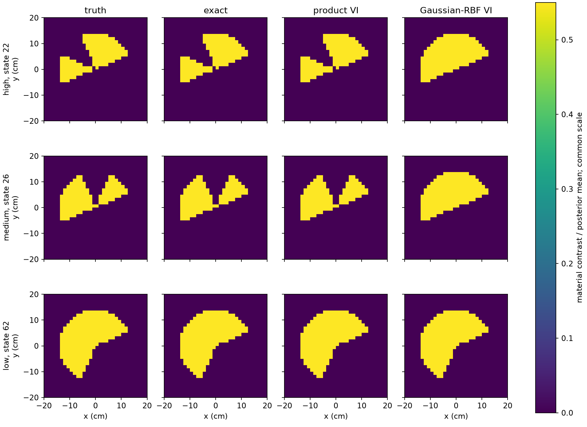

**视觉观察：** 固定RBF版本会填上原本不存在的区域、把分离区域连起来。这不仅是图片模糊：留出场和KL也变差。线性可行性检查发现，当前4维特征只能对256种确定标签中的118种任意集中。30例中14例RBF的Brier大于0.01，其中6例对应不可表达标签；另外8例仍可能是优化失败。用product边际初始化和额外起点后KL下降，但没有消除全部问题。不能把这个结果推广成“所有Gaussian概率模型都不行”。

为检查真正的概率不确定性，另做了**事后弱数据诊断**：30次新的先验抽样实例（26种不同标签状态），只保留两个复通道，噪声系数0.3/0.8/1.5。精确后验平均逐区熵为0.369/0.564/0.641 nat；product VI与精确联合后验的平均KL为0.840/0.837/0.528，RBF-VI为3.747/1.520/0.901。这说明单独的边际概率也可能漏掉相关模式。该诊断不能回填成原冻结v2的确认性测试。

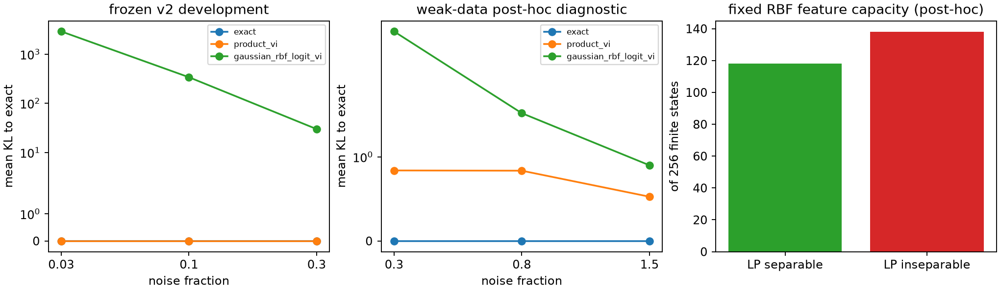

## 流形实验到底在做什么

这次不再用角度参数循环包装成“流形”。每个Gaussian直接保存正定协方差，通过SPD指数更新；振幅、中心、协方差的导数与完整全波场分别核对。材料导数最大相对误差约4×10⁻¹¹，端到端场导数约2×10⁻⁸。

四个方法分别是：完整阻尼GN；只保留较强奇异方向；在弱补空间做正负有限探测并重新拟合可见方向；在同一补空间随机探测。所有最终提案都用完整全波场检查下降。它们是参数切空间的算法对照，**还不是已经证明的新twofold SOM理论**。

Sol评审发现初版v2在满秩时仍称“弱方向探索”，随机对照空间也不匹配。这些已在v3修正，v2仅保留为开发轨迹。v3使用30个新种子对象、固定ROI初值，分离双目标/相邻双目标/尖边双椭圆各10个，N64积分数据、N32反演。每个对象4种方法，共120次；另有上一版120次开发反演。

度量明确采用log振幅、中心0.03m尺度和SPD仿射不变切向Frobenius度量。下面比较**3000 RHS预算以内最后可用的状态**，没有伪造同一时刻额外求解；各方法实际步长和终止成本仍单独保留。

|目标|完整GN材料误差|谱截断|弱方向有限探测|同补空间随机探测|
|---|---:|---:|---:|---:|
|分离双目标|0.46%|0.48%|0.46%|0.46%|
|相邻双目标|0.47%|5.47%|3.68%|1.91%|
|尖边双椭圆|44.15%|44.24%|44.15%|44.18%|

每格为10例中位数。相邻组的无噪声留出场误差分别为0.56%、3.12%、2.23%、1.12%。弱方向探测能补回部分被截掉的更新，却没有胜过完整GN，也没有胜过同补空间随机控制。终端每例约5–6秒；这是小状态、固定两个Gaussian的结果，不能外推到大规模。

下图改看各组均值，便于显示少数严重失败对整体表现的影响；它与上表中位数口径不同。分离组谱截断在3000 RHS的均值为1.91%，中位数为0.48%，提示存在尾部失败。

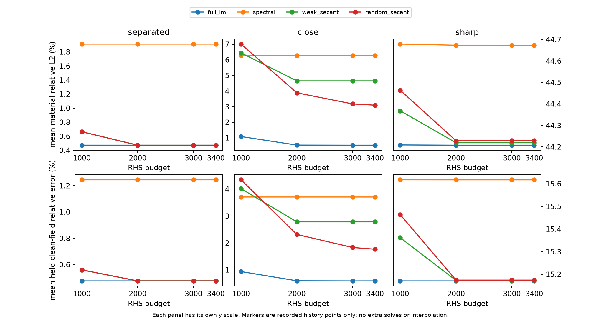

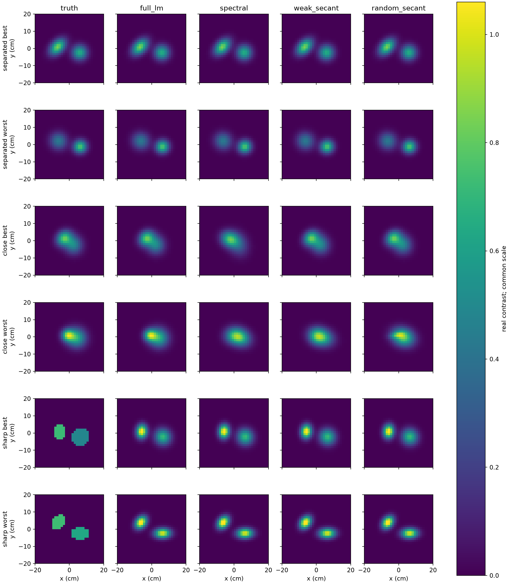

**视觉观察：** 尖边的主要误差是轮廓被平滑Gaussian替代，峰值也会补偿性变高；增加迭代或更换局部选向没有修好。这个观察支持进一步检查材料表示容量，却不证明一定需要U-Net，也不证明新增Gaussian一定可辨识。相邻高斯的图肉眼往往很相似，实际材料与留出场指标仍有差别，所以视觉和数值必须一起看。

补充展示每组“谱截断相对完整GN损失最大”的终端案例，检视被中位数掩盖的失败。它是事后选图，图内注明各自实际RHS；不把这些终点图冒充同一预算时刻的图。

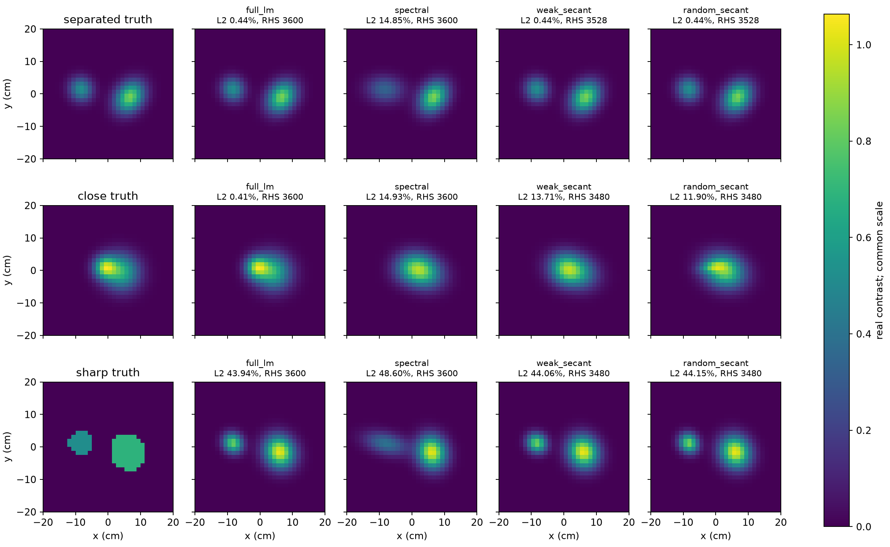

视觉上，分离例的较弱目标被谱截断拉宽；相邻例出现位置/峰值偏差。完整GN在相同观测下明显更接近真值，所以这些失败不能直接称为物理上不可分辨。尖边例则所有方法都保持明显的平滑轮廓误差，提示单纯改选向不足。

## 理论修正与下一步真正值得解的问题

完整推导见[扩展理论审计](../Theory/a2/extensions/CORE_AUDIT_ZH.md)。已纠正峰值高斯协方差导数中的错误trace项、保矩分裂振幅、静态标签的联合似然，以及从平均总场转到平均散射场时遗漏的材料—场相关项。相同逐点概率而不同空间联合律的例子，Born均值相同、协方差不同，全波均值也不同。相关矩展开只有明确Neumann条件下的有限维余项界，没有被升级成实际Maxwell后验认证。

已有[Bayesian微波反演](https://cames-old.ippt.pan.pl/index.php/cames/article/view/38)和[Gaussian流形优化](https://proceedings.neurips.cc/paper/2015/file/dbe272bab69f8e13f14b405e038deb64-Paper.pdf)近邻。因此，概率或流形名称本身不构成创新；最近邻核查范围见[文献表](../delegated/a2_extensions/PRIOR_ART_ZH.md)。

NN-native更值得考察的位置是：学习空间联合标签与多峰后验，或有误差控制的local-T/端口响应。直接串联图像U-Net可以作为未来基线，但目前没有证据证明它能修复数据支持的边界。四个GPT Pro核心问题已经写入[原有问题入口](GPT_PRO_QUESTIONS_ZH.md)：流形上的原生SOM、可复用n-port、可信结构增长、联合概率与NN推断。不要再提交旧三问题包。

<!-- GPU_EXTENSION_START -->
## 4060大规模分支：参数规模扩大后，哪些优势保留下来

**已完整执行30个对象×4种表示＝120次反演。** 反演网格为128×128（16384个复状态单元/频率/发射），数据来自192×192单元积分模型。三频1.25、2.0、2.75 GHz，12个圆周线源、64个半圆接收，发射半径34cm、接收半径30cm，成像视场40cm×40cm。偶数接收拟合、奇数接收留出。

三类各10个对象：16–32个离网格平滑Gaussian、多圆盘/矩形尖边夹杂、相交细曲线与局部挖空。K16/K64/K144分别有96/384/864个实材料参数；体素有16384个。每例120次Adam更新，使用同一个全波后端和同形式的离散平滑项。全波状态仍需求解，Gaussian基函数解析并没有使全波场变成解析。

**下表为各组10例均值。** 留出误差相对无噪声生成场，和上文概率实验的带噪留出指标不同。

|目标|表示|材料相对L2|留出场误差|
|---|---|---:|---:|
|离网格多Gaussian|Gaussian K16|41.07%|14.81%|
|离网格多Gaussian|Gaussian K64|24.14%|5.37%|
|离网格多Gaussian|Gaussian K144|17.70%|2.25%|
|离网格多Gaussian|体素|20.23%|5.25%|
|多夹杂尖边|Gaussian K16|50.89%|18.18%|
|多夹杂尖边|Gaussian K64|42.12%|7.86%|
|多夹杂尖边|Gaussian K144|40.94%|6.29%|
|多夹杂尖边|体素|39.53%|9.13%|
|细曲线与局部挖空|Gaussian K16|53.76%|16.86%|
|细曲线与局部挖空|Gaussian K64|35.79%|7.23%|
|细曲线与局部挖空|Gaussian K144|29.38%|5.80%|
|细曲线与局部挖空|体素|44.85%|12.44%|

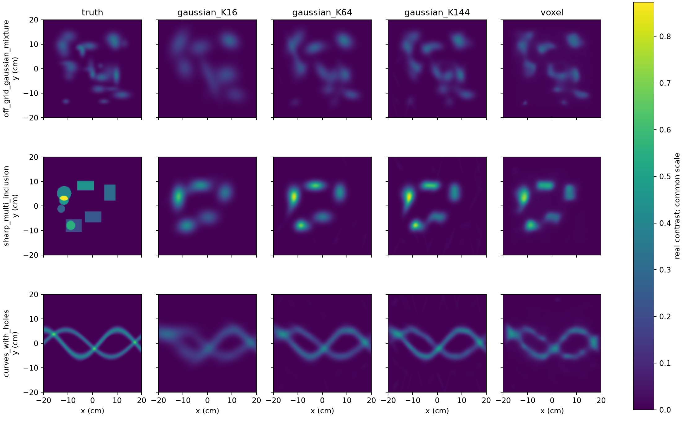

**配对结果：** 离网格多Gaussian中K144的材料误差低于体素为9/10例；多夹杂尖边中K144的材料误差低于体素为1/10例；细曲线与局部挖空中K144的材料误差低于体素为10/10例。这些是本次对象和固定设置下的计数，不是跨分布成功率。

视觉上，更多Gaussian能保留更多小结构，并让细曲线更连贯；K16容易将它们合并成宽带。尖边仍会变圆，较低留出场误差并不总对应较低材料误差。K144还会出现很淡的长条/斜条背景伪影，不能解释成已经确认的材料细节。具体观察和改进假设见[视觉审查](../delegated/a2_gpu/VISUAL_REVIEW_ZH.md)。

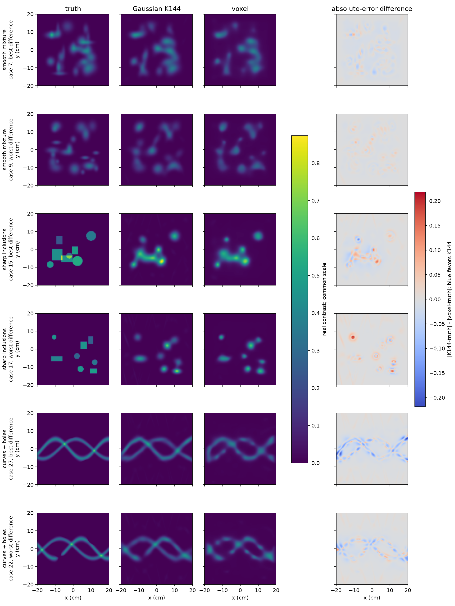

上图每组按K144材料L2减体素材料L2的差值取最小/最大，展示相同对象的真值和两种重建；差图蓝色表示该像素K144误差较小。选择只用于展示，不进入优化或超参数选择。

### 参数少了，成本怎样变化

|表示|实材料参数|优化与逐步存档平均秒/例（29例）|相对体素的配对耗时比中位数|
|---|---:|---:|---:|
|Gaussian K16|96|20.93|1.08×|
|Gaussian K64|384|22.93|1.20×|
|Gaussian K144|864|23.86|1.23×|
|体素|16384|19.50|1.00×|

第19个对象（case18）的两种方法在系统重启前完成、另两种在重启后完成，因此只在配对计时中排除，质量统计仍保留全部30例。方法顺序固定、未做独立重复计时；该表是执行策略下的时间，包含每步checkpoint I/O，不能当作纯CUDA速度。

保存的120次完整优化时间合计2632.2秒；记录到的数据生成/首次构建合计653.3秒，反演算子构建合计18.2秒。这不是无中断端到端总耗时：原case18被中断的部分工作、部分重复初始化、最终评价/绘图/同步与停机时间没有被完整分项计量。跨两次进程记录到的PyTorch分配显存峰值为314.4 MiB；这是共同过程峰值，不能用于不同表示间的峰值比较。

每个完整反演包含4356个正演RHS和4320个伴随RHS（含最后36个正演RHS评价），各表示相同。隐式梯度不需要逐材料参数构造完整Jacobian；Gaussian渲染仍有O(NK)开销，体素映射为O(N)。因此864对16384、约19倍的参数差并没有转化为速度优势。完整复杂度见[复杂度说明](../Theory/a2/extensions/COMPLEXITY_ZH.md)。

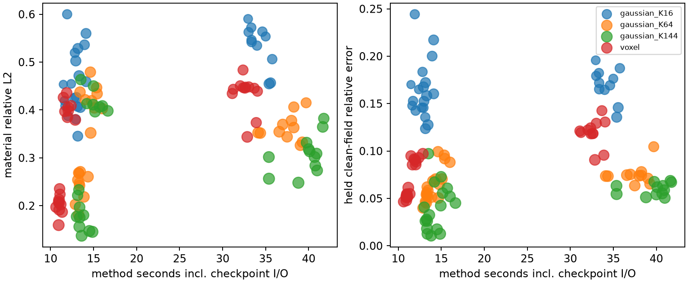

另有256×256＝65536状态单元的单频正演/伴随规模检查。当前GPU后端已重新对照SciPy场参考（相对差约5.30×10⁻⁷）、隐式梯度有限差分（约1.51×10⁻⁴）及批量多频一致性；这些验证求解实现，不证明材料恢复或加速。

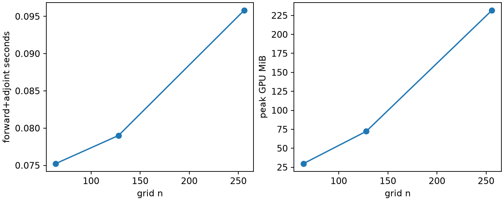

### 这些结果意味着什么

**Gaussian的紧凑表示值得继续研究，当前证据尚未支持SOM、概率或NN的新主贡献。** 平滑多结构和细曲线给出正面线索；尖边与低幅伪影说明需要同时研究表示与数据支持。下一步应检验普通自适应Gaussian、TV/界面模型与完整GN，再决定是否需要NN。torch.nn.Module在这里仅封装待反演参数，不是跨对象训练的神经网络。

本组没有额外测量噪声，仍含网格与积分失配；两种正演属于同一VIE软件体系，不能称完全独立软件验证。不同K从不同的初始材料图开始，体素从K64初始图开始；相同更新次数/步长/罚项不等于有效先验或调参难度相同。因此这是有意义的规模开发实验，尚非满足重复噪声、强基线调参、实测和3D Maxwell要求的论文验收。

原运行在系统重启后中断；保留已完成结果，隔离损坏的case18 K144检查点后重算该方法并继续。重建数据与旧数据逐数组一致，最终源码/配置哈希、120步轨迹、求解计数和图像误差全部核对。详见[执行记录](../runs/a2/gpu/execution_receipt.json)。
### 追加检查：细长Gaussian是否利用了原网格？

这是看图和参数后提出的**事后诊断**，没有重新优化。90个Gaussian模型中，按峰值振幅>0.01计，K16/K64/K144分别有0/3/133个分量的最短主轴标准差小于原网格3.125mm；对应0/3/23个对象含这类分量。全体最小标准差约2.12mm。阈值是诊断选择，不是可辨识性判据，也不能仅凭短轴就认定伪影。

随后把全部120个固定解转到256×256网格重新正演：Gaussian按连续参数求值；体素把原单元按分片常数细分。使用N256点/配点核，对比原N192积分数据；仍是同一VIE软件，未冒充独立求解器或连续误差证书。

|目标|K144原网格留出场|K144细网格留出场|体素原网格留出场|体素细网格留出场|
|---|---:|---:|---:|---:|
|平滑多Gaussian|2.248%|2.247%|5.253%|5.270%|
|多夹杂尖边|6.288%|6.287%|9.129%|9.169%|
|细曲线|5.804%|5.804%|12.444%|12.473%|

每格是10例均值。主要场误差排序保留；因此这次检查没有支持“低场误差主要靠原粗网格实现”的解释，也没有证明所有细长分量都是真实细节。需要经分量删除/旧参数重拟合、重复噪声和额外采集再判断数据支持。此次120次固定场重算用时98.85秒，其中初始化31.77秒、正演RHS4320、无伴随；费用不混入主优化表。全部参数、逐例结果和源码哈希见 `gaussian_parameters_posthoc.json`、`refined_field_posthoc.json` 与 `REFINEMENT_SUMMARY.json`。

<!-- GPU_EXTENSION_END -->

## 上一阶段A2证据：保留，未作为本轮新增方法的独立验收

以下内容是新增概率/流形分支之前已完成的A2实验。其温启动、固定模板、局部成本和实测限制均保留；不能与新分支混为一次统一冻结测试。

2026-09-11。原始 A1、A1_2 保留；上一轮报告移入 `deliverables/archive/pre_A2`，本文件继续作为统一中文报告。

## 先回答这轮做成了什么

**A2 已归档并进入可运行的下一轮开发，但当前证据还不能把 MF-TSOMG 或 Gaussian n-port 写成一篇已经达到 TAP 验收的方法论文。** 我保留 Gaussian 参数空间 SOM 的研究主线，没有把任务改成 geometry/phase calibration，也没有用“加了 GNN”代替贡献。

这轮做了四件具体的事：把 Pro 的两版分析保存并区分适用条件；实现多频全波 Gaussian 参数 twofold 与强 GN 对照；扩大成像到三类模板各十次扰动、五种方法；补做组件端口、误差证书、3D 向量有限模型和 Fresnel 实测诊断。结果既有局部数学成立，也有明确失败：完整导数之后再截断没有省下导数成本，谱预条件仍输给强 GN，低阶端口仍可能产生明显偏差，实测边界也没有因增加 Gaussian 就解决。

**我的投入建议是有条件继续问题研究，暂不把当前算法扩大包装成 TAP 主贡献。** 该阶段继续的条件曾收敛成三个重量级 Pro 问题（现已合并扩展为上文四题）：原生 SOM 的不可替代作用、可复用的 n-port 模型、具有数据支持含义的新增结构/边界。不能解决这些问题时，应撤回对应贡献，而不是继续调参。

## A2 来源与本轮复现的关系

[A2 入口](../Theory/A2.md) 连接 [Pro 第一版正文](../Theory/a2/sources/PRO_RESPONSE_1.md)、[第二版正文](../Theory/a2/sources/PRO_RESPONSE_2.md) 和本地修订。两段完整分析都已保存。浏览器确认生成附件入口存在，但未取得可核对的原始附件字节，详见 [来源状态](../Theory/a2/SOURCE_STATUS.md)。因此这轮数值称为“依据正文独立重建”，不称为“Pro 原附件代码复跑”。

两版 Pro 在有限维算法上有区别：全维 M=I−XD 与 L=X⁻¹−D 等价，不表示投影后的 M-Galerkin 与 L-Galerkin 相同。本轮没有把两版结果拼成一个算法的加速结论。A1、A1_2 的来源哈希保留，Calibration 旧文件未搬动或覆盖。

## 这次的图到底在看什么

任务是有限孔径微波成像：从物体外部测到的复散射场恢复介电对比度。它可以对应夹杂或缺陷检查，但下面的主成像仍是二维标量合成实验，不是真实工业检测。

|设置|本轮实际内容|
|---|---|
|物理区域|40 cm × 40 cm；反演 N64，即 4096 个状态单元|
|独立离散检查|数据用 N128、单元积分 Green 核生成；反演用 N64 点核。不同网格/积分减少同网格 inverse crime，仍不是完全独立物理软件|
|采集|1.5 与 2.75 GHz，12 发射环周分布、48 接收半圆分布；复散射场 RMS 1% 噪声|
|拟合/留出|偶数接收器拟合，奇数接收器留出；同一几何中的相邻通道，不是独立目标测试|
|材料|相邻平滑双 Gaussian、较高对比度双 Gaussian、带矩形缺口的圆盘|
|统计单位|三个固定形态模板，每个十次平移、噪声和初始化扰动。不是三十种形状|
|初始化/预算|真值附近的初值；尖边使用双 Gaussian 代理初值。始终两个 Gaussian、12 参数，各方法至多30次外层迭代|

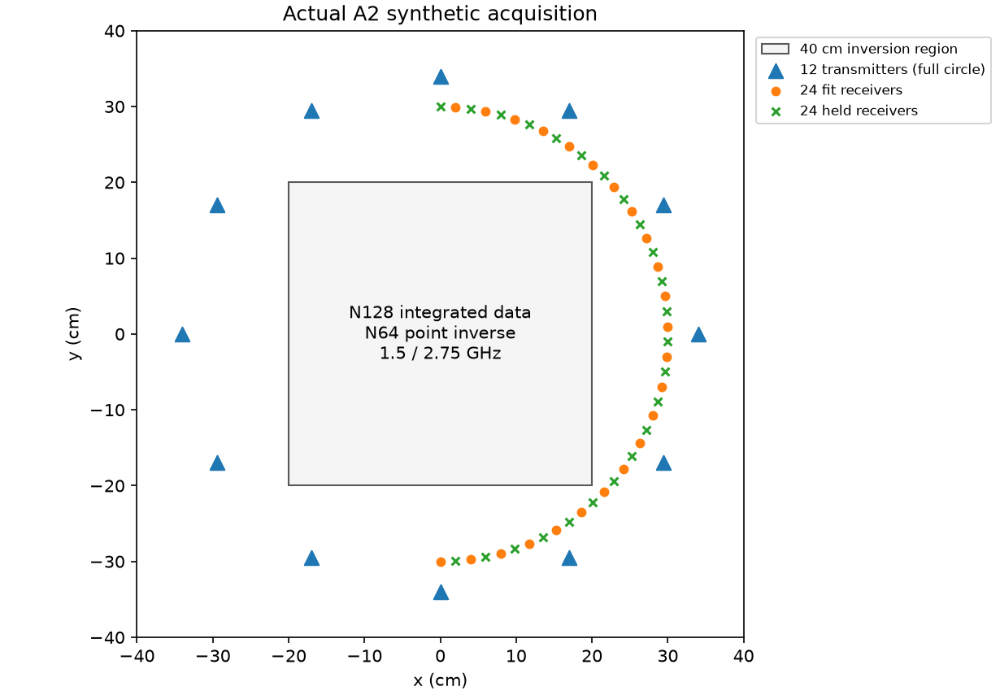

这组实验检验的是“在同一局部恢复任务上，选哪些参数方向有用”。它没有检验盲初值、自动生长材料节点、未知物体数量或跨形状泛化。`gaussian_strong` 是文件标签，只表示对比度更高，未据此证明已覆盖强多次散射区间。

五种方法的差别如下：完整 LM 保留全部参数方向；固定 twofold 保留数据第一层六方向，再选内部传播第二层两方向；自适应方法按梯度捕获率增方向；随机补充是同维数控制；GSVD 比值方法按两算子的广义谱关系选向。**自适应梯度规则是启发式，不能称为误差证书。** 所有分支都计入其完整导数和前向尝试。合成留出误差使用未参与拟合的通道上的无噪声生成场，仅用于评价；不与实测留出误差混淆。

此外，LM 仍支付 B 与谱分解诊断开销，其计时不是优化过的纯 LM；GSVD 分支的广义特征向量未在原参数坐标正交归一，系数 I 阻尼改变了有效度量，因此不是严格的同度量选向消融。

<!-- IMAGING_SUMMARY_START -->
**完整执行：30个案例×5方法＝150次反演。** 下表均为每组十例的中位数；拒步停止与达到迭代上限分开计数，不称数值崩溃或统计失败率。

|目标|方法|材料L2|留出场|秒/例|拒步/达cap（各/10）|
|---|---|---:|---:|---:|---:|
|相邻Gaussian|LM|3.80%|2.45%|12.88|6/0|
|相邻Gaussian|固定twofold|4.88%|2.57%|19.81|8/0|
|相邻Gaussian|自适应|1.26%|0.64%|17.41|7/0|
|较高对比度|LM|0.16%|0.14%|9.01|0/0|
|较高对比度|固定twofold|17.76%|10.43%|40.61|7/3|
|较高对比度|自适应|0.20%|0.13%|21.26|0/0|
|尖边缺口|LM|48.57%|17.01%|51.98|4/6|
|尖边缺口|固定twofold|56.22%|23.95%|41.09|8/2|
|尖边缺口|自适应|58.29%|25.33%|11.99|9/1|

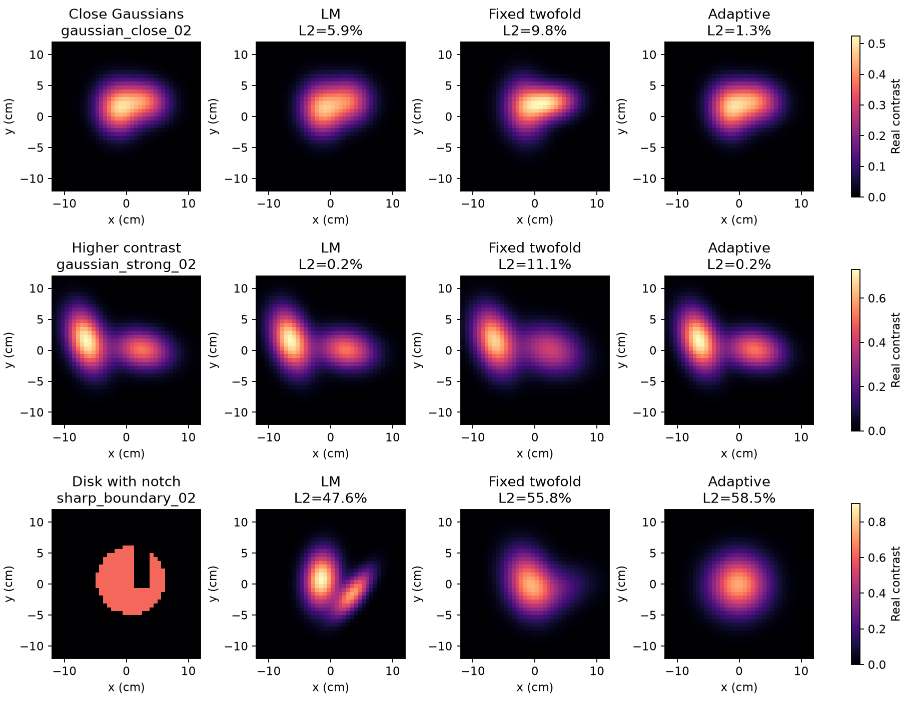

图中每行选自该组自适应材料误差排序的中间案例，各方法使用同一个目标和初值；显示中央24cm区域，原计算区域为40cm，每行共用色标。这是按既定排序规则选择的展示，不用来单独判优。

相邻目标上，自适应材料中位误差1.26%对LM的3.80%，留出场也较低；但只有6/10配对同时在材料和留出场上更好，耗时更长。较高对比度组LM材料更准且更快，自适应最终均扩至12个完整方向。因此值得研究的是早期限制方向是否改变非线性路径，而不是宣称内部传播增加信息或固定twofold已胜出。

视觉上，相邻组的几张图很接近，不能凭外观宣布明显优势；较高对比度组固定twofold改变了目标形状/幅度；尖边真值有明确缺口，LM保留了部分凹陷却把它变成两个平滑团，自适应则几乎填平缺口。更快的尖边自适应伴随更高材料和留出场误差，不能称同精度加速。下一步需分离边界表示、优化路径与物理失配，不能只串联一个网络把图变锐。

全部五方法、停止比例和配对胜数见 [完整统计](../runs/a2/imaging/SUMMARY_ZH.md)。各组最好/典型/最差完整图：[相邻](../figures/a2/imaging_gaussian_close.png)、[较高对比度](../figures/a2/imaging_gaussian_strong.png)、[尖边](../figures/a2/imaging_sharp_boundary.png)。这些是开发诊断；尖边原Gaussian代理参数误差已标为无效，没有进入上述材料分数。
<!-- IMAGING_SUMMARY_END -->

## 为什么把 SOM 拉回 Gaussian 参数空间，并不自动更好

材料参数 θ、物理电流 j、电流端口 b 是三个对象。Gaussian 只让 χθ 及其材料导数容易计算；全波电流仍须解多次散射。物理尺度归一化的材料导数记 G，则

$$
T=(I-XD)^{-1}\operatorname{diag}(E+Dj)G,
\qquad A=\mathcal R(WST),\quad B=\mathcal R(W_\Omega DT).
$$

A 表示参数变化在测量中留下的局部信号，B 表示同一变化引起的内部传播。精确消去状态后，B 没有增加一份独立观测。因此第二层的价值若存在，应来自非线性路径、近似状态、结构选择或计算预算；不能直接写成“内部信息让参数更可辨识”。

本轮推导了固定二次问题的受限更新损失，且保存了一个关键反例：H=[[1,.9],[.9,1]]、g=(1,0)，只保留第一方向时，梯度缺失率为零，但完整最优步仍强烈依赖第二方向，二次目标损失约2.132。这解释为什么当前梯度自适应不是认证算法。它是已知二次代数的应用，不是新的 SOM 定理。详细推导见 [参数理论](../Theory/a2/PARAMETER_SOM_AND_PORTS_ZH.md)。

代码按复噪声 RMS σ 归一化再实化时，proper complex Gaussian 的实 Fisher 是 2 A_codeᵀA_code。AᵀA 可作相应局部曲率；指定算法的分辨率还要包含材料映射、正则和受限更新，不能直接把 AᵀA 图片叫成全局 PSF。

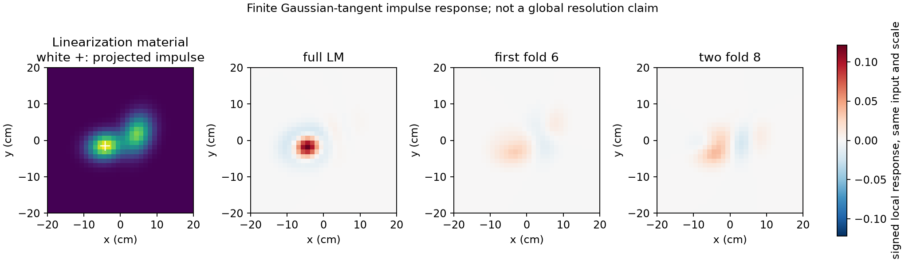

上图把同一个像素扰动先投到当前有限 Gaussian 切空间，再比较局部更新响应，三张响应共用色标。完整 LM 的正主瓣集中在标记附近；截断响应更弱、更分散，twofold 还出现右侧负旁瓣。它说明“方向变少”会改变局部响应，不证明任意点目标或全局双目标分辨率。

## 成本：减少迭代，不等于更快

先实现了矩阵自由 Jv/J*，伴随相对误差约1.68×10⁻¹²、有限差分约1.03×10⁻¹⁰、与稠密 GN 步差约1.54×10⁻⁹。随后做两轮成本优化：第一轮低秩预条件；第二轮同时强化对照，允许用接收伴随构造 Jacobian 并在小的对偶系统中求解。

|实参数 p|完整/对偶 GN 秒|普通 CG 秒|已测最佳谱预条件秒（含建基）|
|---:|---:|---:|---:|
|49|2.24|26.00|16.98|
|196|9.39|40.02|27.30|
|784|2.05|39.67|10.12|
|3136|4.67|50.00|14.96|

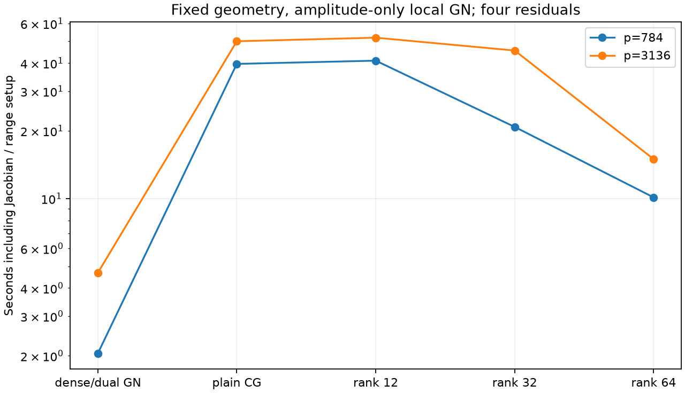

这不是四组端到端成像：固定 Gaussian 中心/尺度，只优化幅值，四个残差共享一个局部物理状态。状态准备和阻尼探测另列；被测 Jacobian 仅约1.20/4.82 MB（p784/3136）。p784 的谱预条件把 CG 降到7–8次，仍比对偶 GN 慢约4.94倍；p3136 约慢3.20倍。plain CG 的部分记录到100次上限，不当作收敛。记录中的 RHS 包含请求的零伴随右端，不能把不同 RHS 当作等成本单位，墙钟结论更直接。

FFT 正演单次传播是 O(N log N)，而不是“12 参数所以正演只要12维”。显式导数需要与 min(p,m_real) 相关的方向/伴随求解；稠密 Jacobian 存储 O(mp)，小系统求解可选 primal 或 dual。端口建基、候选分裂、谱更新、外层重线性化都要付费。两轮已没有净优势，所以停止针对该瓶颈继续调秩，交给 Pro 解决机制和 break-even 条件。

## Gaussian 之间的 n-port：关系成立，压缩仍有困难

采用可加材料势，组件局部响应

$$
T_i=(I-X_iD)^{-1}X_i,\qquad
j_i=T_i\left(E+\sum_{k\ne i}Dj_k\right)
$$

可以在完整离散空间精确重写多次散射，重叠不会自动使它失效。投影激励和边都必须包含 T_i；本轮修复了大网格分支漏掉该作用的问题。它目前是响应坐标网络，不是已经定义好功率归一化与无源性合同的电磁 S 参数网络。

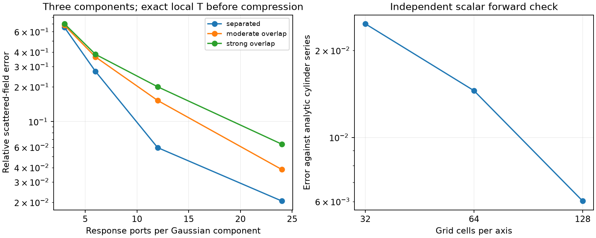

每组件24个响应端口时，三种间距的散射误差约2.05%、3.85%、6.37%；低阶误差可达约65%–70%。N24 回归中完整组件恒等式误差约10⁻⁹，而9维压缩网络误差仍有68.117%。这正说明恒等式成立不能代替低维可压缩性。局部逆与 SVD 已用于建基，尚无包含这些成本的端到端净加速证据。

圆柱级数解与 N32/N64/N128 正演的差异约2.47%、1.45%、0.603%，支持网格加密改善这个可解析目标；它不替代任意尖边的独立连续正演验证。Schur 检查也显示，只修自能、漏掉激励/接收/直通项可有约90.9%传递误差，完整消元则达到约10⁻¹⁵。

另一个显式弱电流分支在修正 D Pweak 及其伴随后，三个代表例增至rank128，状态残差仍约11.8%–13.2%。这是否定当前分支的闭合，不是对成熟传统 TSOM 的否定。不能拿这个弱实现当作唯一 TSOM 基线。

## 误差证书：能核查什么，不能判定什么

在非零对比度、正损耗和指定离散核下，L=X⁻¹−D 的耗散下界 Γ 给出

$$
F_c=C\widehat J+\widehat Z^*r_p,
\qquad \|F-F_c\|_F\le
\|\Gamma^{-1/2}r_d\|_2\,
\|\Gamma^{-1/2}r_p\|_F.
$$

它认证当前候选材料的离散正演精度，不能认证材料是真值。χ=0 需要消元；近无损、核条件不满足时应返回不适用；不允许为满足定理偷偷加损耗。

|检查|实际结果|范围|
|---|---|---|
|二维离散修正场|36项全部覆盖，界/实际误差约3.65–19.44|局部重构检查，尚未证明节省实际反演成本|
|单元积分核|12项核 Gram/shift 检查，数值最小余量约−1.04×10⁻¹⁴；超出充分条件与构造漂移被拒绝|对称正权GL、等面积方格、kh≤π等声明条件；非区间浮点认证|
|三维向量点偶极|81/192未知量，16项覆盖|单独保留dyadic Green与辐射修正的有限DDA；不是完整三维反演|
|有限旧/新模型目录|旧类9候选，新类含旧类并扩展至27候选；三种真值各10噪声|旧目录被排除不等于连续旧模型类被排除|

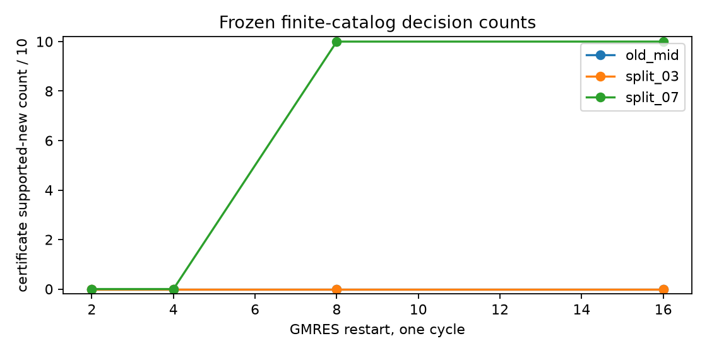

目录实验中，粗求解时证书返回“未知”；更精确时恢复与精确有限目录相同的判断。但是普通近似没有产生假阳性，证书只延迟了决定，**没有证明减少假结构或节省计算**。其中 d/σ=0.7 的保矩等权双 Gaussian 仍单峰，不能把“新目录更合适”写成“分辨了两个缺陷”。早期保矩与类嵌套实现错误已隔离到 invalid_v1，不计正面证据。

## Fresnel：真实测量中的边界问题

使用官方 Fresnel 2001 偏心介电圆柱 TM 数据的既有原始副本，取2/4/6GHz、12源视角、交错接收留出。它是真实相干散射数据，不是根据公开几何合成的场。原始文件来源、相位共轭、几何与 SHA 见 [数据索引](../data/a2/DATA_INDEX_ZH.md)。本轮没有绕过受限下载，也没有新增取得3D实测。

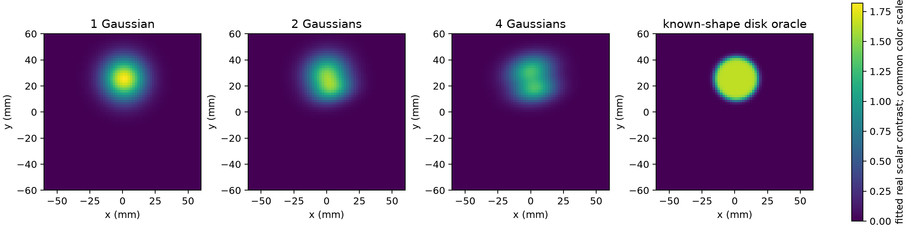

从1到4个 Gaussian，图中目标中心基本稳定，但边缘仍弥散，4分量出现纵向分团。右图利用已知圆形，是形状 oracle 诊断，不是公平通用算法。它可以帮助判断模型差异，不能当作未知目标真值恢复结果。

|模型|2GHz留出场误差|4GHz|6GHz|
|---|---:|---:|---:|
|1 Gaussian|10.22%|15.56%|21.79%|
|2 Gaussian|10.22%|15.30%|20.95%|
|4 Gaussian|10.59%|15.16%|20.56%|
|已知圆形诊断|9.10%|13.78%|17.24%|

上表允许在散射训练数据上逐频拟合一个额外复增益，属于 nuisance；它不只是 incident 源归一化，并保留材料幅度歧义。把增益固定为1后，Gaussian 留出误差大致升至19%–30%，圆形诊断也仍有约19.4%/18.6%/23.2%。因此边界并非唯一确定的误差来源，不能直接让网络学习补偿所有残差。

每种 Gaussian 做了10起点，但旧长跑只保存每起点训练目标和所选结果，没有全套每起点 held、时间和参数。2/4分量全部到优化上限；1分量所选最低目标也到上限。报告不称它为十组完整配对统计或已收敛的最优逼近。主执行源码哈希缺失被明确标为空，后置快照不回填历史。

## NN 要放在哪里

A1_2 上轮已做过原生散射图求解器：网络在物理状态迭代中输出节点阻尼/动量，没有图像 decoder。192/48/96 场景与3训练种子的记录仍保留；六步 GNN 没超过六步 GMRES，端到端小型反演约慢六倍。这是历史证据，本轮没有把它重新描述为新训练结果。

A2 的判断是：暂不启动 Cascade U-Net 训练。固定两高斯确实难表达缺口，但“表示受限”不能确定“U-Net是最合适的补救”。应先比较界面/水平集、TV、更多Gaussian或软分区，且检查实测模型失配。若局部端口有跨布局可复用性，NN 可学习 local-T 或端口更新并接受场残差检查；当前压缩和摊销收益未成立，不能为 NN-native 的名字先增加训练。

## TAP reviewer 与下一步投入边界

两轮隔离 Sol 审查都已完成，原始意见保留。第二轮在其审查范围内确认 Fisher、GL 核与局部二次理论的修复，评分为正确性3、原创性2、实验2、实践2、表达3；不算平均分。后来补完的成像、有限目录、显式电流v2和向量点偶极检查由根任务复核，不能声称全部被第二轮 Sol 审过。

最近邻中，参数与认证状态空间联合自适应、伴随修正、TSOM内部传播、T-matrix SOM与边界正则均已有工作，详见 [主张—来源表](../delegated/a2_audit/PRIOR_ART_ZH.md)。ScholarQA 两次429后改用原始来源；用户指定2023 Far-Field Approximation Learning论文目前只有题录核查，未完成全文技术逐项比较。

尚未通过的关键门槛是：相对成熟基线的独特机制与净收益、盲初值/多形态冻结测试、完整CSI/TSOM/TV/认证ROM强对照、对应主张的三维反演与多目标实测，以及完整历史执行谱系。不能把三模板150次运行、文件哈希或内部评分当作这些门槛的替代。

[最终裁决](../reviews/a2/FINAL_VERDICT_ZH.md) 逐项列出通过和未通过；[Pro问题包](GPT_PRO_QUESTIONS_ZH.md) 已替换旧清单，不再让Pro重做本轮已经解决的代数检查。下一步要得到可以改变论文判断的理论或实验，而不是仅再画一批更漂亮的图。

## 交付复核

该阶段是五组快速检查；本次扩展交付增加为八组，在独立解压副本中重新执行，并核对最终包的源码一致性。原始A1、A1_2及两版Pro正文哈希保持不变。ZIP同时包含配置、结果、图、修订与评审；文件完整性检查不解除上面的科学门槛。实测原始文件和未取得的Pro原附件未放入包中，下载与谱系缺口按实际状态报告。
