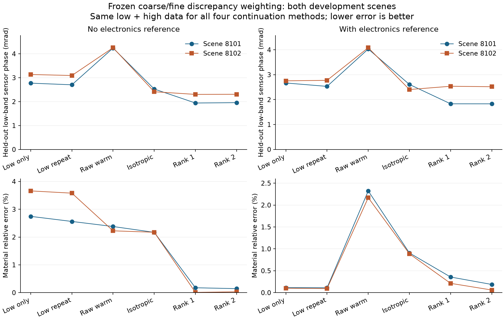
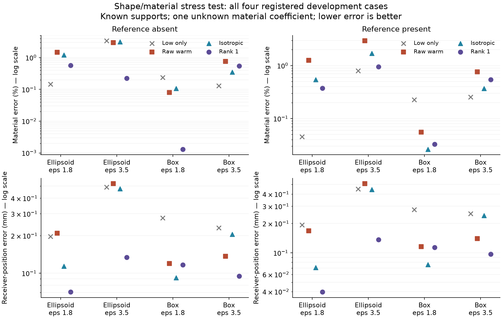

# A3 阶段研究汇报：相位能拟合，不代表位置和材料已经分清

更新：2026-09-08。已实际执行理论检查、自动科研流水线、二维冻结比较与独立三维电磁实验；仍在开发与审查阶段，**不是已经成熟可投的 TAP 定稿**。英文工作稿见 `research/trispace_self_calibration/a3_research/PAPER_DRAFT_A3.md`，执行合同见同目录 `PLAN.md`。

## 先读这里：目前真正确定了什么

- **SOM 独特优势已经做出有限范围内的裁决。** 240 次冻结比较排除了事先
  指定幅度的 Twofold 优势，它已退出标题和核心；不是无限等待正面结论，
  也不是否定全部经典 SOM。
- **高频有校准信息，但错误模型会让收益反转。** 匹配数据的实验和同模型
  控制给出了相反结果，支持在当前场景中区分信息增益与模型偏差。
- **一个误差方向的抑制确实能有效，但不是通用解。** 最初两场景材料恢复
  明显改善；随后四个新形状／材料案例证明，位置、材料和相位指标会冲突。
  方法骨架也已核验有直接前人，不能当作原创公式。
- **当前三维结果依赖已知目标支撑域。** 它提供空间锚点，不能宣称已经
  解决任意未知目标与未知阵列的绝对联合定位。
- **下一步正检验你的原始两阶段想法。** 用高频得到的位置重做低频材料
  反演，另设真实位置已知诊断，以判断剩余偏差究竟能否靠校准解决。

第 1–20 节保留早期阶段的思路与证据，阶段性“待做”以第 21 节以后的
更新及 A3/STATUS.md 为准。下面先解释完整问题，再给出各轮结果和反例。

## 1. 如果向研究负责人汇报，首先应该说什么？

我们现在不再把论文概括成“让 SOM 顺便估计机器人位置”。真正的问题是：**既然定量全波成像需要相干相位，能不能识别并校准破坏相位一致性的几何和电子误差，同时知道何时不该相信校准结果？**

这里有三个不能混为一谈的成功：

1. 预测信号和测量吻合——拟合成功。
2. 吻合的原因确实是正确的位置、电子参数和材料——归因成功。
3. 用于拟合的数值模型足够准确，并且没有落在错误相位分支——物理和非线性验证成功。

本轮三维实验已经给出很具体的反例：位置可以校得很好，残差也不大，但材料仍然明显偏。这个反例比再添一条看起来漂亮的谱不等式更有用，因为它直接规定算法必须检查什么。

## 2. 相位精确到底有什么实际意义？

全波定量成像不是只在图上找一个亮点。我们希望不同发射、接收和频率下的数据由同一个材料分布解释。几何不准会让传播相位不一致，反演就可能用错误的材料、位置或内部结构去补偿。

对单条传播路径，小位置误差引起的相位变化大约是 $\delta\phi=k\,\widehat r^T\delta x$。例如 1 GHz 的自由空间单程传播中，沿传播方向 1 cm 误差约对应 12 度相位误差；双程测量需要使用实际双程路径导数，不能把单程数字直接套上去。相位敏感性既是风险，也是潜在的定位信息。

但“更高频率有更多位置灵敏度”有条件：信噪比、角度多样性、材料与电子误差的混淆，以及正演模型精度都要允许。若数值模型本身的高频相位就是错的，提高频率只会更精确地拟合错误模型。

Phaseless 方法并不是没有物理约束，更不是没有价值。相位缺失或无法可靠建模时，舍弃相位可能更稳妥。我们的研究价值应当是：在相位尚可通过低维结构化误差校准的条件下，保留这部分相干信息，而不是笼统贬低强度反演。

## 3. 你的“等效方法”想法，保留了什么？

等效电流仍然是有用的数值表示。关键是必须回答：这个电流变化是否来自同一个物理状态方程？

如果允许电流自由变化，只要电流空间足够大，它就可能把位置变化造成的数据全部解释掉。这不是位置被校准，而是位置证据被吸收。相反，如果电流始终由材料与阵列位置通过物理方程决定，它只是一个中间状态，不是额外的自由解释。

所以现在要分清四件事：材料参数个数、求解器的数值基底维数、独立自由电流维数，以及经典 SOM 的保留谱维数。我们的物理估计器不额外引入自由电流。增大数值基底是为了更准确地计算同一个物理模型，不能直接套用“nuisance 越大，位置越不可辨”的结论。

原来的 $\rho$ 也没有失去意义：它仍描述材料信息在消除位置混淆后保留了多少。另一方面，$B_{\rm vis}$ 回答位置变化中有多少不能被材料和电子误差冒充。前者偏相对保留比例，后者还需要检查绝对强度与所有零方向。二者是互补检查，不能只看一个漂亮的最小正特征值就宣布三维位置都可恢复。

## 4. SOM 的独特价值现在检验到哪一步？

上一次的重要问题是降阶路径根本没有真正工作。本轮已经解决这一基础问题：56 次二维开发运行中，任务扩充后的 SOM-informed 和 generic ROM 都接受了包含最高频率的更新。

但是，当前结果没有显示稳定的 SOM 独特优势。三个开发样本的状态与导数联合精度检查中，generic task 基底在低、中、高频的首次通过维数约为 32–48、64、96–128；Twofold 分别约为 96、128、160–192。这里的 generic 不是故意做弱的纯状态 POD，而是加入了任务残差和导数右端信息。

随后已经补完基底复用、49 个材料参数检查、匹配扩充规则，以及 40 个新
场景的 240 次冻结比较。当前实现的预设 Twofold 优势被排除，详见第 21 节。
这不等于对全部经典 SOM 的普遍证伪，但足以让当前论文撤回“必须用 SOM
才能校准”的核心主张，而不是继续拿实现未完善来无限推迟裁决。

## 5. 本轮新增的、能指导采集的分析

把发射机与接收通道画成两类节点，一次收发测量就是一条连接。假设每个节点的复增益未知，并且测量场不为零。

如果连接结构没有闭环，可以沿着树逐个调整增益，把任意一组几何引起的非零数据变化完全吸收。此时无论使用 SOM、直接反演还是换一个优化器，都无法凭这些数据恢复被吸收的几何信息。

一旦形成闭环，就会出现增益无法独立消掉的相干关系。尤其有一种有用情形：一个新接收机分别连接两个已有发射机，单独加任意一次测量都没有新闭环，两次一起加才有。这解释了为什么某些单步贪心采集规则会漏掉有用的测量组合。

但闭环不是万能药。在三维物理模型的局部检查中，一个复闭环最多提供两个实方向；允许两个材料参数一起变化后，这两个方向又可以被材料吃掉。三个闭环在这个例子中才留下完整的三维位置方向，而且还不一定足够稳定。

**这不是我们发明了闭环不变量。** 相关思想在干涉测量与增益校准中早已存在。可能有研究价值的是把“采集结构—真实全波材料混淆—需要增加什么测量”连成可以执行和验证的设计规则；是否达到论文级原创性还要经最近邻文献和对照实验检验。

## 6. 三维实验最重要的发现

参考端是矢量球波展开的多球相互作用，反演端是独立的三维电磁体积分／偶极离散，不是把二维标量模型挤成三维。包括两种横向极化与两个入射方向。

目前场景仍很受限制：两个已知形状区域，只估计其介电常数、接收阵列的共同平移、共同延迟和四个跨频共享复增益。这不是任意三维内部结构成像，也不是未知六自由度移动天线群。

在两个开发场景的平均结果中：

| 设置 | 位置误差 | 材料相对误差 | 留出视角相位误差 |
|---|---:|---:|---:|
| 固定错误位置，0.04 m 离散 | 90 mm | 45.7% | 0.467 rad |
| 只校位置、不建模电子误差 | 40.6 mm | 4.9% | 0.218 rad |
| 联合校准位置与电子误差 | 1.32 mm | 20.4% | 0.0569 rad |
| 更细的 0.03 m 离散、联合校准 | 1.21 mm | 15.8% | 0.0453 rad |
| 同一细网格，再加独立带噪声电子参考 | 0.110 mm | 1.28% | 0.00481 rad |

这张表不能只挑最后一行宣传。参考测量增加了数据条件，因此它的收益不是同等数据下纯算法的收益。而且，只校位置的材料误差恰好低于未加参考的联合模型，说明“联合估计所有东西”并非总能让所有指标都更好；该方法同时具有很大的数据失配与位置误差。

真正值得研究的是：哪些额外自由度会吸收材料信息？什么时候原始数据足够，什么时候必须增加参考或其他视角？如何让系统如实报告剩余不确定性，而不是把一个低残差解包装成全面成功？

## 7. 高频失败不是删除项，而是下一步的约束

把频率组从 $k=3,6,9$ 改成 $3,9,18\ \mathrm{rad/m}$，仍使用 0.03 m 网格时，留出相位误差反而升到约 0.26 rad，材料误差也明显存在。联合 Jacobian 此时依然满秩，名义局部标准差甚至更小。因此“满秩＋更高 Fisher 信息”不足以证明真实恢复更好。

独立正演对照定位了数值误差：最高频率下，多球场误差约 24.8%。已实现的 FFT／GMRES 与原来的稠密离散解一致，但把方程残差压到 $10^{-10}$ 并不能消除这个离散误差。细化到 0.015 m 后，误差降到约 9.5%，说明存在可继续推进的数值改进路线，但仍不够低。

接管后的材料导数和细网格反演已经完成一轮。0.01 m 网格上，低频组不加参考的材料误差降至平均 5.49%、位置误差约 0.590 mm、留出相位误差 0.0164 rad；加带噪电子参考后，分别约为 0.310%、0.155 mm、0.00195 rad。提高到含 k18 的频率组，同样网格的材料误差约 2.77%，但留出相位误差为 0.0540 rad，仍高于低频组。因此“高频改善材料指标”和“高频所有相位预测更准”不是同一件事。

独立高频场误差随网格加密继续下降：0.015、0.012、0.01、0.0075 m 分别约 9.45%、6.96%、5.44%、3.75%。0.0075 m 的一个高频场景已完成：不加参考的位置误差约 0.457 mm、材料误差 1.89%，加参考约 0.419 mm、1.82%。不能通过放宽物理准确度门槛来制造高频成功。旧相位指标的解释另见第 15 节的重要修正。

## 8. 自动科研实际做了什么？

已经实际运行安装好的 Agentic-AI-Scientist development loop，而不是只写普通 Python 后称为 pipeline。其第一轮产出了四组条件性理论的 20 个测试案例，主线程独立重新执行，并额外检查了负对照条件。

后续自动评价出现了两类偏移：把任务扩成非电磁的通用位姿图，以及把“重复使用验证数据会破坏保证”的预设负对照误解成原定理需要修复。自动写作还因模板路径失败而未产出可审阅论文。以上均已记录，不采用这些自动评价作为科学结论。

这正是保留主线程科研判断的原因：流水线可以做实现、测试、复查，但不能决定一个反例究竟证伪了什么，更不能因为自动报告写着 PASS 就宣布论文成熟。

第二轮 DeepSeek 因余额不足中断后，Codex 已接管并完成本地验证，未充值或改主线程模型。你新授权的 GLM 只用于短小的机械核对：一次独立、只读、零自动重试的检查在约 23.5 秒内完成，发现两处数字精度／表述问题，主线程确认并修正。暂不追加 GLM 消耗；它没有被当作数学审稿人或原创性裁判。

## 9. 哪些是前人成果，哪些仍可能是我们的贡献？

已经明确属于前人的包括：SOM 和 Twofold；多频 SOM 中的复校准因子；几何、时钟、目标位置与相干成像联合校准；目标导向降阶、双残差修正；闭环增益不变量。论文不会把这些分别改名后打包成五个创新点。

目前我们实际做出的工作是：对 A3 的条件进行独立验证、修正实现、建立可运行的对照；给出稀疏采集结构在自由增益模型下的明确不可辨识解释；用独立三维电磁模型暴露“位置准确、材料仍错”和“高频信息更强、实际相位更差”的现象；继续把这些现象转成可检查的算法控制。

这些工作有用，但还不能自动推出达到 TAP 所要求的原创性。最终必须有一条非平凡、能够改变测量或反演决策的理论—算法—实验证据链，而不是只有注意事项和通用线性代数。

## 10. 尚未满足的终局条件

- SOM 复用与强基线的冻结、独立终局比较；不是当前四个开发场景的平均值。
- 物理非线性相位分支和主动采集的最终恢复比较，而非仅代数或局部指标。
- 更高维材料和更完整的天线模型；非球形验证和匹配强度基线已完成开发版本，但还不能推广到任意三维成像。
- A3 实测预测扩展已完成，但没有天线位置真值；真实阵列校准的硬件证据仍未补齐。
- 最近邻方法的充分全文核查，以及严苛审查意见的逐项修复。

工作继续推进；这些缺口会保留在状态表里，不通过措辞把它们隐去。

## 11. 接管后，SOM 的公平比较走到了哪里？

已完成 24 个基底复用对照：4 个九维材料场景，以及 2 个四十九维材料场景，每个场景各跑直接 Gauss–Newton、直接伴随优化、通用任务基底和 Twofold 任务基底。所有方法的材料自由度相同，ROM 数值 rank 都为 128。没有把低维材料先验的收益算成 SOM 的收益。

这一次，基底确实复用了；在已接受的高频更新点，另做离线精确导数对照，九维两种 ROM 合计 52 次更新全部满足 1% 的导数误差标准。较高维也已实际接受更新，而不是一直回退。九维时通用和 Twofold 的平均全阶 RHS 求解数从直接 GN 的 2034 降到 279，但运行时间仍较长。四十九维时，两种 ROM 也没有显示出清楚的时间优势。

这一结果支持撤下“只要用 SOM 谱结构，自校准就会更快”的叙事，但仍不是所有 SOM 方法的证伪。较高维直接 GN 先触及 RHS 预算，ROM 却花了更多总时间，因此更低的末端残差不能包装成同计算预算的胜利。完整 classical SOM/MFSOM、冻结测试集和串行正式计时仍是未关闭的比较项。

## 12. 真正的新进展：把相位敏感性和可校准信息拆开

这次主线程补出了一条更具体的电磁推导，不再只是抽象地写一个投影。对远处接收机，散射场可写成传播因子乘以角向散射图样。接收机移动时，最大的变化通常是传播距离造成的相位变化；但如果每个接收通道的复增益本来就是未知的，这个主导项恰好可以被复增益变化吸收。

因此，真正剩下的位置证据不是那一大块 k 倍相位敏感度，而是移动引起的观察方向变化、视差和更高阶近场项。固定频率和信噪比，把阵列逐渐移远时，剩余几何 Jacobian 至多按距离的倒数衰减，相应信息量至多按距离平方的倒数衰减。

10 组三维独立 Treams 计算支持这个机制：不消去增益时，位置 Jacobian 的奇异值随距离基本不变；消去自由收发增益后，最小奇异值的距离拟合斜率约为 -1.010 和 -1.023。我们没有拿这些斜率充当证明；证明另外列出了可微远场展开和噪声缩放条件。

它给出一个直接设计原则：**不要根据未经增益／材料消去的 phase sensitivity 决定“哪里适合校准”；要看哪些变化真的是位置独有的。** 靠近目标取得角度视差、增加角度多样性、限制电子自由度或增加参考，可能比继续增加一个无独特信息的频点更重要。

边界同样重要：这是固定频率、接收端运动的结论；跨频绑定增益、未知发射端改变入射电流、方向图变化等要重新建模。单个电磁偶极的极化结构也不能随手等同于标量 rank-one 点目标。相关远近场阵列校准已有很长历史，当前只称独立推导的具体化结果，不宣称已核验“前人从未做过”。

## 13. 分支拒绝已经变成了一轮可运行的修复动作

先用很稀疏的高频数据生成八个候选解。在四个跨网格开发场景中，候选集全部没有满足既定恢复标准的解。此时再大的候选间距，也不能证明“真解肯定在其中”。独立验证主要能做的是拒绝。

下一步算法不是把拒绝当终点，而是根据固定、随机、局部信息量和候选分支差异分别补采同样数量的数据，再从旧候选出发重建候选集，最后用从未参与拟合的另一频率测量验证。按分支差异补采的方案在四个案例中均建立了满足标准的候选，固定方案为一个，随机和局部信息量方案各为两个。

这只是开发证据，不是四百或八百个独立场景：重复噪声是在同一个场景／候选集条件下抽样。部分准确候选仍频繁被拒绝；部分不够准确的候选也会通过单纯噪声残差阈值。说明下一步需要处理预测不确定性、近似模型误差和验证分辨率，不能直接将残差检查称为严格的参数精度证书。

## 14. 强度基线也已经开始公平补齐

对同一份三维复高斯噪声数据取幅度，使用相匹配的 Rice 似然，而不是随便假设幅度噪声也为高斯。因为本模型的公共时延和发射相位在幅度里完全消失，强度反演没有输出这些不可辨识量的假精确估计。

0.03 m 网格的两个开发案例中，强度直接反演的位置误差约 6.71 和 3.49 mm，材料误差约 25.1% 和 31.5%。同网格相干联合反演的平均位置误差约 1.21 mm、材料误差约 15.8%。这支持在当前受限条件下保留复数据的价值，但只比较了单个共同初值和直接优化器；它不等于复现了 classical phaseless SOM，也不意味着所有强度成像都不行。相关文献纠偏和证据等级另见 PHASE_APPLICATION_EVIDENCE.md。

## 15. 一项重要纠错：预测得准、恢复得准，原来被一个指标混在一起了

审稿式复查发现，前面旧表的“留出相位误差”把估计的材料和位置重新代入了参考求解器，并没有用反演程序本身及其估计电子参数预测数据。它有诊断价值，但实际测量时我们没有这个参考求解器，不能把它当作可部署预测误差。

现在已对全部 10 个细网格拟合重新补算，不重新拟合留出数据，并明确区分：

- **实际传感器预测**：反演求解器＋估计的位置、材料与电子参数，会预测出什么测量值。
- **恢复的结构场**：去掉电子因子后，我们认为目标本身产生什么散射场。
- **参考模型参数传递诊断**：旧指标，保留原值，但改名，不与前两者混用。

结果很有说明力：低频组不加参考时，传感器预测场误差仅 0.66%，恢复的结构场误差却约 7.29%；加带噪电子参考后，前者是 0.89%，后者降到 1.49%。也就是说，加入参考甚至未让传感器场预测这个指标更小，却明显改善了恢复出来的物理量。电子参数此前在帮模型“解释”材料／离散偏差。

这比“残差小就成功”更接近本项目真正要解决的问题：**我们希望恢复正确的物理信息，不只是复现观测曲线。** 旧结果没有删除，英文稿已标明指标含义并加入实际预测表。

## 16. 非球形验证不再只是计划

已编译独立 ADDA 代码，并核对 CGS／时间约定和极化顺序；同网格控制的场差约为 $2\times10^{-11}$。随后完成球、椭球、长方体共 24 个频率／分辨率检查，球体另有 Treams 参照。必须说明，ADDA 和我们的代码都属于离散偶极子／VIE 家族，因此不是“所有数值近似均独立”。

椭球最高频率的交叉代码场差从粗网格约 9.48% 降至细网格 0.855%。长方体存在中间网格反而变差的现象，已保留在图中；这种边界离散的非单调性提醒我们，不能只挑两个端点宣称收敛已保证。

进一步完成 16 个椭球反演对照。细网格、两个开发场景的均值如下：

| 方法 | 位置误差 | 材料误差 | 实际留出传感器相位误差 |
|---|---:|---:|---:|
| 固定错误位置 | 90 mm | 19.1% | 0.638 rad |
| 只校位置、不建模电子误差 | 61.8 mm | 20.0% | 0.505 rad |
| 联合位置、材料与电子误差 | 0.521 mm | 2.29% | 0.00661 rad |
| 再增加带噪电子参考 | 0.338 mm | 1.93% | 0.00574 rad |

这是真正非球形的三维矢量电磁反演，但仍只有已知椭球支撑上的一个材料参数，不是任意复杂目标的三维图像重建。算法收敛的错误基线同样保留，不能把优化器的“收敛”当作物理成功。

## 17. 实测数据给出的不是胜利宣言，而是边界

A3 新增了 9 组方法／源视角划分实验，每组比较四个初值，并只用训练数据决定初值和复增益。比较平面波入射、线源入射，以及在公开的 ±3 mm 半径误差范围内拟合有效天线半径。

线源模型将留出归一化平方残差从约 0.021619 改善到 0.021266；再拟合半径仅变成 0.021263，收益非常小，而且两种半径在三个划分中都碰到上边界。留出相位误差仍约 0.137 rad。不能把这个结果解释为真实天线位置已被成功恢复：它更可能暴露出简化入射场／天线模型的不足，至少目前没有位置真值能裁决。

这与仿真中的结论形成了必要制衡：模型正确时自校准确实有效；模型不够正确时，新增“校准自由度”可能只是代替别的误差背锅。

## 18. 接下来算法比较必须击败什么？

现已完成十组粗细网格校准比较：先用便宜模型找解，再通过细模型修正预测值或预测值＋导数。这个机制本身属于已有多保真优化思路，不会被改名当新定理。

尤其加入一个强对照：**简单地先跑粗模型，再把解交给普通细网格优化器。** 如果复杂修正机制连这个对照也没有收益，就撤掉复杂机制，不把“比从头跑细网格快”包装成创新。所有校正、细网格验证、失败尝试与初始计算都计费，串行比较。最终创新仍必须由实际决策／恢复收益和最近邻核查支撑。

结果已经给出了取舍：直接细网格平均 20.93 秒，简单粗到细 17.13 秒，切线修正 20.52 秒，仅函数值修正 34.97 秒。切线修正虽然把细网格求解 RHS 从 144 减到 120，但对两个场景分别比简单粗到细慢 21.2% 和 18.5%。仅函数值修正两次都用完了外层迭代次数。

因此不把复杂修正纳入核心贡献。它在纸面上满足一致性条件，却没有转化成超越强对照的实际收益。粗到细保留为普通实现策略；两个开发场景也不足以宣布统计意义上的加速。

已补齐一轮谱初始化对照：把 sensing-SOM、Twofold、Krylov 和物理右端项初始化接到相同扩充／复用／真实目标验收规则，并与直接 GN、伴随优化一起串行重跑。36 组全部完成，四类降阶方法各接受 74 次降阶更新，事后高频导数误差检查全部通过 1%。这里裁决的是明确实现的谱初始化收益，不偷换成“经典 SOM 的全部可能性已被否定”。

九个材料参数的小问题中，直接 GN 平均 0.85 秒；四类降阶约 2.19–2.74 秒。
49 个材料参数的问题中，直接伴随优化约 8.05 秒；降阶约 49.78–58.37 秒。
当前 sensing／Twofold 的时间均未胜过 Krylov。大问题各方法的停止原因不同，
因此不能把较小的降阶残差当作同时间预算的胜利。这些是开发集结果，尚不是
统计排除预设优势的最终检验。

## 19. 从“增益图的公式”走到非线性物理检验

此前的分支修复实验知道电子参数，不能证明未知增益情况下的图设计有效。
现在补了一个明确的机制检查：同样九条复测量，一种连接成树，另一种形成
三个独立闭环；对五个真实全波候选分别重新拟合未知收发复增益。

树状连接下，连故意放错位置或材料的候选都能把带噪数据拟合到机器精度。
这不是优化器太强或实验坏了，而是增益自由度确实足以吸收这些差别。闭环
连接下，两次噪声／增益实现的正确候选损失为 0.75 和 4.27，最好错误候选
仍为 87.1 和 88.8。60 次增益优化均保留。

它说明“怎样连接测量”比一味增加拟合自由度更重要。但不能过度解释：只有
一个物理场景，正确候选是人为放入的正控制，两个图覆盖的接收点不同，
预测与数据使用相同物理求解器，比较的是训练残差而非独立验证证书。
这补上了一个机制缺口，还没有解决真实候选覆盖和可靠拒绝问题。

## 20. 本轮审稿处理

独立上下文的 Codex 审稿指出，个别旧相位数字仍被简称为预测误差；我已将
每处改为明确的参考模型转移诊断，并新增 METRIC_SEMANTICS.md。还修正了
“不同频率组误差更大”可能被误读为“加入高频损害相同低频预测”的因果跳跃。
已知电子参数的实验范围、尚未实现的连续模型误差准入机制、单初值强度反演
不能分离信息损失与优化失败，也都已在正文标明。

剩余理论问题收敛为四项：错误归因的可靠性控制、无覆盖保证时的拒绝机制、
破除远场增益混淆的具体电磁正条件、SOM 是否存在可验证的条件性独特收益。
它们已汇总到 A3 目录的 GPT_PRO_REMAINING_QUESTIONS_ZH.md；本地科研不等待
这份问题包的外部回答。

## 21. SOM 的一项预设优势现在有正式裁决了

不是继续拿开发集解释：我冻结了 40 个此前未使用的场景、六种方法、八秒
决策预算和统计规则，完成了全部 240 次串行运行，未根据中途结果调参。
没有异常记录，代码与协议哈希复查一致，所有被采用的更新都在截止前。

六种方法均成功 37/40。预设主比较是 Twofold 对 Krylov：成功率优势的
单侧 95% 上界为 8.81 个百分点，低于事先规定的 10 个百分点。在 37 个
成功且目标精度匹配的场景中，Twofold／Krylov 耗时比中位数为 1.186，
95% 区间约 [1.177,1.195]；没有达到节省 20% 时间，反而中位耗时高约18.6%。

因此，**当前这套 Twofold 初始化的物理降阶实现，在这个明确的基准中，
预设的两类优势都被排除了。** 这不是“尚未跑完”，也不是宣判整个 SOM
家族无价值：九维材料、同离散模型、小位置初值、特定共享参数与实现是
结论的边界。时限是可用决策的截止时间，数值操作允许记录实际超时，
最大观察到约 0.047 秒；不是伪称严格相同的硬实时总耗时。

科研决策：不再让 SOM 独特性占据标题或核心贡献，不把余下时间花在只找
一个有利场景上。保留它作为可替换的数值基底与负结果。完整证据与裁决
在 SOM_ADJUDICATION.md。全波自校准的新贡献仍必须另外建立，不能把否定
一条路线本身当成 TAP 论文已经成熟。

## 22. 对“高频帮低、中频”的直接追问

我把已有估计冻结，重新在相同 k=3、k=9 通道上评价，不再混合不同频段。
在 k=9，无电子参考时，较高频组的传感器相位误差从约0.00437升到0.00723rad；
但结构场误差由7.45%降到4.19%。有参考时，相位误差从0.00389升到0.00696rad，
结构场误差则由1.57%升到4.03%。这再次说明“相位拟合更好”和“物理恢复更好”
不能随意等同，而且高频收益并非自动成立。

但旧实验把 k=6 换成了 k=18，部分共享频率的训练噪声也变了，所以它还
不能单独裁决高频的因果作用。下一轮已冻结更严格的三选一对照：低频原样，
低频原样＋高频，低频原样＋一次独立的低频重复测量。低频噪声、电子参考
完全共享，新增高频和重复测量的数量一致。适配器的导数／共享数据检查
已通过，随后全部 12 次拟合与独立预测评价均已完成；结果见下一节。

理论上有一个应当讲清的正面结论：**模型正确、参数定义相同、原始数据
不被替换时，增加独立相干数据不会降低局部可辨识信息。** 但它可能增加
模型偏差，最终恢复误差仍会变坏。我已将这两项分开推导、独立检查；它们
属于已有估计理论的应用，不冒称新定理。真正待解决的是：如何在不偷看真值
的情况下识别这种偏差，并据此选择测量或计算精度。

## 23. 严格保留低频数据后，高频仍不自动带来收益

这次不再替换原有频率：三组共享完全相同的低频观测与噪声，分别不加测量、
加高频、加一次独立的低频重复测量。有电子参考时，参考数据也完全相同。
全部 12 次拟合收敛，保存了失败检查与每个样本，没有只挑有利结果。

两个开发场景的平均结果是：无参考时，加高频将位置误差从 0.239 增到
0.472 毫米，低频传感器相位误差从 0.00295 增到 0.00425 弧度；但材料误差
从 3.20% 降到 2.30%。有参考时，加高频将材料误差从 0.108% 增到 2.246%，
相位误差从 0.00271 增到 0.00406 弧度。加低频重复测量则没有同样的恶化。

所以不能简单说“高频不好”，也不能说“相位越敏感，自校准越准”。我们要
区分高频携带的真实参数信息，与高频对模型偏差的放大。当前结果来自两个
已知支撑域、单材料参数的场景；要把原因归结为数值误差，还需要正确模型
与更细模型的控制，收敛状态本身不能排除局部极小值。

接下来的算法检验已经登记：先用低频得到初步估计，只根据粗细模型在该点
的预测差异构造一个高频误差方向，不偷看真值，也不用高频残差反推权重。
比较原始拟合、整体降权、只压低一个误差方向、压低两个实数误差方向。
后三者分配相同的总误差权重，避免通过偷偷增加正则强度获得优势。它们还
必须与直接不用高频的简单办法比较。误差协方差方法本身已有先例；只有能
保留有用的校准信息、并在公平实验中带来额外收益，才值得继续发展。

## 24. 一个必须诚实承认的空间锚点

目前三维实验预先知道目标占据什么空间，这实际上给了天线定位一个空间
参照。若目标与天线同时允许移动，在当前两个入射方向下，存在二维的共同
平移变化，可以由一个共同的时钟变化精确抵消。所有频率的全波数据都不变，
并非只是 Born 近似或一阶导数不敏感。九组矢量场检查达到约 10^-15 的精度。

这意味着，我们已经展示的是“相对已知支撑域校准接收阵列”，而不是“从零
同时绝对定位任意目标和阵列”。固定坐标规范只是选择描述方式，不等于获得
新的定位信息。若要扩大到未知目标支撑域，必须明确估计相对量，或增加真实
空间／时钟参照及合适的已知入射方向。增加偏振不能代替增加不同方向；即使
去掉这一种歧义，也不意味着所有材料与相位分支都变得可辨识。

## 25. 高频不必全扔掉：定向抑制误差的首轮结果

16 次登记好的对照已经全部跑完、全部收敛，输入哈希、共享数据和端点检查
通过。这里真正值得追的是：粗细模型差异提供的一个方向，是否比把整块
高频数据一起降权更有用。它没有增加数据，没有额外真值，也没有自由调整
材料维数；四种方法都从同一个低频初步估计出发。

无电子参考时，平均材料误差从原始拟合的 2.30%、整体降权的 2.17%，降到
单方向降权的 0.093%；结构场误差从整体降权的 2.98% 降到 0.58%。位置误差
从原始的 0.472 毫米降到 0.136 毫米。简单低频-only 的材料误差为 3.20%，
所以这里不只是“放弃高频、退回低频解”。两个实数方向版本结果接近。

但有电子参考时不能讲全面胜利：单方向降权的材料误差是 0.285%，虽好于
原始的 2.25% 和整体降权的 0.896%，却不如低频-only 的 0.108%。位置误差
倒是比低频-only 小。还有个别场景的位置或相位误差不如整体降权。这些
相反方向的指标都留在结果中，没有只报平均的有利数字。

一个重要控制是，原始拟合从低频解开始和从原来的初值开始，最终目标值
相差不到 8×10^-11。这排除了“只是换了一个好初值”对这四对端点的解释，
但不能证明全局最优。定向降权后的高频原始残差反而明显增大，说明我们
不是把拟合压得更小，而是在这些场景中少追逐了对材料恢复有害的误差。

目前的科学判断：这条算法路线值得扩大检验，但还不能称为原创突破。
方法骨架属于已有的误差建模／加权最小二乘，真正需要建立的是可满足的
电磁适用条件、失效诊断，以及跨材料、网格和阵列的稳定收益。接下来的
同模型控制已经启动，用来区分数值失配与噪声／优化因素，不把有利结果
当作终点。

## 26. 把模型失配拿掉后，高频的作用反过来了

刚完成的 12 次同模型控制只替换生成数据的模型，真实参数、噪声样本、噪声
绝对大小、电子参考和优化初值都保留。在这个故意设置的同模型实验中，无
参考时加高频使位置误差从 0.299 降到 0.105 毫米，材料误差从 0.478% 降到
0.079%；有参考时材料误差从 0.297% 降到 0.078%。低频传感器相位也改善。

因此，“高频本身没有用”不是这些结果支持的解释。更符合目前证据的是：
高频的校准信息确实有用，但当前独立离散模型间的偏差会把收益反转。这个
结论仍限于两个开发场景，不能把同模型控制称为新的独立 Maxwell 验证。

同时我做了一个只用于事后解释、从未输入算法的真值诊断：粗细模型差异
的单个方向，覆盖了真实高频数值误差能量的约 94%–96%。这既解释了为何
定向降权有效，也提醒我们它可能处于特别有利的条件。接下来要主动打破
这种条件：换材料、边界形状、离散尺度，或加入与该方向不一致的误差。
若效果消失，必须给出适用条件或撤回广义优势，不能靠继续挑选有利案例。

额外的结果审查助手因工作区额度耗尽没有完成，我没有将它记为审查通过，
也没有重试付费调用。本轮结果解释由我亲自复核；已经完成的数学审查和
它促成的“重复使用 pilot 数据”统计表述修正另行保留。

## 27. 原创性再次收紧，不用新名字包装已有方法

新核验的直接前人已放入 DISCREPANCY_PRIOR_LEDGER.md，论文中也已补引。
这不会抹掉我们的真实实验结果，但会改变能宣称什么：不能把方法骨架
作为原创，必须证明具体的全波自校准决策确实解决了已有基线未解决的问题。

我已经把“误差方向恰好特别有利”的批评转成 4 个新形状／材料案例、32 次
拟合，并保留参考模型的网格敏感性检查。下一层仍需真实的多材料成像、
更复杂阵列误差和强误差建模对照。阶段性漂亮数字不能替代这些验收门槛。

## 28. 压力测试找到明确的目标冲突

4 个新案例的 32 次拟合全部完成。相对整体降权，单方向降权在 8 个
“案例／参考条件”组合中有 5 个材料误差更小、6 个位置误差更小，却有
6 个低频传感器相位误差更大。这是 4 个案例的描述，不是 8 个独立场景
的统计显著性结论。

高对比度盒形目标、有参考时是最清楚的冲突：位置误差从 0.241 降到
0.097 毫米，但材料误差从 0.370% 增到 0.547%，结构场误差也增加。
所以“位置校得更好”仍不能自动推出“材料成像更好”。这不是模型没跑起来，
而是在已收敛、输入一致的实际对照中出现的科学反例。

参考模型也做了 N64／N96 检查，高频场差异在约 0.034%–0.952% 之间；这只
是有界的网格敏感性检查，不等于证明连续 Maxwell 真值已精确到这个量级。

新一轮因此检验更接近你原始设想的两阶段办法：先保留高频获得的位置，
再固定位置重做低频材料／电子误差反演，并与直接联合解、原始低频解比较。
另设真实位置已知的诊断组，检验剩余材料偏差究竟还能不能靠位置校准消除。
它现已完成，结果见下一节；固定估计位置也不意味着估计误差消失了。

## 29. 两阶段验证完成：校准好位置，不等于材料就能恢复好

32 次新拟合全部收敛，原始输入、固定位置和初始化审计通过。以单方向
校准给出的位置再做低频成像，材料误差相对直接单方向联合解在 8 个
条件中改善 5 个，但相对原始低频解只改善 2 个。这仍然只是 4 个复用
开发案例，不是统计意义上的成功率。

最值得向研究负责人汇报的是反例：高对比度椭球、不加电子参考时，
材料误差从直接联合解的 0.222% 变成两阶段的 3.233%；给它真实位置，
仍有 3.307% 误差。这说明这组问题里，位置并不是材料偏差的唯一原因。
相反，低对比度椭球、有参考时，两阶段确实把 0.375% 降到 0.0427%。
我们应该解释两者为什么不同，而不是挑后一组写成通用优点。

## 30. 已吸收 Q3_3 / A3_3：把“方向感”变成可检验的条件

新材料已经完整读完，并逐项写入 A3_3_THEORY_AUDIT.md。我赞同最核心的
问题重述：观测中的相位差异，到底应该归给位置、电子增益、材料，还是
模型计算误差？这比继续寻找一个必然优于所有方法的 SOM 标签更有意义。

但有三处必须严格修正，不能直接照搬成论文结论：

- “误差方向与位置方向正交”必须在消掉其他未知量、白化后判断。
  直接与原始位置导数比较会判断错误；我已构造并跑通小反例。
- 给数据降权后，若真实测量噪声没变，风险不能直接写成加权信息矩阵
  的逆。需要真实噪声经过估计器后的方差，再加模型偏差。
  12 组代数检查通过，错误的简写也确实给出不同数值。
- 邻近网格差异或训练出的误差协方差，不自动构成真实误差上界。
  在补齐条件前，这套规则叫“诊断与风险代理”，不能称严格证书。

因此下一步没有推倒重来：保留原来登记的强采样误差基线，在同一问题上
比较成熟误差建模方法；再研究面向位置、材料两个任务的方向选择与模型
精化决策。谱结构是选择候选动作的工具，最后仍要看完整恢复误差与总成本。
目前尚未执行这些新策略的正式对照，不能提前宣称它们优于前人。
