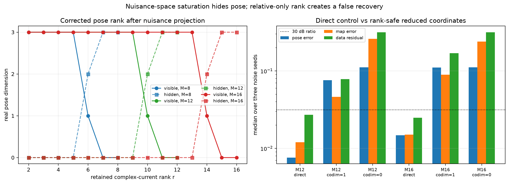

# TriSpace SOM 未知阵列自校准：最终科学审查

日期：2026-09-04  
审查者：Codex 顶层科研编排与最终科学判断  
状态：**完成初稿所需的理论、实验与纠偏；Major Revision；尚非可投稿终稿**

## 1. 结论先行

本轮确实调用了项目的 Agentic-AI-Scientist 自动科研工作流，完成三轮开发—实验—
反驳循环，并在 final development decision 中锁定。最初计划的 E1--E5 全部被尝试，
随后自动扩展到 E6--E11、多发射源/有方向源、有限差分、初始化与孔径压力测试、
hard/soft state-consistency 反例以及多种 `M,r` 组合。自动结果随后又经过独立代码
复现、敌对式科学审稿和顶层秩判定纠错。

最终判断不是“TriSpace SOM 已解决未知阵列 self calibration”，而是：

> 未知阵列几何导致的 receiver-side Green-operator tangent，只有在明确声明的
> SOM 保留电流空间和度量中才产生非空洞的等效电流坐标；该坐标自然分成最小
> 范数提升与 retained-basis leakage。保留电流和 map nuisance 的维数会对 pose
> 可见性施加一个显式障碍。所测试的 state-consistency witness 并没有恢复因此
> 隐藏的位姿方向，所以可靠的自校准还需要额外的源、频率、轨迹、锚点或先验。

这是一个可发表候选的 **有限维 identifiability/negative-result 方向**，但目前不
支持“新算法优于 direct joint inversion”或“完整 TriSpace self-calibration 已经
实现”的主张。

## 2. 自动科研流水线的实际完成情况

| 环节 | 实际完成 | 科学判定 |
|---|---|---|
| theory-first seed | 类型化 full-wave 模型、两个有限维命题、5 个反驳实验 | 完成；后实验修订已写回 theory seed |
| literature/novelty | 16 个锚点、claim ledger、邻近工作比较 | 完成有界检索；多数仅摘要/出版页级，不是全球新颖性证明 |
| autonomous development | 3 个完整 rounds，E1--E11 | 完成并锁定，不改写历史输出 |
| mechanical audit | summary 与 E1/E3 byte-for-byte 复现；公式、projector、FD、oracle 泄漏检查 | 通过，但发现报告措辞过度和 success gate 过松 |
| scientific red team | state witness、第三空间、算法收益、gauge 等逐项质疑 | Major revise，不放弃 |
| parent correction | 重算 nuisance saturation 的秩与非线性对照 | 发现并修正 `r>=M-1` 的相对阈值伪影 |
| manuscript synthesis | 论文结构、原创性防火墙、英文论文初稿、中文 GPT Pro prompt | 本目录内完成 |

自动流水线原始锁定报告仍保留在：

`../../experiments/idea_loops/loop_2026-09-04_02-58-31/final_2026-09-04_06-31-18_geometry_lifted_retained_range_som/`

顶层纠错没有覆盖这些历史文件，而是单独保存在 `validation/`，因此错误发现过程
可审计。

## 3. 模型与语义：哪些对象不能再混淆

在 world-fixed domain grid、固定均匀背景下使用 independent-current 模型

\[
y=S(x)j,
\qquad
j-D_\chi\{e(x)+D j\}=0.
\]

令 `M=I-D_chi D`，局部线性化为

\[
\delta y=S\delta j+H_Sh,
\]

\[
M\delta j-D_{E_{\rm tot}}\delta\chi-H_Dh=0.
\]

这里必须保留三组区别：

1. `H_Sh=(D_xS[h])j` 是 receiver sampling 改变对一个固定 current 的数据作用；
   把它写成电流只是 **pseudo-current/data-equivalent current**。
2. `M^{-1}H_Dh` 是 transmitter/illumination 改变所引起的真实 induced-current
   response。它已经通过 `S` 进入数据，不能再把总 pose Jacobian 一次性提升后
   重复计算。
3. world-fixed 均匀背景下 `D_xD=0`；只有 moving/body-fixed grid、变化边界或变化
   背景才允许泛写 `G_D(x)`。本实验属于前者。

本实现中的 domain 与 sensing Green matrix 没有显式乘入 `k^2`。因此代码变量
`chi` 应解释为已经吸收 `k^2` 的 **scattering potential**，而不是未经缩放的相对
介电常数。跨频率固定同一组系数不等价于固定材料介电常数；本文不作物理一致的
multifrequency material claim。

## 4. 成立的有限维结果

### 4.1 规范的 SOM 保留空间提升

给定正交保留电流基 `U`，令

\[
K_U=SU,
\qquad C_U=K_U^\dagger H_S,
\qquad Q_U=UC_U,
\qquad R_U=(I-K_UK_U^\dagger)H_S.
\]

则

\[
H_S=K_UC_U+R_U,
\qquad K_U^*R_U=0,
\qquad \operatorname{rank}(C_U)\le p.
\]

`Q_Uh` 是所声明电流度量与保留空间中的最小范数表示，`R_Uh` 是相对于
`Range(SU)` 的 leakage。它不是相对于完整 current space 的“绝对不可约残差”。

当 `S` 满行秩且 `U=I` 时，`R_U=0` 对所有 `H_S` 自动成立。因此“阵列几何变化总
能等效成某个电流变化”在常见欠定离散模型中是真的，但没有 pose identifiability
内容。这个 vacuity control 是论文必须保留的反过度主张结果。

### 4.2 数据侧 pose-hiding 维数障碍

在白化、实化后的 `m` 维数据空间中，令

\[
\mathcal N_U=
\operatorname{Range}_{\mathbb R}(\mathcal R(K_U))+
\operatorname{Range}(A_\chi),
\]

其中第一项允许 complex retained-current coefficients，第二项允许 real map
coordinates。对总 pose Jacobian `B in R^{m x p}` 定义

\[
B_{\rm vis}=(I-P_{\mathcal N_U})B,
\qquad q=\operatorname{rank}(B_{\rm vis}).
\]

则 data-hidden pose dimension 为 `p-q`，且

\[
\boxed{
\dim\ker B_{\rm vis}
\ge \max\{0,p+\dim\mathcal N_U-m\}.
}
\]

证明只需注意 `Range(B_vis)` 位于 `N_U` 的正交补，再使用 rank-nullity。该代数
本身不新，但它对未知几何下的 SOM 截断给出直接的设计约束。

本实验 `m=2M,p=3,K=3`。若 nuisance columns generic independent，则
`dim N_U=min(2M,2r+3)`：

- `r<=M-3` 只表示维数上允许三维 pose 可见，并不保证可见；
- `r=M-2` 时正交补至多一维，因此至少两维 pose 被隐藏；
- `r>=M-1` 时 nuisance range generically 填满数据空间，三维 pose 全部被隐藏。

这解释了 `M=8,12,16` 的共同结果，不需要声称一个尚未证明的特殊 Fourier/Hankel
定理。对称阵列的 Fourier mode 解释仍可作为后续结构研究，但不是当前定理前提。

### 4.3 精确 state hiding 条件仍成立，但未成为有效机制

对 `z=delta c+C_Uh`，状态方程可写成

\[
MUz-D_{E_{\rm tot}}\delta\chi-D_Uh=0,
\qquad D_U=H_D+MUC_U.
\]

若

\[
\mathcal N_D=MU\ker K_U+\operatorname{Range}(D_{E_{\rm tot}}),
\qquad T_U=(I-P_{\mathcal N_D})D_U,
\]

则有限维内，一个方向能同时被 retained current 与 real contrast 隐藏，当且仅当

\[
R_Uh=0,\qquad T_Uh=0.
\]

这个 iff 是正确的 solvability statement。然而执行实验中从未观察到 `T_Uh≈0`
成为 binding condition；它不能被写成已验证的 self-calibration mechanism。

## 5. 五组核心验证实验的裁决

| 实验 | 被检验的主张 | 执行证据 | 最终裁决 |
|---|---|---|---|
| E1 | geometry error 可等效为 current；受限提升有非零 leakage | `rank(G_S)=8/8`，unrestricted residual `5.5e-16`；`r=4` residual `0.784`；正交误差 `8.9e-18` | 完整空间等效是空洞控制；受限分解成立 |
| E2 | 未知 pose 使 SOM 坐标移动；hard cutoff 有 rank event | 简并 gap `1.4e-15`；hard projector jump `1.424`，soft `0.127` | 坐标漂移与 rank event 成立；soft filter 只稳定坐标，不自动标定 |
| E3 | receiver pseudo-current 与 transmitter physical-current 可分 | FD 呈 `O(eps^2)`；split identity 误差 `2.6e-18` | 在声明的 world-fixed 模型中成立 |
| E4 | state witness 能区分 data-hidden direction | data residual `5.3e-16`，但 state residual `0.947`、`T_U=0.733`；可见方向 `T_U` 也约 `0.674` | 只验证了 data half；state 判别机制失败 |
| E5 | reduced pose coordinates 能实现更好的 self-calibration | 满可见秩时只是重参数化；隐藏时会冻结 pose；半圆存在伪极小 | 不是算法优势；只能作为诊断/限制实验 |

### 5.1 顶层纠错后的高秩结果

旧程序用 `s_i > 1e-8 s_1` 判定 `P_perp B` 的 rank。当 `P_perp≈0` 时，三个奇异值
都只有 `1e-18`，但相互比值仍可能正常，于是被误判为 rank 3。正确规则首先检查
nuisance rank/codimension；codimension 为零时，visible rank 必须严格为零。

纠正后：

| M | 关键 retained rank | nuisance codim | visible / hidden pose rank |
|---:|---:|---:|---:|
| 8 | `r=5,6,7` | `3,1,0` | `3/0, 1/2, 0/3` |
| 12 | `r=9,10,11` | `3,1,0` | `3/0, 1/2, 0/3` |
| 16 | `r=13,14,15` | `3,1,0` | `3/0, 1/2, 0/3` |

三 seed 非线性 control：

| setting | method | median pose error | median map error | median data residual |
|---|---|---:|---:|---:|
| M12 | direct | 0.00761 | 0.0121 | 0.0271 |
| M12 | `r=10`, codim 1 | 0.0759 | 0.0463 | 0.0787 |
| M12 | `r=11`, saturated | 0.1118 | 0.2598 | 0.3169 |
| M16 | direct | 0.0148 | 0.0150 | 0.0249 |
| M16 | `r=14`, codim 1 | 0.1110 | 0.0895 | 0.1694 |
| M16 | `r=15`, saturated | 0.1118 | 0.2403 | 0.3154 |

所有这些坏解仍可能返回 `3/3 success`，再次说明优化器停止状态不等于科学成功。

### 5.2 扩展实验的有效信息

- 多发射源的结果支持 **source-model rank deficiency removal**。L=1 isotropic
  monopole 的 orientation 是 null；L=2/L=3 或 directional source 使局部 rank
  变为 3。它没有消除全局 map--pose SE(2) gauge。
- 240 个 robustness runs 的 stored gate 全部返回 positive status，但该 gate 比严格
  optimality/residual acceptance 更松；论文只报告具体误差与 SNR 趋势，不使用
  “240/240 科学成功”。
- half-circle 中 `known_alpha` 三个 seeds 都收敛到 pose error 约 `0.86` 的伪极小；
  一个 `reduced_r6` seed 到达 `1.2867`。局部 basin 风险必须出现在正文而非脚注。
- hard state equality 在两个 nominal seeds 失败；soft VP 虽把一部分 hidden error
  降低，却产生 map error `0.838`、discarded-current fraction `0.87` 和 full-physics
  residual 约 `0.83`。它是 biased model fit，不是恢复。

## 6. 哪些是前人工作的车轱辘话

以下内容不能作为原创贡献：

- equivalent source/current、contrast source、Lippmann--Schwinger；
- Chen SOM、Zhong--Chen Twofold SOM 及 current-space SVD；
- “未知 `G` 会改变子空间”；
- joint map/pose、alternating optimization、Gauss--Newton、LM、variable
  projection、Schur complement、Woodbury；
- blind calibration、gain/phase self-calibration、radar/SAR autofocus；
- source/receiver extension FWI；
- CSI/CC-CSI 同时使用 data/state residual；
- 多频、多视角、多轨迹通常有帮助；
- 用实测 incident field、multipole expansion 和 phase-center correction 预先修正
  发射场与 Green operator。Bellomo 等 2014 已明确做过该类天线标定。

简单地把这些词重新组合并命名为 “TriSpace” 不产生科研价值。

## 7. 检索范围内真正保留下来的原创候选

### 7.1 强候选

1. 在 SOM retained-current coordinates 中，对 receiver-side pose tangent 给出
   canonical lift/leakage，同时显式揭示 unrestricted equivalence 的 vacuity。
2. 把 receiver pseudo-current 与 transmitter-induced physical-current response
   类型化分开，并明确 double-counting failure mode。
3. 对 retained-current + real-map nuisance 给出 pose-hiding dimension obstruction，
   并用饱和秩纠错与 nonlinear controls 验证其后果。
4. 公开 state witness 与隐藏方向恢复失败的负证据，而不是删除失败实验。

### 7.2 只可作为组织语言

`TriSpace` 可以保留为项目名和 `(Q_Uh,R_Uh,D_Uh)` 的 typed graph，但不能声称
`V_P=Range(Q_U)` 与 `V_S,V_D` 是三个平级、可交换投影的空间。`V_P` 只是
`Range(U)` 内维数不超过 pose dimension 的 scene-dependent tangent。

### 7.3 仍需全文检索才能定稿

当前有界检索没有发现“retained-SOM canonical lift + leakage + physical/pseudo
split + nuisance dimension bound”的完全相同组合，但相邻工作非常近：

- Huang--Nammour--Symes、Métivier--Brossier 和 da Silva 等的 source/receiver
  extension FWI；
- Bellomo 等的 microwave diffraction tomography antenna calibration；
- Li--Lee--Bresler 的 bilinear identifiability up to transformation groups；
- joint inverse scattering + transmitter localization；
- classical SOM/TSOM、CC-CSI 与 virtual experiments。

所以只能写 “not found in the screened set”，不能写 “first” 或 “no prior work”。

## 8. 可实现算法：论文中应给出的安全版本

当前可实施、不会制造虚假恢复主张的版本如下。

### 输入

- 初始 pose `x_0`、map/contrast `chi_0`；
- 多源/多频/多帧 complex measurements 与 noise covariance；
- gauge anchors 或明确的 quotient convention；
- retained-rank 或 soft spectral filter policy。

### 每轮更新

1. 用当前 `x_k,chi_k` 构造 `S(x_k)`、illumination、current 与 full-wave residual。
2. 对白化后的 `S(x_k)` 更新 SOM retained projector；在 fixed-rank stratum 上用
   Procrustes/projector 跟踪，而不是比较任意 singular-vector 符号。
3. 计算 `Q_U,R_U`，记录 retained leakage、lift norm、smallest retained singular
   value 与 rank-event 指示。它们是诊断，不是 pose recovery 本身。
4. 形成 map/current nuisance range 与 projected pose Jacobian
   `B_vis=P_Nperp B`。用 absolute + relative + backward-error 阈值判秩；nuisance
   饱和时 visible rank 强制为零。
5. 若 stacked `B_vis` 满秩且条件数可接受，执行 direct joint GN/LM，或在完全等价
   的 Schur/Woodbury `p x p` 核心中更新 pose。
6. 若 rank deficient，不把 hidden components 冻结后宣称恢复；改为加入独立
   transmitter、directionality、frequency/frame、external anchor 或 pose prior。
7. 接受 step 时同时检查 full-physics data residual、state residual、parameter step、
   trust-region ratio 与 rank stability；optimizer `status>0` 不是 acceptance gate。

这一路线与用户原有的 map--pose data-tangent `A/B` 分析可以组合，但只能在共同
joint Jacobian 中组合：Chen `G_S` 的 current right-singular space、map tangent
`Range(A)` 和 pose tangent `Range(B)` 是不同类型的对象，不能直接等同。

## 9. 当前论文接受边界

### 已达到

- 有完整、可执行的 2D scalar Helmholtz 验证代码；
- 解析/有限差分、独立复现和输出一致性检查；
- 五个规划实验全部尝试，并保留扩展与失败结果；
- 三个有限维结论及其适用条件；
- 原创性防火墙和明确的 prior-art 边界；
- 一份可继续修改的论文初稿。

### 未达到

- 特定 Chen/Zhong 版本的 Twofold SOM domain fold 全文核验与实现；
- continuum closed-range/regularized lifting theorem；
- stacked multi-frame/multifrequency 的充分 identifiability theorem；
- global basin 或大位姿误差 convergence；
- 3D Maxwell、mutual coupling、clock/phase-center drift、unknown background；
- measured hardware data；
- 全文级 exhaustive novelty review；
- 优于 direct joint inversion 的 runtime/accuracy/basin 证据。

因此当前交付是 **可信论文初稿**，不是 **投稿验收通过**。

## 10. 建议下一阶段只做三件最值钱的事

1. 证明或反驳多帧/多源堆叠后
   `rank(P_Nperp B_stack)=p-gauge_dim` 的可设计充分条件，并把 acquisition design
   直接写成最大化最小非零奇异值的问题。
2. 回到 Zhong--Chen 原文，确定实际 Twofold domain fold，在同一 typed 模型里
   实现后再决定是否让 “TriSpace SOM” 进入论文标题。
3. 用 high-fidelity 3D Maxwell 或至少含 phase-center/mutual-coupling 的合成数据
   重跑最小实验集；若 state witness 仍失败，就把论文定稿为 identifiability/
   cautionary contribution，不再追逐一个没有证据的 state-recovery 机制。
