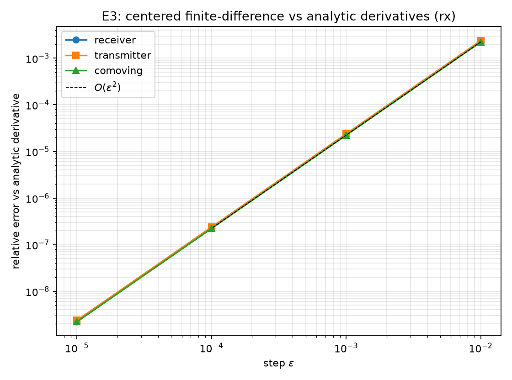
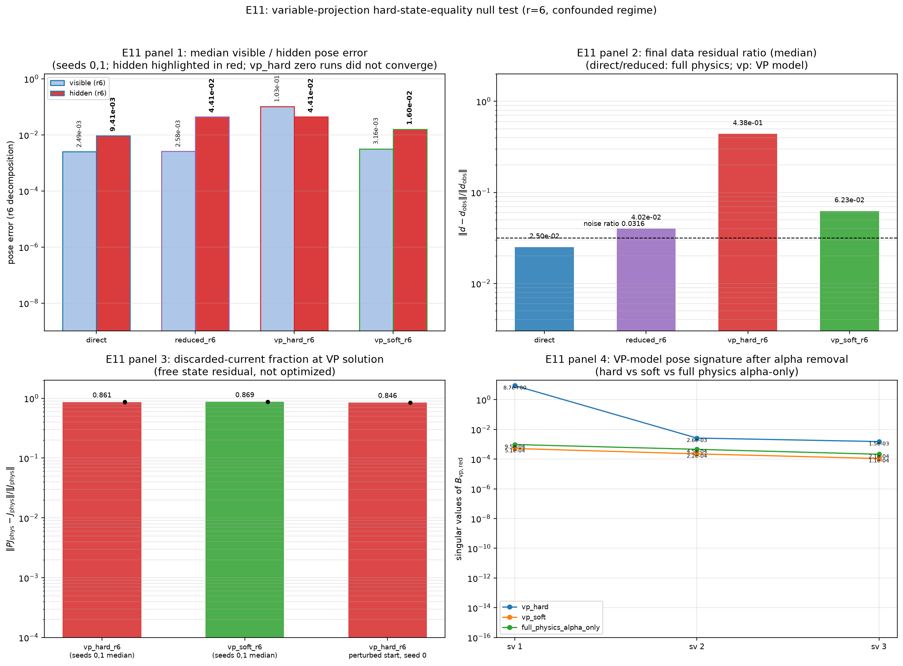
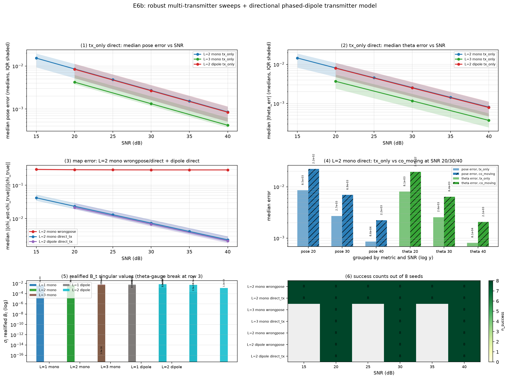

# [Archived pre-correction draft] Geometry-Lifted SOM under Unknown Array Geometry: Canonical Equivalent-Current Coordinates, Pose-Hiding Bounds, and Limits of Self-Calibration

**Working paper draft — 4 September 2026**  
**Scientific status:** finite-dimensional theory and deterministic synthetic
validation; major revision required before submission.

## Abstract

Subspace optimization methods (SOM) for nonlinear inverse scattering normally
assume that the antenna geometry, incident field, and Green operators are
known. If the array pose is uncertain, the operator used to define the SOM
coordinates is itself uncertain. A tempting response is to absorb the
geometry error into an equivalent induced-current perturbation. We show why
this statement is generally vacuous in an unrestricted, underdetermined
discretization: a full-row-rank current-to-data operator can reproduce every
single-snapshot data perturbation. We instead declare a retained SOM current
space and decompose the receiver-side geometry tangent into a canonical
minimum-norm retained-current lift and an orthogonal retained-basis leakage.
For a world-fixed homogeneous background, we distinguish this pseudo-current
from the physical induced-current change caused by transmitter motion, thereby
avoiding double counting in the joint data/state linearization.

After whitening and realification, we derive a local dimension obstruction for
self-calibration. If the retained-current and map nuisance range has dimension
`d_N` in an `m`-dimensional real data space and the pose has `p` coordinates,
then at least `max(0,p+d_N-m)` pose directions are data-hidden. In the tested
model (`m=2M`, three real map coordinates), retaining `r=M-2` complex current
modes necessarily hides at least two of three pose coordinates under generic
nuisance rank, while `r>=M-1` saturates the data space and hides all three.

Deterministic 2D scalar Helmholtz experiments verify the lift identity,
receiver/transmitter derivative split, spectral-coordinate drift, and the
dimension bound. They also produce two negative results. First, a proposed
full-wave state-consistency witness does not distinguish accurate from
inaccurate pose estimates in the tested regimes. Second, a solver restricted
to the data-visible pose coordinates either reparameterizes the direct joint
objective or freezes hidden coordinates; it does not recover them. Multiple
or directional transmitters remove a source-symmetry rank deficiency but do
not remove the global map--pose gauge. The resulting TriSpace SOM framework is
therefore a typed diagnostic and acquisition-design theory—current lift, data
leakage, and state defect—not a claim of universally solved self-calibration.

**Keywords:** inverse scattering; subspace optimization method; self-calibration;
unknown antenna geometry; equivalent current; identifiability; nuisance
subspace; full-wave imaging.

## 1. Introduction

Full-wave inverse scattering seeks material properties from fields generated
and measured by an antenna system. The forward map depends not only on the
unknown material but also on the transmitter and receiver coordinates,
phase centers, incident fields, and background Green function. In practice,
these quantities are never exact. Even a low-dimensional rigid displacement
of an array changes both the sensing operator and, when the transmitter moves,
the illumination that induces the unknown current.

Classical SOM makes the nonlinear problem more tractable by decomposing the
induced current using the singular structure of the current-to-data operator
[Chen, 2010](https://doi.org/10.1109/TGRS.2009.2025122). Twofold SOM adds a
second current-space reduction associated with domain/state information
[Zhong and Chen, 2009](https://doi.org/10.1088/0266-5611/25/8/085003).
Both constructions presume that the operators defining those coordinates are
known. Unknown geometry therefore creates a more fundamental problem than an
extra optimization variable: it moves the coordinate system used by the
inversion.

The motivating idea of this work is that a Green-operator perturbation might
be represented as an equivalent induced-current perturbation. That idea is
physically appealing but mathematically insufficient. If a discretized
current-to-data operator has full row rank, every data perturbation has such a
representation. Existence then says nothing about geometry, identifiability,
or calibration. Moreover, receiver motion and transmitter motion have
different semantics. Receiver motion changes how a fixed current is sampled;
transmitter motion changes the incident field and hence the physical current.
Lifting both mechanisms indiscriminately can count the same pose effect twice.

This paper studies a narrower question: what remains of the equivalent-current
idea after the admissible current space, metric, and full-wave state equation
are specified? We call the resulting organization *TriSpace SOM* as a project
framework, but not as a third independent spectral decomposition. Its object
is the typed pose signature

\[
h\longmapsto (Q_Uh,R_Uh,D_Uh),
\]

whose coordinates live respectively in retained current space, measurement
space, and state-residual space.

The contributions are intentionally bounded.

1. We give a model-conditional split between receiver re-sampling and
   transmitter-induced physical-current variation on a world-fixed grid and
   state the double-counting failure mode.
2. We define a canonical retained-SOM lift and orthogonal retained-basis
   leakage. We use the unrestricted full-row-rank case as a negative control
   rather than as a success claim.
3. We derive a finite-dimensional dimension obstruction for local pose
   visibility after retained-current and real-map nuisance variations are
   eliminated.
4. We report both positive and negative numerical evidence. Pose-dependent
   coordinate drift and source-diversity rank recovery are supported, whereas
   the tested state-consistency witness and hidden-direction recovery are not.

The algebraic projectors and pseudoinverses used below are standard. The
scientific content lies in their typed coupling to the full-wave current model,
the boundary between physical and pseudo-current effects, the explicit
self-calibration obstruction, and the negative evidence against an apparently
natural state-residual remedy.

Our claims are local and finite-dimensional. The experiments are deterministic
synthetic 2D scalar Helmholtz studies, not hardware calibration, 3D Maxwell
validation, a continuum theorem, or a global convergence result.

## 2. Related work and originality firewall

### 2.1 Contrast currents and SOM

Equivalent sources and contrast currents are classical devices for rewriting
nonlinear scattering. SOM separates a data-determined current component from a
complementary component using the SVD of the fixed sensing operator. Twofold
SOM adds domain-side current information, while contrast-source inversion and
cross-correlated CSI combine data and state residuals; none of those generic
ideas is claimed here. The experiments in this paper implement a truncated SOM
sensing basis. We do not call that implementation Twofold SOM because the
exact domain fold must be fixed to a specific source and discretization before
it can be reproduced without ambiguity.

Virtual-source and virtual-antenna methods also manipulate measurements or
contrast sources to obtain more favorable imaging conditions; see, for
example, [Bevacqua et al., 2015](https://doi.org/10.1109/TAP.2014.2382114)
and [Zhang et al., 2024](https://doi.org/10.1109/TMTT.2024.3385996). These
methods motivate acquisition diversity but do not by themselves identify an
unknown pose-dependent SOM operator.

### 2.2 Antenna and microwave-system calibration

Calibration of microwave imaging systems is established prior art. Bellomo
et al. used measured incident fields and multipolar expansions to correct both
the incident field and data-equation Green operator, including phase-center
effects, for microwave diffraction tomography
([Bellomo et al., 2014](https://doi.org/10.1109/TAP.2014.2308534)). Two-port
error models and data-driven calibration also correct measurement-chain errors
before inversion; see [Cathers et al., 2023](https://doi.org/10.1109/OJAP.2023.3329356)
and [Hanabusa et al., 2022](https://doi.org/10.1109/LGRS.2022.3169799).
Consequently, “calibrate the Green operator and then invert” is not new. Our
narrower object is a joint local pose tangent expressed in retained SOM
current coordinates, together with an explicit hiding bound.

### 2.3 Joint geometry inversion, blind calibration, and autofocus

Joint scene and calibration estimation appears in inverse scattering,
blind gain/phase calibration, and radar/SAR autofocus. Simultaneous inverse-
scattering reconstruction and transmitter localization has been studied
directly [Karthik and Ghosh, 2023](https://doi.org/10.1109/PIERS59004.2023.10221374).
Generic bilinear identifiability up to transformation groups is treated by
[Li, Lee, and Bresler, 2017](https://doi.org/10.1109/TIT.2016.2637933).
Adding pose variables to an optimizer, alternating map and calibration steps,
and quotienting a gauge are therefore antecedents, not contributions.

### 2.4 Source/receiver-extension FWI

The closest conceptual genus is source/receiver extension in full-waveform
inversion. Huang, Nammour, and Symes introduce source-receiver extensions to
mitigate model error [2017](https://doi.org/10.1190/geo2016-0301.1);
Métivier and Brossier develop a receiver-relocalization strategy
[2021](https://doi.org/10.1190/geo2020-0922.1); and da Silva et al. treat
receiver-coordinate inaccuracies
[2023](https://doi.org/10.3997/2214-4609.2023101497). Geometry degrees of
freedom that absorb wave-equation data misfit are thus prior art. Within our
bounded search, we did not find the exact combination of a retained-SOM
current lift, retained-basis leakage, receiver/transmitter current semantics,
and a nuisance-dimension pose-hiding bound. This is a retrieval-bounded
statement, not evidence of literature-wide absence.

### 2.5 Boundary of the claimed increment

| Ingredient | Prior art or generic tool | Role here |
|---|---|---|
| equivalent/contrast current | classical | forward-variable representation |
| SOM/Twofold SOM | established | retained current coordinates |
| joint map and pose inversion | established | comparison and implementation |
| pseudoinverse/projector/Schur complement | textbook | analysis tools |
| source/receiver extension | established | closest geometry-nuisance genus |
| data plus state residual | established in CSI families | tested diagnostic, negative result |
| retained-SOM pose lift plus leakage | not found in screened set | bounded formulation candidate |
| pseudo-current/physical-current split | not found in same organization | model-semantic candidate |
| nuisance-dimension pose-hiding bound specialized to retained SOM | not found in screened set | main theoretical candidate |

## 3. Typed full-wave model

### 3.1 Independent-current equations

Let `j in C^n` denote the induced or contrast current, `chi in R^N` the real
scattering-potential parameters, and `x in R^p` the array pose. At a nominal
pose, write

\[
y=S(x)j,
\tag{1}
\]

\[
\Phi(j,\chi,x)
=j-D_\chi\{e(x)+D(x)j\}=0.
\tag{2}
\]

Here `S=G_S` maps current to receiver data, `D=G_D` propagates current inside
the imaging domain, `e` is the incident field, and `D_chi` denotes pointwise
multiplication by the contrast. Define

\[
M=I-D_\chi D,
\qquad E_{\rm tot}=e+Dj.
\]

For current, contrast, and real pose perturbations `(delta j,delta chi,h)`,

\[
\delta y=S\delta j+H_Sh,
\qquad H_Sh=(D_xS[h])j,
\tag{3}
\]

\[
M\delta j-D_{E_{\rm tot}}\delta\chi-H_Dh=0,
\tag{4}
\]

\[
H_Dh=D_\chi\{D_xe[h]+D_xD[h]j\}.
\tag{5}
\]

Equations (3)--(5) are the central semantic split. `H_Sh` changes receiver
sampling of a fixed current. A current used to reproduce it is a pseudo-current.
By contrast, when `M` is invertible, `M^{-1}H_Dh` is the physical current change
caused by the perturbed illumination or internal propagator.

On the world-fixed grid used in the experiments, with a fixed homogeneous
background and external antennas, `D_xD=0`. Moving receivers changes `S`;
moving transmitters changes `e`; neither changes the domain-to-domain Green
matrix. A body-fixed grid, moving boundary, or varying background is a different
model and can have `D_xD != 0`.

Eliminating the current at fixed contrast gives the total pose Jacobian

\[
Bh=H_Sh+SM^{-1}H_Dh.
\tag{6}
\]

Lifting all of `Bh` through `S^dagger` mixes physical-current response with
receiver pseudo-current. Our construction lifts `H_S` only and retains `H_D`
in the state equation.

### 3.2 Whitening, realification, and gauges

Let `W` whiten the complex data according to the noise covariance. All ranks
and orthogonal projectors below are computed after whitening. For a complex
matrix multiplying complex coefficients we use the block realification

\[
\mathcal R(A)=
\begin{bmatrix}
\Re A&-\Im A\\
\Im A& \Re A
\end{bmatrix},
\]

whereas a complex Jacobian multiplying real pose or contrast coefficients is
embedded by vertically stacking its real and imaginary parts. This distinction
prevents the real nuisance space from being silently enlarged to a complex one.

Identifiability is always understood after removing declared gauges. In a
joint map--pose model, a global rigid transformation can be traded between the
map and platform coordinates unless an external frame or anchor is fixed.
Adding more measurements of the same unanchored physical system does not
remove that global gauge.

### 3.3 Numerical normalization

The experimental Green matrices use the 2D kernel `(i/4)H_0^(1)(k r)` with
pixel-area quadrature. They do not carry an additional explicit `k^2` factor.
Accordingly, the numerical variable called `chi` is interpreted as a
scattering potential that has absorbed the required frequency scaling, not as
an unscaled relative permittivity. Results across different `k` values are
operator-sensitivity tests, not a fixed-material multifrequency experiment.

## 4. Canonical retained-current lifting

Let `U in C^{n x r}` have orthonormal columns spanning a declared retained
current space. In the present experiments, `U` contains the first `r` right
singular vectors of the nominal `S`. Set

\[
K_U=SU,
\qquad C_U=K_U^\dagger H_S,
\qquad Q_U=UC_U,
\qquad R_U=(I-K_UK_U^\dagger)H_S.
\tag{7}
\]

### Proposition 1: retained lift and leakage

For every `H_S` in finite dimensions,

\[
H_S=K_UC_U+R_U,
\qquad K_U^*R_U=0,
\qquad \operatorname{rank}C_U\le p.
\tag{8}
\]

For each pose direction `h`, `C_Uh` is the unique minimum-Euclidean-norm
coefficient minimizing `||K_Uc-H_Sh||_2`, and `Q_Uh` is the corresponding
minimum-current-norm representative inside `Range(U)`.

**Proof.** `K_UK_U^dagger` is the orthogonal projector onto `Range(K_U)`.
Equation (8), orthogonality, the minimum-norm property, and the rank bound
follow from the Moore--Penrose identities. `square`

Exact retained representation holds if and only if

\[
\operatorname{Range}(H_S)\subseteq\operatorname{Range}(K_U),
\quad\text{equivalently}\quad R_U=0.
\tag{9}
\]

If the unrestricted `S` is full row rank and `U=I`, then `R_U=0` for every
geometry tangent. Thus unrestricted equivalent-current existence is a vacuous
identifiability statement in the common underdetermined single-snapshot case.

If `S=U_S Sigma V_S^*` and `U=V_r`, then

\[
Q_r=V_r\Sigma_r^{-1}U_r^*H_S,
\qquad R_r=(I-U_rU_r^*)H_S,
\tag{10}
\]

and

\[
\|Q_r\|\le \frac{\|H_S\|}{\sigma_r(S)}.
\tag{11}
\]

Weak retained singular modes can therefore produce a large pseudo-current.
Any implementation must declare a metric, cutoff or regularizer, and policy
for singular-value crossings.

The pose-equivalent current tangent

\[
\mathcal V_P^{(U)}=\operatorname{Range}(Q_U)
\subseteq\operatorname{Range}(U),
\qquad \dim\mathcal V_P^{(U)}\le p,
\tag{12}
\]

is subordinate to the retained current space. It depends on the scene current,
pose, whitening, current norm, basis, and regularization. We do not treat it as
a third standing spectral space.

### 4.1 Three different residual notions

The term “irreducible residual” is ambiguous unless its range is declared.
We distinguish:

\[
r_S=(I-SS^\dagger)H_Sh,
\]

the component outside the complete sensing range;

\[
r_{\rm SOM}=R_Uh=(I-P_{\operatorname{Range}(SU)})H_Sh,
\]

the retained-basis leakage; and

\[
r_{\rm Schur}=(I-P_{\mathcal N})Bh,
\]

the pose component remaining after declared map/current nuisance variations.
In a finite full-row-rank sensing problem, `r_S=0` identically, while
`r_SOM` and `r_Schur` can remain nonzero and scientifically informative.

## 5. Pose hiding and the TriSpace graph

### 5.1 State-consistent graph

Write a retained current perturbation as `delta j=U delta c` and define
`z=delta c+C_Uh`. Equations (3)--(4) become

\[
\delta y=K_Uz+R_Uh,
\tag{13}
\]

\[
MUz-D_{E_{\rm tot}}\delta\chi-D_Uh=0,
\qquad D_U=H_D+MUC_U.
\tag{14}
\]

This yields the typed TriSpace pose graph

\[
\Gamma_P^{(U)}=
\{(Q_Uh,R_Uh,D_Uh):h\in\mathbb R^p\}.
\tag{15}
\]

Its coordinates belong to different ambient spaces and are coupled through
the same pose direction. Equation (15) is bookkeeping with physical semantics,
not a `2^3` decomposition generated by three commuting projectors.

Let

\[
\mathcal N_D=MU\ker(K_U)+\operatorname{Range}(D_{E_{\rm tot}}),
\qquad T_U=(I-P_{\mathcal N_D})D_U.
\tag{16}
\]

### Proposition 2: exact joint hiding condition

A pose direction can be hidden to first order by retained current and real
contrast variations while satisfying both the data and state linearizations
if and only if

\[
R_Uh=0,
\qquad T_Uh=0.
\tag{17}
\]

**Proof.** Because `Range(R_U)` is orthogonal to `Range(K_U)`, zero data
variation in (13) requires `R_Uh=0` and `z in ker(K_U)`. Equation (14) is then
solvable in `(z,delta chi)` precisely when `D_Uh` lies in `N_D`, equivalently
when `T_Uh=0`. `square`

Proposition 2 is a solvability criterion, not a convergence theorem. In the
experiments, the state condition never became a useful discriminator. We keep
the proposition because it states exactly what would have to happen; we report
the non-binding state channel as a negative result.

### 5.2 Data-side dimension obstruction

Work in the whitened, realified data space `Y_R` with dimension `m`. Let

\[
\mathcal N_U=
\operatorname{Range}_{\mathbb R}\!\left(\mathcal R(K_U)\right)
+\operatorname{Range}(A_\chi)
\tag{18}
\]

be the nuisance range generated by complex retained-current coefficients and
real map coefficients. For the total real pose Jacobian `B in R^{m x p}`,
define

\[
B_{\rm vis}=(I-P_{\mathcal N_U})B,
\qquad q=\operatorname{rank}(B_{\rm vis}).
\tag{19}
\]

The data-hidden pose directions form `ker B_vis`.

### Proposition 3: nuisance-dimension lower bound

\[
\dim\ker B_{\rm vis}
\ge
\max\{0,p+\dim\mathcal N_U-m\}.
\tag{20}
\]

**Proof.** The range of `B_vis` lies in `N_U^perp`, so
`q<=m-dim N_U`. Rank--nullity gives
`dim ker B_vis=p-q>=p+dim N_U-m`; nonnegativity completes the bound.
`square`

For `M` complex receiver measurements, `m=2M`. If `r` complex current
coefficients and `K` real map coefficients generate independent nuisance
columns up to saturation, then

\[
\dim\mathcal N_U=\min(2M,2r+K).
\tag{21}
\]

In the experiments, `p=3` and `K=3`. Hence `r<=M-3` permits but does not
guarantee three visible pose directions; `r=M-2` leaves at most one visible
direction; and `r>=M-1` generically hides all three. This is a data-dimension
obstruction, not a claim about a particular circular Fourier mode.

### 5.3 Relation to the map--pose data-tangent branch

The project also uses the local map form

\[
\delta y=A\delta\chi+Bh.
\tag{22}
\]

After whitening and gauge removal, orthonormal bases `Q_A,Q_B` for
`Range(A),Range(B)` give the principal-angle matrix

\[
Z=Q_A^TQ_B,
\]

and the Schur information for pose is proportional to

\[
K_{\rm eff}=B^T(I-P_A)B.
\tag{23}
\]

This *P-fold* map--pose overlap is a data-space object. Chen SOM right singular
vectors are current-space objects. They are connected through the full
linearized physics, but they are not the same subspace and must not be assigned
a direct Grassmann distance without a type-correct push-forward or pull-back.
Equations (18)--(23) provide the legitimate meeting point: a joint nuisance
range in the common real data space.

## 6. Rank-aware self-calibration procedure

The numerical results do not justify a hidden-direction recovery algorithm.
They do justify a diagnostic and acquisition-aware implementation around a
direct joint full-wave solve.

**Algorithm 1: rank-aware geometry-lifted SOM diagnosis and update**

**Input:** measurements and noise covariance; initial map `chi_0` and pose
`x_0`; source/receiver configuration; retained-rank or soft-filter policy;
gauge anchors or a quotient convention.

For iteration `k=0,1,...`:

1. Construct `S(x_k)`, `e(x_k)`, the current, and full data/state residuals.
2. Whiten the data and compute or update the retained SOM projector. Align
   fixed-rank projectors across iterations; near a rank event, use a continuous
   spectral filter or restart the local model.
3. Compute `Q_U`, `R_U`, the retained singular gap, and the lift norm. Treat
   them as diagnostics of coordinate adequacy.
4. Build the real nuisance range and `B_vis`. Determine numerical rank using
   relative and backward-error-scaled absolute thresholds. If the nuisance
   range fills the data space, set the visible rank to zero exactly rather than
   ranking roundoff.
5. If the *stacked* projected pose Jacobian is well-conditioned after gauge
   removal, compute a direct joint GN/LM step. An exact Schur or Woodbury
   reduction to a `p x p` pose core is allowed because it preserves the same
   objective.
6. If visible rank or its smallest significant singular value is insufficient,
   do not freeze the hidden coordinates and call the result self-calibration.
   Add an anchor or prior, or redesign the acquisition by changing transmitter
   diversity, directionality, frequency, frame, aperture, or trajectory.
7. Accept a step only after checking the full-physics residual, state residual,
   trust-region ratio, parameter change, and rank stability. A positive
   optimizer status alone is not a recovery certificate.

This procedure can be combined with a verified Twofold SOM current reduction,
but the executed Phase-I code uses only a truncated sensing-SOM basis.

For acquisition design, a natural local score is

\[
\mathcal J_{\rm design}
=\sigma_{\min,+}\!\left(
\begin{bmatrix}
P_{\mathcal N_1^\perp}B_1\\
\vdots\\
P_{\mathcal N_L^\perp}B_L
\end{bmatrix}
\right),
\tag{24}
\]

after consistent whitening and gauge projection. Maximizing the smallest
nonzero singular value is a design hypothesis, not yet a proved global
criterion.

## 7. Numerical study

### 7.1 Setup and reproducibility

The experiments solve a 2D scalar Helmholtz Lippmann--Schwinger model on a
world-fixed square `[-0.5,0.5]^2`. The main nonlinear studies use a `16 x 16`
pixel grid, a three-dimensional real Gaussian contrast basis, `M=8,12,16`
receivers on full or limited circular arcs, receiver radius `1.6`, transmitter
radius `2.0`, and wavenumbers `k=8,12,16`. The true pose is
`(0.08,-0.06,0.05)` and the nominal pose is zero. Unless otherwise stated,
complex noise has an exact norm ratio of `10^{-30/20}` relative to the noiseless
data, with deterministic seeds `0,1,2`.

The full loop attempted the five planned falsification groups and then added
multi-transmitter, grid/scene, rank-saturation, state-penalty, and variable-
projection controls. The summary generator and the E1/E3 core were independently
rerun byte-for-byte. No ground-truth leakage was found outside observation
generation, error evaluation, and explicitly named oracle baselines.

The stored success predicate in part of the robustness sweep is effectively
`scipy status>0`; it is reported only as an optimizer stop count. Scientific
interpretation uses parameter error and residuals.

### 7.2 E1: vacuity and retained-basis leakage

For the canonical `M=8` case, `S` has numerical rank `8/8`. The unrestricted
current lift reproduces a receiver-pose perturbation with relative residual
`5.5 x 10^{-16}`. This verifies the vacuity prediction: the complete current
space can absorb every data direction. With four retained singular modes, the
relative leakage is `0.784`, and the normalized `K_U^*R_U` orthogonality error
is `8.9 x 10^{-18}`. Across the settings sweep, retained-rank leakage remains
large (`0.474--0.864` for `r=4` and `0.354--0.686` for `r=6`).

The result supports the decomposition but not pose recovery. A nonzero
`R_U` says that a declared current coordinate system cannot absorb the entire
receiver tangent; it does not by itself identify the pose in a nonlinear joint
problem.

### 7.3 E2: pose-dependent SOM coordinates and rank events

Analytic perturbations of the antenna geometry change the retained projector.
At a singular-value degeneracy, the hard rank cutoff produced a projector jump
of `1.424`, whereas a soft spectral filter reduced the corresponding change to
`0.127`. A representative gap at the crossing was `1.4 x 10^{-15}`.

This verifies that unknown `G` creates a moving-coordinate problem and that
hard rank selection can be unstable. The soft filter is a coordinate-stability
device; no reconstruction advantage is inferred from this experiment.

### 7.4 E3: pseudo-current versus physical current

Receiver-only, transmitter-only, and co-moving analytic derivatives were
checked by centered finite differences over step sizes `10^{-2}` to `10^{-5}`.
Errors followed the expected second-order regime before roundoff, and the
decomposition of the total pose tangent into receiver re-sampling plus
transmitter-induced physical-current response held to `2.6 x 10^{-18}` in the
reported identity check.

This is evidence for the typed model in Section 3, not for every coordinate or
hardware convention.

### 7.5 E4: data-side hiding and the state-witness null

A constructed direction satisfies the data-side cancellation to
`5.3 x 10^{-16}` relative to the declared nuisance range. Its state-space
residual is nevertheless `0.947`, and its normalized `T_U` score is `0.733`.
A data-visible direction has a leakage score of `0.131` but a similar `T_U`
score near `0.674`. Across nonlinear estimators, accurate and inaccurate pose
solutions both produce `T_U` values roughly in `0.81--0.89`.

Thus the experiment verifies only the data half of Proposition 2. The tested
state witness is non-discriminating. Later hard equality, scalar penalty, and
exact variable-projection variants do not repair this failure. The hard model
stalls at the degenerate singular-value cut or reaches a distant minimum. The
soft variable-projection model reduces one hidden-coordinate error but has
median map error `0.838`, discarded-current fraction `0.87`, and full-physics
data residual around `0.83`; it fits a biased reduced model rather than
recovering the physical solution.

### 7.6 E5: corrected rank saturation and nonlinear controls

The locked autonomous report initially ranked `B_vis` only relative to its
largest singular value. When the nuisance range fills the real data space,
`P_Nperp` is numerically of order `10^{-15}` and all singular values of
`B_vis` are roundoff-sized. A relative-only rule can then return rank three.
The parent audit first determines the nuisance rank and codimension; a zero
codimension implies visible rank zero exactly.

The corrected transition is:

| M | last rank with possible full visibility | `r=M-2` | `r>=M-1` |
|---:|---:|---:|---:|
| 8 | `r=5`: visible 3, hidden 0 | `r=6`: visible 1, hidden 2 | visible 0, hidden 3 |
| 12 | `r=9`: visible 3, hidden 0 | `r=10`: visible 1, hidden 2 | visible 0, hidden 3 |
| 16 | `r=13`: visible 3, hidden 0 | `r=14`: visible 1, hidden 2 | visible 0, hidden 3 |

The corresponding three-seed nonlinear medians are:

| setting | method | pose error | map error | data residual |
|---|---|---:|---:|---:|
| M12 | direct joint | 0.00761 | 0.0121 | 0.0271 |
| M12 | restricted, `r=10` | 0.0759 | 0.0463 | 0.0787 |
| M12 | saturated, `r=11` | 0.1118 | 0.2598 | 0.3169 |
| M16 | direct joint | 0.0148 | 0.0150 | 0.0249 |
| M16 | restricted, `r=14` | 0.1110 | 0.0895 | 0.1694 |
| M16 | saturated, `r=15` | 0.1118 | 0.2403 | 0.3154 |

All rows report `3/3` positive solver stops. The poor restricted solutions are
therefore a scientific failure despite nominal convergence. When the visible
pose rank is three, the tested “reduced” solver is an orthogonal
reparameterization of the same map-plus-pose objective; agreement with direct
joint inversion is expected and is only an implementation consistency check.
When the rank is smaller, the parameterization freezes the complementary pose
directions by construction.

Limited aperture creates an additional nonlinear problem. In the half-circle
case, the known-map pose-only oracle converges for all three seeds but reaches
pose errors around `0.86` with residual ratios `0.266--0.278`, far above the
noise ratio `0.0316`. One restricted seed reaches pose error `1.2867` despite a
small optimizer optimality value. Local stationarity is not global recovery.

### 7.7 Source diversity

For a single isotropic point transmitter, rotation about the point-source
center is a null coordinate and the transmitter-pose Jacobian has rank two.
Two or three spatially separated transmitters produce rank three. A single
phased-dipole model also reaches rank three, but weakly: its third
column-normalized real singular value is `0.0583` compared with a leading
value near `1.41`.

In the stored robustness sweep, a two-monopole transmitter-only model improves
from median orientation error `1.45 x 10^{-2}` rad at 15 dB to
`8.10 x 10^{-4}` rad at 40 dB. Three transmitters further improve the trend;
a co-moving two-element array is also SNR-responsive. These results show that
source directionality or spatial extent removes the point-source orientation
rank deficiency. They do not remove the global map--pose gauge.

## 8. Discussion

### 8.1 What the equivalent-current idea contributes—and what it does not

The unrestricted equivalence is too permissive to identify geometry. The
retained-SOM lift becomes meaningful because it declares which current changes
are admissible and how they are measured. Its leakage is a coordinate adequacy
test. Yet a coordinate test is not a self-calibration solver. Pose becomes
identifiable only through components that survive all admissible nuisance
variations, and Proposition 3 limits how many such components can exist.

This creates a bias--identifiability tradeoff. Increasing `r` improves the
ability of retained currents to explain data but enlarges the nuisance range
that can absorb pose. In the single-snapshot finite-dimensional model,
aggressively retaining current modes can eliminate all data-side pose
information. More “expressive” current coordinates are not automatically
better for self-calibration.

### 8.2 Why the state channel failed here

The state equation appeared to offer an independent witness: a pseudo-current
that fits receiver re-sampling need not satisfy the physical current equation.
The finite-dimensional iff statement confirms this possibility. However, in
the tested low-dimensional contrast model, state defects were either not near
the solvability null or were absorbed without producing a useful ranking of
pose hypotheses. Hard enforcement encountered a rank-event degeneracy; soft
enforcement changed the model and produced biased current/map estimates.

This negative result is regime-specific. Near resonance, at stronger contrast,
with richer field/state observations, or under cross-frame sharing, the state
channel might bind. That is an open hypothesis, not a result of this paper.

### 8.3 Acquisition rather than algebra is the likely route forward

Hidden directions cannot be recovered by relabeling them. Independent
information must be added. Multiple spatially separated transmitters,
directional illumination, independent frequencies with physically consistent
material scaling, multiple platform frames, asymmetric apertures, known
fiducials, or calibrated pose priors can change the stacked projected pose
Jacobian. Equation (24) suggests a concrete design target.

The dimension bound should therefore be used before reconstruction: if the
declared nuisance model already saturates the available real data dimension,
no local optimizer can create missing pose information.

### 8.4 TriSpace terminology

TriSpace SOM is useful only if its types remain explicit. `Q_Uh` is a retained
current tangent, `R_Uh` is a measurement-space leakage, and `D_Uh` is a
state-space defect. They do not define three equal, independent, commuting
subspaces. The earlier project-level S-fold/D-fold/P-fold hierarchy remains a
design language: the S and D folds concern current coordinates; the P fold
concerns map--pose overlap in data space. Their legitimate combination occurs
through the full joint linearization, not through informal intersection of
unlike domains.

## 9. Limitations

1. All theorems are finite-dimensional and local. Nonclosed range and
   unbounded pseudoinverses in continuum sensing remain open.
2. The canonical lift is canonical only after whitening, current norm,
   retained basis, and regularization are declared.
3. The experiments use a 2D scalar Helmholtz model with a low-dimensional real
   contrast basis; they do not include 3D Maxwell polarization, mutual
   coupling, unknown backgrounds, clock drift, or measured phase-center error.
4. The code uses scattering-potential normalization. Its `k` sweep is not a
   fixed-permittivity multifrequency material validation.
5. The exact Twofold SOM domain fold was not implemented and remains a
   primary-source task.
6. The nonlinear study does not establish a global basin. Limited aperture
   produced clear converged-but-wrong solutions.
7. No runtime or basin evidence establishes an advantage over direct joint
   inversion.
8. The prior-art search is bounded. Several closest papers were verified at
   abstract or publisher-page level rather than by complete derivation-level
   comparison.

## 10. Conclusion

Unknown array geometry makes the Green operator—and hence the SOM coordinate
system—uncertain. Treating this uncertainty as an unrestricted equivalent
current is generally vacuous. A declared retained current space produces a
well-defined minimum-norm receiver pseudo-current and a retained-basis leakage,
while the transmitter contribution remains a physical current change in the
state equation. The resulting nuisance range yields a simple but consequential
dimension obstruction: retaining more current degrees of freedom can hide the
pose that self-calibration seeks to estimate.

The experiments support this geometry/current split, the retained lift, and
the hiding bound. They do not support the proposed state witness as a recovery
mechanism or a restricted solver as an algorithmic improvement. The practical
lesson is therefore diagnostic and constructive: quantify the projected pose
rank, preserve failure evidence, and add genuinely independent acquisition
information whenever the nuisance model consumes the available data space.

## Reproducibility and AI-use statement

The experiment loop, raw JSON outputs, figures, deterministic seeds, and
locked development decision are retained under
`experiments/idea_loops/loop_2026-09-04_02-58-31/`. The parent rank correction
is separate under `research/trispace_self_calibration/validation/` and records
hashes of the principal source scripts. A mechanical audit independently
regenerated the consolidated summary and the E1/E3 core byte-for-byte. An
autonomous AI-scientist loop generated and tested hypotheses; separate workers
performed source digestion, reproducibility checks, and skeptical review;
Codex retained responsibility for the mathematical claims, numerical-rank
correction, novelty boundaries, and final scientific interpretation. All
unsupported positive claims and all material negative results are retained in
the record.

## References

1. X. Chen, “Subspace-Based Optimization Method for Solving Inverse-Scattering
   Problems,” *IEEE Transactions on Geoscience and Remote Sensing*, 2010.
   [DOI](https://doi.org/10.1109/TGRS.2009.2025122)
2. Y. Zhong and X. Chen, “Twofold Subspace-Based Optimization Method for
   Solving Inverse Scattering Problems,” *Inverse Problems*, 25, 085003, 2009.
   [DOI](https://doi.org/10.1088/0266-5611/25/8/085003)
3. L. Bellomo, S. Pioch, M. Saillard, and K. Belkebir, “An Improved Antenna
   Calibration Methodology for Microwave Diffraction Tomography in
   Limited-Aspect Configurations,” *IEEE Transactions on Antennas and
   Propagation*, 62(5), 2450--2462, 2014.
   [DOI](https://doi.org/10.1109/TAP.2014.2308534)
4. S. Cathers, J. LoVetri, I. Jeffrey, and C. Gilmore, “Electromagnetic Imaging
   System Calibration With 2-Port Error Models,” *IEEE Open Journal of
   Antennas and Propagation*, 4, 1142--1153, 2023.
   [DOI](https://doi.org/10.1109/OJAP.2023.3329356)
5. T. Hanabusa, T. Morooka, and S. Kidera, “Deep-Learning-Based Calibration in
   Contrast Source Inversion Based Microwave Subsurface Imaging,” *IEEE
   Geoscience and Remote Sensing Letters*, 19, 1--5, 2022.
   [DOI](https://doi.org/10.1109/LGRS.2022.3169799)
6. G. Huang, R. Nammour, and W. Symes, “Full-Waveform Inversion via
   Source-Receiver Extension,” *Geophysics*, 82(3), R153--R171, 2017.
   [DOI](https://doi.org/10.1190/geo2016-0301.1)
7. L. Métivier and R. Brossier, “Receiver-Extension Strategy for Time-Domain
   Full-Waveform Inversion Using a Relocalization Approach,” *Geophysics*,
   2021. [DOI](https://doi.org/10.1190/geo2020-0922.1)
8. S. L. da Silva, R. Moreira, B. Hochwart, and M. Cetale, “Suppressing
   4D-Noise Induced by Coordinate Inaccuracies Using a Receiver-Extension FWI
   Strategy,” *84th EAGE Annual Conference & Exhibition*, 1--5, 2023.
   [DOI](https://doi.org/10.3997/2214-4609.2023101497)
9. G. R. Karthik and P. K. Ghosh, “A Scalable Deep Learning Model for
   Simultaneous Reconstruction and Transmitter Localization in Inverse
   Scattering,” *PIERS*, 1237--1242, 2023.
   [DOI](https://doi.org/10.1109/PIERS59004.2023.10221374)
10. Y. Li, K. Lee, and Y. Bresler, “Identifiability in Bilinear Inverse Problems
    With Applications to Subspace or Sparsity-Constrained Blind Gain and Phase
    Calibration,” *IEEE Transactions on Information Theory*, 63(2), 822--842,
    2017. [DOI](https://doi.org/10.1109/TIT.2016.2637933)
11. S. Sun, B. J. Kooij, and A. G. Yarovoy, “Inversion of Multifrequency Data
    With the Cross-Correlated Contrast Source Inversion Method,” *Radio
    Science*, 53(6), 710--723, 2018.
    [DOI](https://doi.org/10.1029/2017RS006505)
12. M. T. Bevacqua, L. Crocco, L. Di Donato, and T. Isernia, “An Algebraic
    Solution Method for Nonlinear Inverse Scattering,” *IEEE Transactions on
    Antennas and Propagation*, 63, 601--610, 2015.
    [DOI](https://doi.org/10.1109/TAP.2014.2382114)
13. X. Zhang, N. Du, J. Wang, A. Massa, and X. Ye, “Improving the Imaging
    Performance of Microwave Imaging Systems by Exploiting Virtual Antennas,”
    *IEEE Transactions on Microwave Theory and Techniques*, 2024.
    [DOI](https://doi.org/10.1109/TMTT.2024.3385996)
