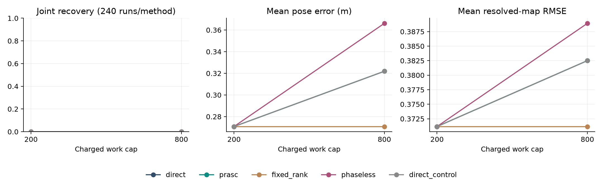
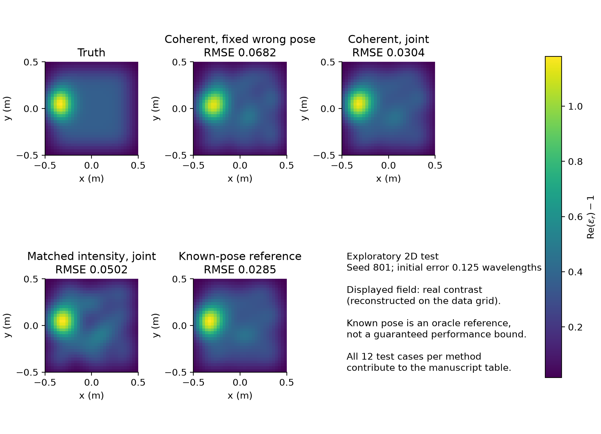

# Model-Conditional State Error Bounds and Dual Observability for SOM-Informed Full-Wave Array Self-Calibration

Research draft, 6 September 2026. Project: TriSpace SOM-SLAM. Intended venue: IEEE Transactions on Antennas and Propagation (TAP), conditional on stronger calibration evidence. No submission-readiness or global-novelty claim is made.

## Abstract

Unknown antenna geometry corrupts the coherent phase used by quantitative inverse scattering. Arbitrary equivalent currents can explain away calibration signatures, while physical current elimination cannot create information. We distinguish independently varying current nuisance from numerical state approximation, and connect dual map/pose spectra, omitted-state bias, and shared-map acquisition. For a specified passive two-dimensional volume-integral discretization, we derive a computable resolvent bound and propagate state and tangent residuals to prediction and gradient error bounds. Residual enrichment admits low-frequency approximations but remains unadmitted at the highest frequency. The frozen 2,400-run budget protocol accepts no reduced iteration: its cost accounting and stage schedule prevent a discriminating test of reduced-method performance. In a separate exploratory 49-parameter imaging study, exact coherent joint inversion reduces spatial map RMSE from 0.1054 at fixed wrong geometry to 0.0261; matched intensity inversion gives 0.0430. These results support geometry calibration in the tested family, not a SOM-specific advantage. A public-data model-adequacy pilot lacks antenna-offset ground truth. The contribution is therefore a conditional error-control and observability framework with explicit failure evidence, not a demonstrated superior self-calibrating SOM algorithm or universal phase-branch guarantee.

Keywords: inverse scattering; unknown array geometry; coherent phase; SOM; self-calibration; model-conditional error bounds.

## 1. Introduction

Quantitative microwave imaging reconstructs material properties through a full-wave model, rather than merely locating a radar reflector. An error in antenna geometry changes receiver sampling, transmitter illumination, and potentially phase centers and polarization. A wrong forward model can turn that error into a false inclusion, incorrect material contrast, or displaced structure. SOM and its twofold extension supply organized current coordinates for this nonlinear inverse problem [1,2]. Through-wall imaging and experimental imaging under oblique illumination provide representative application precedents [8,9].

The relevant regime is coherent near-field or limited-aperture acquisition of a sufficiently stationary scene, with useful phase measurements but imperfectly known sensor coordinates. Flexible arrays, sequential scans, and mobile antennas are plausible settings. They are not all validated applications of the present scalar model. Self-calibration aims to estimate the structured cause of phase error so that different frequencies and views become consistent with one geometry and one material model. It does not make noisy measured phase exactly known.

Phaseless inversion remains appropriate when phase is unavailable, prohibitively costly, or too poorly modeled. Published phaseless SOM and current-based phaseless reconstruction retain meaningful current structure [3,4]; saying they have no current constraints is incorrect. Nor is SOM plus calibration new: Idriss and Raj jointly optimize complex transmitter calibration factors with multifrequency SOM on measured data [5]. Antenna calibration in diffraction tomography and source-receiver extension are established adjacent directions [6,7]. Our question is narrower: can geometry-aware current approximations be controlled without mistaking improved fit for recovered calibration information?

We contribute a typed rank/observability account, a computable model-conditional physical-state bound, and an executable falsification study. Projection, Schur complements, canonical correlations, continuation, and residual correction are prior tools, not newly invented theories. The discretization-specific passive bound and the explicit control/failure formulation are project contributions whose global novelty is not established. Computational superiority is a separate claim: complete physical current coordinates are a reparameterization of direct inversion and cannot create information.

## 2. Physical model, geometry, and three different ranks

Let real material parameters be $\alpha$, anchored array parameters be $x$, and complex contrast at acquisition/frequency $\ell$ be $\chi_\ell=f_\ell(\alpha)$. The induced current satisfies

$$
M_\ell j_\ell=b_\ell,\quad
M_\ell=I-\operatorname{diag}(\chi_\ell)D_\ell,\quad
b_\ell=\operatorname{diag}(\chi_\ell)e_\ell(x).
$$

Use the raw total-field experiment

$$
y_\ell=d_\ell(x)+S_\ell(x)j_\ell+\varepsilon_\ell,
\qquad\varepsilon\sim\mathcal{CN}(0,\Sigma).
$$

On a world-fixed grid in a homogeneous background, $D_xD_\ell=0$. Receiver motion changes $S$ and transmitter motion changes $e$. A common rigid source/receiver displacement leaves the direct background distance unchanged, but not the object-mediated response. With $T_\ell=D_\alpha f_\ell$ and $E_{\rm tot}=e+Dj$, physical elimination gives

$$
A_\ell=S_\ell M_\ell^{-1}\operatorname{diag}(E_{{\rm tot},\ell})T_\ell,
$$

$$
B_\ell[h]=D_xd_\ell[h]+D_xS_\ell[h]j_\ell
+S_\ell M_\ell^{-1}\operatorname{diag}(\chi_\ell)D_xe_\ell[h].
$$

The exact tangent is $A\delta\alpha+Bh$, without an additional free current. A receiver-side lift of $D_xS[h]j$ into $SUc$ is only data equivalence; surjectivity can make it automatic without establishing physical admissibility or calibration. Lifting the total $B$ and adding transmitter motion again double counts that effect.

All projections use gauge-fixed, whitened, realified matrices. For proper complex noise with $\mathbb E|\varepsilon_i|^2=\sigma^2$, the real-parameter embedding is $\sqrt2[\operatorname{Re}J;\operatorname{Im}J]/\sigma$. Complex nuisance coefficients require both real and imaginary coefficient columns. A full real covariance is needed for improper noise. Absolute pose requires an anchor or a joint gauge quotient.

| Rank | Meaning | Consequence of increasing it |
|---|---|---|
| $L_{\rm det}$ | Classical SOM data-supported cutoff | More data-determined modes, not automatically more nuisance |
| $r_{\rm num}$ | Numerical state basis dimension | More accurate approximation of the same physical equation |
| $r_{\rm free}$ | Additional independently varying current dimension | Enlarged nuisance family, potentially hiding pose |

Our physical estimator has $r_{\rm free}=0$. Its numerical sensing support is not labeled $L_{\rm det}$. SOM-informed bases use sensing modes and optionally sequential projected domain modes. In general, $P_{S^-}V_{D,+}$ is not an exact intersection. TriSpace is the project's organization of sensing, domain, and calibration constraints, not an unconditional three-way direct-sum theorem.

## 3. Phase precision is useful, but branch selection is separate

For the same target, nuisance model, gauge, and noise mechanism, $Z=|Y|$ or $|Y|^2$ is a parameter-independent channel from coherent total-field data. Conditional expectation contracts efficient scores, so

$$
J_Z^{\rm eff}\preceq J_Y^{\rm eff}.
$$

Equality holds in a target direction exactly when its coherent efficient score is measurable from $Z$. This information inequality does not promise that a nonconvex coherent optimizer beats a phaseless optimizer. Unmodeled clock drift can make the implemented coherent likelihood wrong; that failure does not reverse the matched-experiment theorem.

For $Y=ae^{ix}+\varepsilon$ with known $a>0$, coherent information is $2a^2/\sigma^2$, while magnitude has none. With an unknown phase nuisance $\eta$ in $ae^{i(x+\eta)}$, neither experiment separates $x$ from $\eta$. A known incident reference may instead convert scattered-field phase into total-field amplitude. Consequently, the intensity baseline must be induced from the same raw total field, not a parameter-dependent scattered-field transformation.

For an isolated nonvanishing outgoing path, $\partial_r\log G_2=ik-1/(2r)+O((kr^2)^{-1})$. Higher frequency increases phase sensitivity. Efficient information scales like $k^2$ only with additional bounds on relative amplitudes, path derivatives, and nuisance separation. Interference, attenuation, and dispersion can invalidate the simple scaling. A small covariance at a wrong phase branch does not establish correct geometry. Frequency continuation remains an algorithmic policy, not a universal basin theorem.

## 4. Dual spectra, bias, and shared-map acquisition

For a deliberately declared free-current space $C=\operatorname{Ran}K$, put $\Pi=P_{C^\perp}$, $A_c=\Pi A$, and $B_c=\Pi B$. The physical estimator uses $C=0$. Define

$$
K_0=A_c^TA_c,\quad K_{\rm eff}=A_c^T(I-P_{B_c})A_c,
\quad J_x=B_c^T(I-P_{A_c})B_c.
$$

On the support of $K_0$, $K_{\rm eff}v_i=\rho_iK_0v_i$. Its normalized spectrum and the normalized pose spectrum share $1-c_i^2$, where $c_i$ are canonical correlations between the two ranges, with unit padding for unequal dimensions. Raw spectra do not coincide, and $\rho$ is undefined on $\ker K_0$. Relative map retention cannot replace the absolute task-scaled singular value of $B_v=P_{[K,A]^\perp}B$.

If nuisance grows from $N=\operatorname{Ran}[K,A]$ to $N\oplus E$, then

$$
J_x^{\rm old}-J_x^{\rm new}=B^TP_EB\succeq0.
$$

A residualized current block $Q=P_{N^\perp}K_+$ admitted in coefficient space $Z$ preserves pose information exactly when $B_v^TQZ=0$. For complex coefficients, the safe kernel is $\ker F\cap\ker(FJ_c)$, with $F=B_v^TQ$ and $J_c$ multiplication by $i$. Arbitrary real null vectors need not define a complex subspace. This theorem controls free nuisance, not refinement of a physical solver.

Neutral admission can exclude a physically necessary correction. In a fixed linear model with bounded omitted component $D_rz$, $\|z\|\le1$, and full-column-rank $B_v$, the worst-case local risk is

$$
\sup_{\|z\|\le1}\mathbb E\|\widehat h-h\|_{M_x}^2
=\operatorname{tr}(M_xJ_x^{-1})
+\|M_x^{1/2}B_v^\dagger D_r\|_2^2.
$$

The terms are variance and worst-case squared bias. Neither a small residual nor favorable $\rho$ certifies small bias. Gaussian fixed-rank formulas cannot simply be conditioned on a rank selected from the same noisy data; adaptive guarantees need uniform bounds or separate selection data.

Now stack old acquisitions $(A,B)$ with a shared material increment. For a new block $(a,b)$, when $G=A^TA\succ0$ and $H=G^{-1}A^TB$,

$$
I_{\rm acq}=J_{\rm new}-J
=(b-aH)^T(I+aG^{-1}a^T)^{-1}(b-aH).
$$

This measures incompatibility with the old shared-map compensator. Allowing a different map per frame erases some of that evidence. If the old nuisance is first enlarged at loss $L$, the net local change is exactly $I_{\rm acq}-L$. Thus $I_{\rm acq}\succeq L$ is a local information budget. Singular cases require the variational formulation, not this inverse formula. Two scalar frames with $a_1=a_2=1$ and $b_1=-b_2=1$ are separately uninformative but jointly have information two. Their synergy disproves a universal submodularity guarantee for greedy pose-Schur design. Pair look-ahead is a testable heuristic, not always optimal.

## 5. A computable passive-medium physical-state bound

For a computed current, $z=M\widetilde j-b$ quantifies state inconsistency. An inverse bound converts it to prediction error, but an exact inverse-norm oracle would defeat much of the computational purpose. We derive a sufficient alternative for the implemented scalar two-dimensional outgoing Green function $iH_0^{(1)}(kr)/4$.

Use midpoint off-diagonal cell quadrature, the equal-area disk self-cell integral, cell side $h$, and $\chi=(1+i\tau)u$ with active $u_i>0$ and common $\tau>0$. Set $a=h/\sqrt\pi$, $T=\operatorname{diag}(\sqrt u)$, and

$$
\delta=\frac{k^2h^2}{4}-\frac{\pi ka}{2}J_1(ka),\qquad
\zeta=\frac{\tau}{1+\tau^2}-\max(\delta,0)u_{\max}.
$$

Proposition 1. If $\zeta>0$, then

$$
\|T^{-1}M^{-1}T\|_2\le g,
\qquad g=\frac1{\sqrt{1+\tau^2}\,\zeta},
$$

and a computable whitened complex-output error bound is

$$
\|WS(\widetilde j-j)\|_2
\le\|WST\|_F g\|T^{-1}z\|_2.
$$

The proof uses a Bessel Gram kernel and explicitly retains the diagonal quadrature correction. It requires no exact current. Independent block bounds combine by square-sum, with an additional $\sqrt2$ for realification.

Approximate the physical tangent equation $Mt_v=b_v-M_vj$. Define $z_v=M\widetilde t_v-b_v+M_v\widetilde j$. Then

$$
\|T^{-1}(\widetilde t_v-t_v)\|_2
\le g\bigl(\|T^{-1}z_v\|_2
+\|T^{-1}M_vT\|_F g\|T^{-1}z\|_2\bigr).
$$

The output derivative adds $S_v(\widetilde j-j)$. Column bounds give a Jacobian error $\epsilon_J$ and residual error $\epsilon_r$, yielding

$$
\|\nabla\Phi-\widetilde J^T\widetilde r\|_2
\le\epsilon_J\|\widetilde r\|_2
+(\|\widetilde J\|_F+\epsilon_J)\epsilon_r.
$$

The objective bounds are $\tfrac12\max(0,\|\widetilde r\|-\epsilon_r)^2+R$ and $\tfrac12(\|\widetilde r\|+\epsilon_r)^2+R$. These certify numerical error at a candidate parameter, not confidence in the true scene. Lossless media, mixed-sign contrast, nonuniform loss ratio, or nonpositive $\zeta$ require another bound or direct fallback. Refusal does not prove singularity. The proof is exact-arithmetic; ordinary floating-point evaluation with a safety margin is not interval-verified certification.

## 6. Implemented control and its boundaries

The objective is the coherent physical likelihood plus a fixed declared prior. A basis $U$ is built from sensing modes and optional sequential domain modes; coefficients minimize $\|MUc-b\|$, not measurement residual alone. Currents are dependent states, so $r_{\rm free}=0$ throughout.

1. Start from a shared nonoracle material initialization and anchored geometry candidate; follow a fixed low-to-high cumulative frequency schedule.
2. Build a chart and estimate its work. If the reduced probe is unaffordable, use direct full-wave inversion.
3. Admit an approximate state only if computable prediction and scaled-gradient bounds pass the declared budgets.
4. Freeze the basis through a trial, certify the trial itself, and check descent against the exact physical objective before accepting a reduced update.
5. Rebuild at chart events. Failed certificates trigger the declared direct fallback. Stop before unaffordable work and return only accepted iterates.

The reduced derivatives approximate physical tangent equations; they are not asserted to equal derivatives of a moving proxy with a silently omitted basis derivative. The direct baseline receives identical frequency data, scaling, constraints, and tuning opportunity. A direct chart-restart ablation isolates optimizer cadence. The fixed-rank approximation is SOM-informed, not classical independent-current SOM. The intensity baseline uses the exact Rice law of the same coherent parent; it is not an additive-Gaussian intensity surrogate.

A separate exploratory mechanism appends leading singular directions of computable state and tangent residuals outside $U$. It then rechecks the certificate. This connects current-space structure to practical enrichment without true-current decisions, but is not retroactively inserted into the frozen comparison.

The full A2 design additionally proposes covered phase-error frequency gates and active acquisitions. Our nonlinear comparison does not implement those covered confidence sets or active acquisition. It uses fixed continuation; its spectra are local diagnostics. Acquisition policies are tested separately at tangent level. A theorem stating conditions is not evidence that every condition has been implemented.

Conditional descent also has a boundary. A uniformly well-conditioned step metric and a sufficiently small relative gradient error permit exact-objective Armijo descent on a fixed-data stage. Stationarity does not identify the correct branch. Finite-budget L-BFGS-B, box constraints, and chart resets do not by themselves verify all hypotheses of that theorem; accepted exact-objective checks are a narrower safeguard.

## 7. Experiments

E1 tests matched coherent/intensity information; E2 nuisance-rank loss; E3 dual spectra and bias; E4 fixed-budget nonlinear recovery; E5 shared-map acquisition. New experiments examine passive certificates, residual enrichment, larger-map imaging, and measured-data readiness. Matrix identities are not counted as imaging success.

The physical core uses analytic receiver/transmitter derivatives and independently checks the self-cell integral, adjoints, coordinate invariance, and realification. In E4 the inverse grid is $16\times16$, data grid $32\times32$, and domain $[-0.5,0.5]^2$ m. Nine Gaussian material functions have centers in $\{-0.25,0,0.25\}^2$ and standard deviation 0.16 m. Conductivity is $0.005u$ S/m, $u=\Phi\alpha$. The highest wavenumber is $4\pi$ rad/m; frequency ratios are $1/4,1/2,3/4,1$.

Three acquisitions have two transmitters and twelve receivers each. The first is anchored; the others share one rigid error. Receiver/transmitter radii are 1.5/1.9 m. Full-ring and 90-degree receiver apertures cross with weak/strong material strata. A fixed nominal total-field reference defines 30 dB noise. Independent validation noise is generated separately. Evaluating the fitted model on the fine grid provides a discretization-aware predictive check, not validation at unseen acquisition geometries.

After code correction and tuning seeds 1--10, settings and reference scales are frozen before seeds 1001--1020. Twelve starts per seed use three lever-metric radii $\lambda_{\min}/8,\lambda_{\min}/2,\lambda_{\min}$ and four translation directions. Half the squared error lies in translation, half in lever-arm rotation. All methods use constant nonoracle material 0.5: a documented pre-test amendment after the earlier initializer exhausted its cap, also avoiding coherent-information leakage into phaseless initialization.

The primary cap is 200 RHS-equivalent units; 800 is secondary. Forward, adjoint, and derivative columns are charged, reduced solves and extra products use tuning-only calibration, and SVD/factorization/reuse remain visible in wall time. A guard stopping before further work is not an optimizer-status success test. Recovery requires final-data policy completion, anchored pose and resolved-map tolerances, and independent predictive consistency. Errors include all failures.

The compound primary claim requires a positive lower bound on paired success difference and upper bounds below both noninferiority margins. We use 10,000 seed-cluster bootstrap draws, twenty clusters, and one-sided Bonferroni levels $1-0.05/3$. All twelve starts remain together within each seed; errors are normalized by frozen per-aperture margins. A favorable stratum, larger budget, or runtime cannot rescue a failed primary gate.

### 7.1 Theory and physical tangents

Fresh execution of the pipeline package passes 50 bounded tests. E1's phase-only coherent information is analytically 2 versus magnitude 0; an unknown phase nuisance removes both efficient informations. Reference-field intensity retains nonzero information. Ten physical tangents at $\sigma^2=1$ confirm full joint Fisher contraction by quadrature. A subsequent square-root projection of these same matrices eliminates all nine material parameters: all ten efficient pose-information differences remain positive semidefinite, with minimum eigenvalues from 0.00713 to 0.01064 in the declared coordinates. This additional check is not ten new scenes. The low-SNR information test is not a forecast of 30 dB nonlinear reconstruction advantage.

E2 verifies 36 seeded loss identities, maximum backward-scaled residual 0.274 against the specified roundoff-scale threshold of 100; this is not a 27.4% relative identity error. The supported relative-retention sequence 0.75, 1, 0 confirms nonmonotone $\rho$. E3 fixed-linear-model Monte Carlo agrees with its variance/bias formula. However, the physical full/limited-aperture envelope saturates pose visibility: the bias-risk Monte Carlo condition is evaluable in 0/20 records. An empty check is not passed physical validation.

E5 verifies complementary-frame innovation and the innovation-minus-loss identity. In one physical eight-action reference test, greedy, pair look-ahead, and exhaustive shared-map design agree on a three-action subset. Synthetic counterexamples still show greedy gaps, and pair look-ahead is not always optimal. These are tangent subset scores, not improved nonlinear reconstruction under an acquisition budget.

### 7.2 Computable certificates

Eighteen grid/wavenumber/loss combinations test the passive bound: twelve positive-loss cases enclose independently evaluated state/derivative errors, and six lossless cases refuse. An extreme-contrast control also refuses. Finite checks corroborate implementation, not the general hypotheses.

In sixteen reference-point probes, rank 24 sensing/domain bases are unadmitted. Residual enrichment admits the four low-frequency cases at rank 72, while four highest-frequency cases remain unadmitted at rank 128. Both state and gradient bounds enclose all independently evaluated errors. Non-vacuity therefore occurs at 28% of the 256-cell state dimension, with no demonstrated computational advantage. These are approximation tests, not pose recovery.

The bound-to-actual-error ratios below span the positive-loss checks on both tested grids and loss ratios. They quantify conservatism, not estimation uncertainty. In particular, the highest-frequency derivative bound can exceed the measured error by about 9,051 times. Affordable high-frequency admission remains an unresolved algorithm-design problem.

| Wavenumber (rad/m) | State bound/error range | Derivative bound/error range |
|---|---|---|
| $\pi$ | 13.2--123.3 | 41.1--932.5 |
| $2\pi$ | 23.2--144.0 | 58.0--1075.4 |
| $4\pi$ | 36.8--209.9 | 339.9--9051.1 |

### 7.3 Frozen nonlinear comparison

No reduced iteration is accepted in any of the 2,400 runs. Consequently, this frozen comparison tests budget-protocol execution, not reduced-method performance. All records are complete and uniquely paired: 240 runs per method at each budget. All charged-work caps and finite-output checks pass. At the primary 200-unit cap, every method has 0/240 joint successes and the estimates remain at their initial candidates. Mean pose error is 0.27083 m. This is not evidence of intrinsic nonidentifiability or phaseless/coherent equivalence.

| Budget | Method | Joint success | Mean pose error (m) | Resolved-map RMSE | Mean charged work |
|---|---|---|---|---|---|
| 200 | Direct / guarded / intensity / direct restart | 0/240 each | 0.27083 | 0.37116 | 158.67 |
| 200 | Fixed-rank approximation | 0/240 | 0.27083 | 0.37116 | 0.00 |
| 800 | Direct / guarded / direct restart | 0/240 each | 0.32192 | 0.38250 | 714.00 |
| 800 | Intensity | 0/240 | 0.36618 | 0.38892 | 714.00 |
| 800 | Fixed-rank approximation | 0/240 | 0.27083 | 0.37116 | 585.39 |

The zero-work fixed-rank row means no reduced objective evaluation fits the stage caps; basis setup still takes wall time. The guarded method admits zero reduced moves and falls back to the direct chart-restart pathway. Its final estimates agree with the direct restart baseline. The simultaneous primary success-difference lower bound is 0, not strictly positive; the compound gate fails at both budgets. The degenerate bootstrap here cannot establish equivalence or narrow uncertainty about recoverability in a better-exercised experiment.

At each budget, the final-data budget policy completes in 240/240 runs for direct, guarded, intensity, and direct restart, but in 0/240 for fixed rank. Policy completion is distinct from recovery: it can mean only a final-data evaluation at the last accepted point. Both noninferiority comparisons are vacuous because guarded and direct outputs coincide; their numerical inequalities must not be counted as scientific gates passed.

The observed failure is partly a protocol/implementation mismatch. The conservative extra-product conversion counts reported skinny products as dense matvec equivalents, and the fixed stage fractions can prevent any low-frequency optimization before the final-data stage. An exact full-band f/g evaluation costs 158.67 units, leaving insufficient room for another accepted L-BFGS-B trial at budget 200. This explains why the nominal 200-unit test does not isolate a useful SOM mechanism. A revised, dimension-aware cost model or substantially larger cap must be preregistered with fresh test scenes; it cannot retrospectively rescue this primary endpoint.

The result withdraws a superiority claim, not the conditional theory. It also prevents a stronger negative claim that reduced SOM is inherently ineffective: the experiment did not adequately exercise that pathway.

### 7.4 Larger-map and measured-data extensions

An exploratory study increases the material representation to 49 Gaussian coefficients and uses inverse/data grids 20 x 20/32 x 32. Six independent test scenes, each with two error radii, give 12 runs per method. The full aperture, 30 dB coherent parent, shared fixed schedule, no quadratic prior, and 5000-RHS cap are frozen after two tuning scenes. This uses raw RHS accounting with operator and wall counts separate; it is not on the primary equivalent-work scale. The N20 validation adapter changes only the allowed grid size, not the physical formulas.

| Method | Spatial map RMSE | Mean pose error (m) | Predicted phase RMS (rad) |
|---|---|---|---|
| Coherent, fixed wrong pose | 0.1054 | 0.1562 | 0.0797 |
| Coherent, joint geometry/material | 0.0261 | 0.0124 | 0.0117 |
| Matched intensity, joint | 0.0430 | 0.0262 | 0.0204 |
| Known-pose oracle reference | 0.0251 | 0.0000 | 0.0109 |

The descriptive six-scene cluster-bootstrap interval for joint-minus-fixed spatial map RMSE is [-0.0897,-0.0691], with mean -0.0793. The intensity-minus-coherent difference is 0.0169, interval [0.0121,0.0212]. These exploratory results support the practical value of geometry calibration in this family, not a SOM-exclusive advantage: the successful joint solver uses exact full-wave adjoints, not the guarded reduced method. Known pose is an oracle, not a deployable competitor.

Phase errors compare model predictions with clean simulated total fields, masked by true amplitude above 3 noise standard deviations. They do not estimate the error of actual measured phase. The strong direct reference component and the shared-grid model assumptions must also be considered when interpreting this metric.

Six additional controlled mismatch runs use one clock-phase ramp, one receiver-coupling perturbation, and one outside-basis inclusion. Under the clock error, joint calibration worsens spatial map RMSE from 0.1292 to 0.1373. Under coupling, its pose error is 0.1559 m despite a map RMSE improvement. The outside-basis joint run has pose error 0.0859 m while its held-out residual gives a nominal chi-square p-value 0.0704. Thus a seemingly acceptable prediction diagnostic can coexist with a wrong geometry under misspecification. These single-scene controls expose failure mechanisms, not their prevalence.

The 2001 Fresnel cylinder dataset [11] supplies 14,112 complete records: 36 views, 49 receivers per view, and eight frequencies from 1 to 8 GHz. The primary descriptor specifies 720/760 mm emitter/receiver radii, total and incident complex fields, and a dielectric cylinder of radius 15 mm with permittivity approximately $3\pm0.3$. Ingestion and published geometry are verified, but antenna-position-error ground truth is absent.

An initial pilot was rejected after an independent audit found inconsistent incident/outgoing wave signs, a reversed absorption check, and per-frequency gains re-estimated on the purported test set. Those fits are excluded. A corrected, explicitly post-hoc plane-wave Mie pilot uses internally consistent outgoing $H^{(1)}$ waves, conjugates the whole model to follow the primary descriptor's $\exp(+i\omega t)$ convention (p. 1570), cross-checked against training incident fields, and freezes training gains before evaluating odd source views. Four fixed initializations give normalized squared scattering residuals 0.02162 on training and 0.02162 on held-out views. The fitted object center is approximately $(1.32,26.06)$ mm and real permittivity is 3.427, slightly outside the reported interval. Although the time convention is documented, the weak point-source incident-field fit cautions against treating horn illumination as fully modeled. This is conditional model adequacy, not statistical validation under a known noise law. Fitting an object's center is not recovering antenna offsets, and this pilot is not a SOM performance result.

## 8. Discussion and limitations

The purpose of coherent self-calibration is to recover consistency across frequencies and views by estimating structured errors, not to declare phase universally reliable. Its main risk is that geometry mismatch becomes material structure. The framework exposes several such failures but does not show every mobile array is calibratable.

Why SOM? Sensing/domain spaces organize current candidates and reveal missing state content. Yet direct inversion with the same approximation, prior, and acquisition policy can reproduce those tools. A SOM-specific claim requires better finite-budget accuracy, useful rank selection, or a reliably larger basin, not coordinate equivalence. The field-level contribution must be judged against that standard.

The shared rigid offset is not a general swarm trajectory. Vector Maxwell fields, polarization, mutual coupling, antenna directivity, timing, heterogeneous backgrounds, and dynamic targets require new models and gauges. The passive certificate assumes positive common loss and a particular quadrature. Success does not verify the constitutive law; refusal does not disprove invertibility. Unknown independent channel phases can remove the coherent information needed for calibration.

Twenty primary seed clusters have limited statistical resolution, and all-failure bootstrap intervals can be degenerate. A larger Gaussian basis remains a restricted image family. Independent noise at fixed geometry does not demonstrate generalization to new arrays. Tangent acquisition scores do not validate robot trajectories. Downloaded measured data without position-error ground truth do not validate blind geometry recovery. Source-extension, source-stabilizer, and full nonlinear active-acquisition comparisons remain explicit gaps.

The ideas can extend beyond SOM wherever a physical state equation, residual bounds, and nuisance/target tangents exist, including contrast-source and variable-projection inversion. The resolvent, adjoints, and gauges must be rederived. Automotive/mobile sensing additionally needs timing synchronization, moving scenes, multipath, and real-time constraints; it is a direction, not a demonstrated application.

TAP is our provisional preference because the present core is electromagnetic inverse scattering and array calibration. TGRS would be more compelling with an explicit remote-sensing task and stronger comparative imaging evidence. This is a scientific positioning judgment, not an official journal acceptance rule. Moving long proofs to appendices cannot compensate for a missing algorithmic advantage or realistic validation.

## 9. Conclusion

Equivalent-current flexibility and physical-state accuracy are different resources. Their separation is essential for self-calibrating SOM under uncertain Green operators. Dual observability, explicit bias, and shared-map acquisition specify meaningful local requirements. A passive-medium bound makes one class of state/tangent certificates computable; residual enrichment establishes conditional non-vacuity without exact-current admission. These results motivate phase-preserving calibration, but a universal or SOM-exclusive performance claim is unsupported. The nonlinear evidence, including failure, determines the method narrative.

## Appendix A. Efficient information and dual spectra

Let $e=(I-P_{\mathcal H})s$ be a target efficient score and $T$ conditional expectation given the transformed data. The transformed nuisance space is $\mathcal H_Z=\overline{T\mathcal H}$ and $e_Z=(I-P_{\mathcal H_Z})Te$. Differentiability in quadratic mean supplies the score identity. Orthogonality gives

$$
\|e\|^2-\|e_Z\|^2
=\|e-Te\|^2+\|P_{\mathcal H_Z}Te\|^2\ge0.
$$

Equality implies $e=Te$. Conversely, measurability gives $\langle e,Tn\rangle=\langle e,n\rangle=0$ for every nuisance score, so both terms vanish. All directional forms give the matrix inequality, including singular nuisance information.

For dual spectra, write support factorizations $A_c=Q_AR_A$, $B_c=Q_BR_B$. Congruence reduces their normalized Schur forms to $I-CC^T$ and $I-C^TC$, $C=Q_A^TQ_B$. Singular values of $C$ prove the shared values and dimensional padding. Congruence does not preserve raw eigenvalues; null $K_0$ directions have no defined generalized retention.

## Appendix B. Loss, bias, and acquisition identities

The decomposition $N_{\rm new}=N\oplus E$ gives $P_{N^\perp}-P_{N_{\rm new}^\perp}=P_E$. Congruence by $B$ proves the loss formula and neutrality condition. The complex safe kernel is invariant under $J_c$ because $J_c^2=-I$, and every invariant subspace in $\ker F$ is contained in $\ker F\cap\ker(FJ_c)$.

For risk, nuisance annihilation and $B_v^\dagger B=I$ give $\widehat h-h=B_v^\dagger D_rz+B_v^\dagger\varepsilon$. The cross expectation vanishes, covariance is $J_x^{-1}$, and maximizing squared bias gives the stated operator norm.

Complete the old square as $\|Bh-Au\|^2=h^TJh+(u-Hh)^TG(u-Hh)$. Setting $z=u-Hh$ and $V=b-aH$, minimization of $z^TGz+\|Vh-az\|^2$ gives $V^T[I-a(G+a^Ta)^{-1}a^T]V$. The bracket equals $(I+aG^{-1}a^T)^{-1}$. Subtracting old rank loss gives the net budget; the variational expression remains applicable when the inverse formula is not.

## Appendix C. Passive discretization proof

The matrix $Q_{ij}=k^2h^2J_0(k|z_i-z_j|)/4$ is positive semidefinite since

$$
J_0(k|z_i-z_j|)=\frac1{2\pi}\int_0^{2\pi}
e^{ik\widehat s(\theta)\cdot(z_i-z_j)}\,d\theta
$$

is a Gram kernel. Reciprocity makes $D$ complex symmetric, so its Hermitian imaginary part equals its entrywise imaginary part. Disk self-cell quadrature gives $\operatorname{Im}D=Q-\delta I$. For $A'=(1+i\tau)^{-1}I-TDT$, this implies $\operatorname{Im}A'\preceq-\zeta I$. Thus $\zeta\|v\|^2\le|v^*A'v|\le\|v\|\|A'v\|$, proving $\|A'^{-1}\|\le1/\zeta$. The identity $T^{-1}MT=(1+i\tau)A'$ proves Proposition 1. Applying it to $\widetilde j-j=M^{-1}z$ gives the output bound. Zero-contrast cells have zero current and must be eliminated before using $T^{-1}$; our positive-basis probes do not require this step.

## Appendix D. Tangent errors and conditional descent

Differentiate $Mj=b$ and subtract the approximate tangent residual to obtain

$$
\widetilde t_v-t_v=M^{-1}\{z_v-M_v(\widetilde j-j)\}.
$$

Weighted norm inequalities prove the derivative bound. Adding $S_v(\widetilde j-j)$ gives output derivative error. Adding/subtracting $\widetilde J^Tr$ and applying column/Frobenius bounds proves the gradient bound. Coordinate scaling must be consistent: $z_x=Tx$ requires $\nabla_{z_x}\Phi=T^{-T}\nabla_x\Phi$.

For a fixed-data smooth objective, assume $h_-I\preceq H_k\preceq h_+I$ and $\|g_k-\widetilde g_k\|\le\kappa_g\|\widetilde g_k\|$ with $\kappa_g<h_-/h_+$. For $d_k=-H_k^{-1}\widetilde g_k$,

$$
g_k^Td_k\le-(h_+^{-1}-\kappa_g h_-^{-1})\|\widetilde g_k\|^2.
$$

A Lipschitz-gradient descent lemma gives a uniform positive backtracking threshold. A lower-bounded objective then gives stationarity by summing decreases. A fixed error floor gives approximate stationarity only. Box constraints require a projected-stationarity version, and changing active frequencies changes the objective. None of these results identifies the true phase branch.

## References and evidence boundaries

[1] X. Chen, IEEE TGRS 48(1), 42--49, 2010, “Subspace-Based Optimization Method for Solving Inverse-Scattering Problems.” [DOI](https://doi.org/10.1109/TGRS.2009.2025122).

[2] Y. Zhong and X. Chen, Inverse Problems 25, 085003, 2009, “Twofold subspace-based optimization method for solving inverse scattering problems.” [DOI](https://doi.org/10.1088/0266-5611/25/8/085003).

[3] L. Pan, Y. Zhong, X. Chen, and S. P. Yeo, IEEE TGRS 49(3), 981--987, 2011, “Subspace-Based Optimization Method for Inverse Scattering Problems Utilizing Phaseless Data.” [DOI](https://doi.org/10.1109/TGRS.2010.2070512).

[4] K. Xu, L. Wu, X. Ye, and X. Chen, IEEE TAP 68(11), 7457--7470, 2020, “Deep Learning-Based Inversion Methods for Solving Inverse Scattering Problems With Phaseless Data.” [DOI](https://doi.org/10.1109/TAP.2020.2998171).

[5] Z. Idriss and R. G. Raj, 2025, “Data-Driven Calibration Technique for Quantitative Radar Imaging.” [arXiv:2503.07316](https://arxiv.org/abs/2503.07316).

[6] L. Bellomo, S. Pioch, M. Saillard, and K. Belkebir, IEEE TAP 62(5), 2450--2462, 2014, “An Improved Antenna Calibration Methodology for Microwave Diffraction Tomography in Limited-Aspect Configurations.” [DOI](https://doi.org/10.1109/TAP.2014.2308534).

[7] G. Huang, R. Nammour, and W. Symes, Geophysics 82(3),R153--R171, 2017, “Full-waveform inversion via source-receiver extension.” [DOI](https://doi.org/10.1190/geo2016-0301.1).

[8] T. Lu, K. Agarwal, Y. Zhong, and X. Chen, PIER 102, 351--366, 2010, “Through-Wall Imaging: Application of Subspace-Based Optimization Method.” [DOI](https://doi.org/10.2528/PIER10020903).

[9] Q. Meng et al., Sensors 16(7), 1046, 2016, “Microwave Imaging under Oblique Illumination.” [DOI](https://doi.org/10.3390/s16071046).

[10] Q. Wang, A. H. Paulus, and T. F. Eibert, EuCAP 2026, “Phase-Corrected Near-Field Microwave Imaging via Inverse Source Reconstruction with Modulated Signals.” [DOI](https://doi.org/10.23919/EuCAP68105.2026.11612585). Inverse-source imaging is distinct from the material inverse-scattering target here.

[11] K. Belkebir and M. Saillard, Inverse Problems 17, 1565--1571, 2001, “Special section: Testing inversion algorithms against experimental data.” [DOI](https://doi.org/10.1088/0266-5611/17/6/301).

The bounded literature search was updated 6 September 2026, not conducted as a systematic review. ScholarQA resolved 8 queried bibliographic records; other metadata were checked against canonical registries. Full-text support is strongest for [4,5,9]. Original SOM equation details rely partly on the previously reviewed author monograph. Unverified Bellomo equation-level claims are excluded. A2 is a user-supplied theory input, independently audited here, not an external publication establishing priority.
