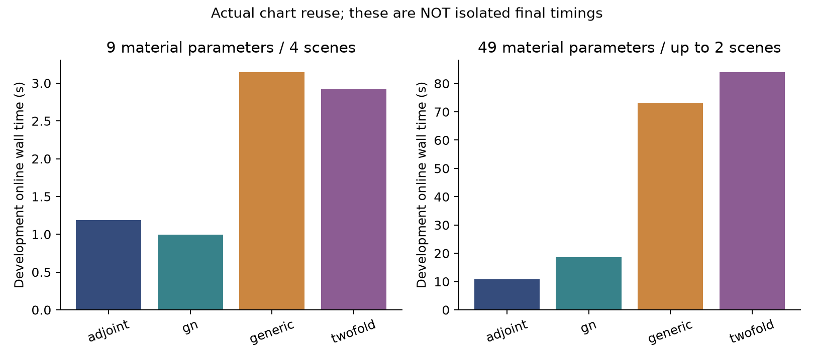
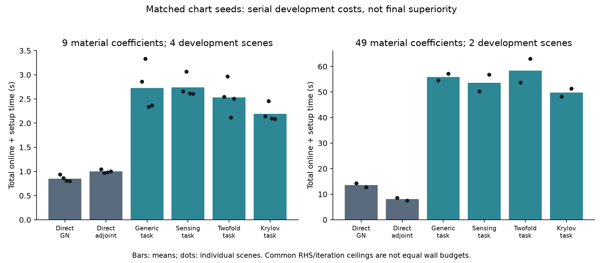
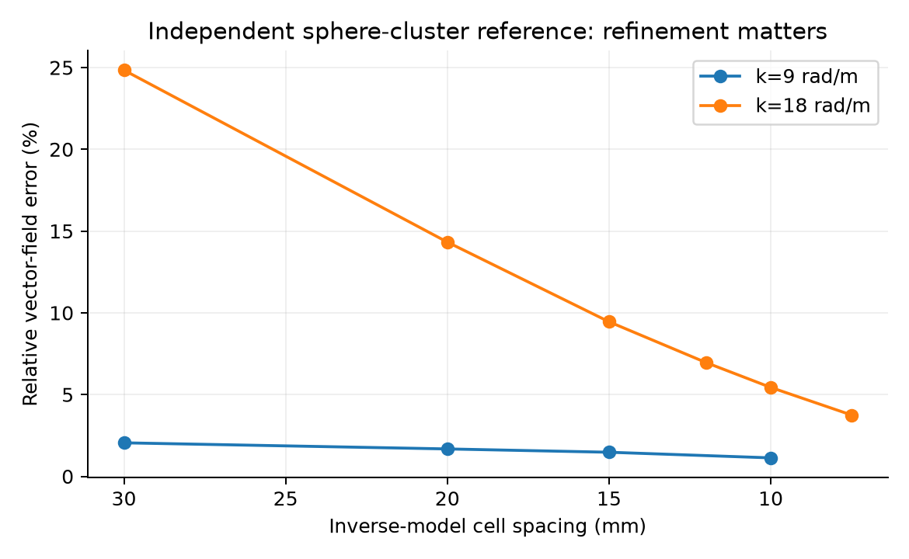
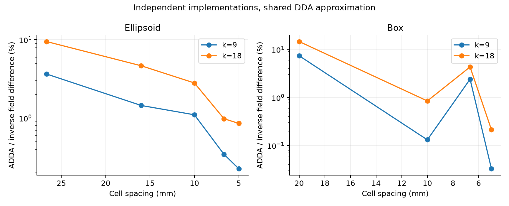
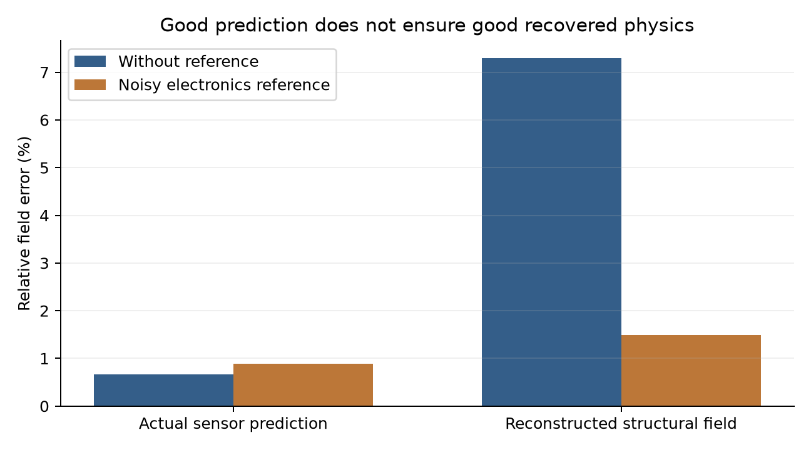
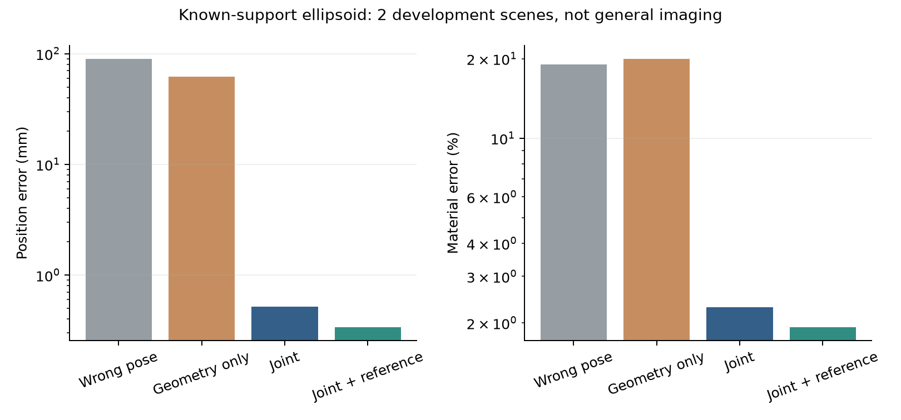

# Phase-Preserving Full-Wave Array Calibration: Attribution, Acquisition Constraints, and Numerical Reliability

**Working manuscript, updated 8 September 2026. Intended venue: IEEE Transactions on Antennas and Propagation. Development studies plus one bounded confirmatory benchmark; not submission-ready.** SOM-specific superiority is not claimed. Broader final comparisons, reliable branch/acquisition policies, broader material/antenna validation, and external scientific review remain required. This document supersedes neither the frozen A2 evidence nor the supplied A3 source documents.

## Abstract

Coherent quantitative inverse scattering requires phase consistency between geometry, electronics and the numerical forward model. We separate parameter attribution, nonlinear phase-branch selection and numerical fidelity within a physical-state formulation without independent current nuisance. Established gain-closure principles yield acquisition constraints, while a full-wave translation/clock symmetry identifies the spatial anchor required by known-support calibration. Fixed-chart derivative checks and independent validation are tested with explicit negative controls. A frozen 40-scene, six-method comparison excludes the prespecified Twofold-versus-Krylov success-rate and conditional-median runtime advantages in the declared benchmark; it does not adjudicate the entire SOM family. Independent-code vector-Maxwell development experiments show that joint electronics and geometry estimation can recover receiver translation while material remains biased. In 12 matched acquisition fits, adding high-frequency measurements worsens held-out low-band sensor phase, while its material-recovery effect changes sign with the presence of an electronics reference. Thus high phase sensitivity, accurate sensor fitting and accurate structural recovery are distinct properties. These bounded results motivate discrepancy-aware calibration; they do not yet establish a generally superior algorithm or unrestricted unknown-map/array localization.

**Index terms:** electromagnetic inverse scattering; array calibration; coherent phase; model discrepancy; reduced-order models; measurement design.

## I. Introduction

Quantitative microwave imaging seeks material properties, rather than only the position or reflectivity of a radar target. A geometric error changes propagation phase, antenna illumination and receiving locations. A reconstruction using the wrong geometry may compensate by changing the material. Conversely, a flexible electronic gain model may fit the measurements while absorbing information required for quantitative material estimation. This is the central ambiguity studied here.

SOM organizes induced currents using spectral structure [1], and its twofold extension is an established inverse-scattering method [2]. That organization does not make inaccurate phase usable automatically. Nor is calibration within SOM new: Idriss and Raj introduce frequency–transmitter complex calibration factors in their multifrequency formulation [3, Eq. (8)]. Antenna calibration in diffraction tomography [4] and joint geometry, clock and target calibration for coherent radar imaging [5] also predate the present implementation. The contribution must therefore be narrower than combining the words full-wave, calibration and SOM.

We pursue a distinction between **fitting phase** and **attributing phase**. Fitting makes predicted measurements agree with observations. Attribution determines whether the agreement identifies geometry, electronics and material individually, or only a combination of them. We further distinguish attribution from selecting the correct nonlinear phase branch and from solving the numerical state equation accurately. None of these questions can replace the other two.

The motivating applications are coherent, approximately stationary, near-field quantitative measurements with imperfectly positioned or repositionable antennas. Flexible arrays and mobile scanning platforms are prospective uses. Autonomous-driving imaging is not validated by the present static, homogeneous-background models. Phaseless inversion remains appropriate when phase is unavailable or inadequately modeled. It does not have no current constraints; the relevant cost is loss of some coherent information under a matched observation model, not the disappearance of all inverse-scattering structure. Chen's [phaseless-inversion chapter](https://onlinelibrary.wiley.com/doi/10.1002/9781119311997.ch8) covers subspace and extended-scatterer reconstruction, and [D'Urso et al.](https://opg.optica.org/josaa/abstract.cfm?uri=josaa-25-1-271) report experimental intensity-based approaches. The latter source is verified at abstract level, not at the inaccessible equation level. Accordingly, self-calibration is not claimed to supersede all phaseless reconstruction.

The analysis uses established projection, closure, dual-residual and reduction machinery [6–10]. Array calibration identifiability, near/far-field distinctions and maneuver/reference remedies also have longstanding antecedents [12]; the conditional Maxwell distance bound below must not be mistaken for the invention of these concepts. The project-specific scientific question is whether these ingredients yield useful full-wave decisions about admissible calibration parameters, additional measurements and numerical fidelity. Global novelty and a final performance advantage remain under investigation; the results below must not be presented as settled answers to those questions.

## II. Physical model and parameter semantics

For frequency/acquisition index $\ell$, let real material coefficients be $\alpha$, anchored geometric parameters $x$, and electronic parameters $\gamma$. The induced current is a dependent physical state:

$$
M_\ell(\alpha)j_\ell=b_\ell(\alpha,x),\qquad
\mu_\ell(\alpha,x,\gamma)=\mathcal C_\ell(\gamma)\big[d_\ell(x)+S_\ell(x)j_\ell\big].
$$

The data are $y=\mu+\varepsilon$. Raw total or scattered fields must be specified per experiment; they are not interchangeable when a direct reference is informative. The 2D core uses total fields and a shared rigid offset of two unanchored acquisition poses. The 3D development study uses scattered vector fields, known world-fixed incident plane waves, and a common receiver translation. These are different declared experiments, not one common hardware model.

For independent proper complex noise with $\mathbb E|\varepsilon_i|^2=\sigma^2$, real whitening maps a real-parameter derivative $J$ to $\sqrt{2}[\Re J;\Im J]/\sigma$. Complex free coefficients require both real and imaginary parameter columns. All covariance claims below refer to the correctly whitened experiment.

There are four distinct dimensions: material dimension $q_{\rm material}$; numerical state rank $r_{\rm num}$; independently variable current dimension $r_{\rm free}$; and the classical SOM retained cutoff. Our physical estimator has $r_{\rm free}=0$. Increasing numerical rank approximates the same state equation more accurately; it does not enlarge the statistical nuisance model. Restricting material to two regions or nine Gaussian coefficients is nevertheless a substantive material prior.

## III. What remains observable after calibration nuisance is eliminated?

Linearization gives $\delta y=A\delta\alpha+B\delta x+G\delta\gamma$ in whitened real coordinates. For geometry, define

$$
B_{\rm vis}=(I-P_{[A,G]})B,\qquad J_x=B_{\rm vis}^{T}B_{\rm vis}.
$$

All required geometry directions must be counted, including zero singular values. A smallest positive singular value cannot justify recovery of omitted null directions. Full joint Jacobian rank after eliminating exact gauges is a sufficient local condition under smoothness; it is not a global phase-branch guarantee. The material-side generalized spectrum and canonical-angle interpretation retained from A2 describe relative information loss, but do not replace an absolute, physically scaled geometry uncertainty measure.

### A. Exact electronic and geometric ambiguities

In the single-path model $\mu_f=g a_f e^{ik_f(r+\ell)}/r$, the transformation $r'=r+\Delta$, $\ell'=\ell-\Delta$, $g'=g(r+\Delta)/r$ leaves every frequency unchanged. Additional frequencies do not automatically separate geometry, delay and gain. If every frequency has a free electronic phase, the common clock ramp lies inside that phase nuisance space.

For effective antenna locations $t+R_s(r_0+p)$, mechanical translation and body phase-center offset have the gauge $\delta p\in\bigcap_{s>1}\ker(R_s-R_1)$, $\delta t=-R_1\delta p$. Two orientations in three dimensions generally leave a relative rotation-axis ambiguity. Removing this particular gauge does not establish observability of the effective positions themselves.

An additional exact symmetry matters when the object support is unknown.
Translating object and receivers by $t$ changes the full scattered field under
plane-wave direction $d_l$ by $e^{ikd_l^Tt}$. A common clock compensates whenever
all $d_l^Tt$ agree (Appendix G). Our known supports are therefore physical spatial
anchors, not innocuous numerical choices. Absolute localization claims cannot
be transferred to an unrestricted material family merely because the finite
parameter Jacobian in these anchored tests has full rank.

### B. Sparse acquisition and gain-invariant information

Consider acquired nonzero transfer entries $h_e$ on a bipartite transmitter–receiver graph. With unrestricted separable complex gains, its log-gain tangent is $\operatorname{diag}(h)B_g$, where $B_g$ is an oriented incidence matrix after reversing the transmitter gain convention. If the active graph has $m$ edges, $n$ vertices and $c$ components, the complex quotient dimension is $m-n+c$.

On a forest, any two nonzero transfer assignments are gain-equivalent: choose one root gain per component and solve successively for each new vertex gain. There is no cycle compatibility condition. Thus no numerical state representation can recover geometry from such data under this nuisance model. A chord creates one complex compatibility condition. A new receiver connected to two existing transmitters can create one cycle even though either connection alone creates none. This explains why a useful acquisition pair can be invisible to a single-edge marginal-gain policy.

Cycles are not sufficient for geometry calibration. Material and other electronics can consume the cycle information. At a fixed reference, implementation uses the raw-field gain Jacobian, whitening and rank-revealing projection; it does not divide noisy fields into unstable cross ratios. Zero entries invalidate the nonzero graph count, while the raw Jacobian remains usable as a local diagnostic. These results specialize established closure ideas [9,10]; they are not claims to have invented closure or graph incidence theory.

### C. Why large propagation-phase sensitivity need not provide calibration information

Fix the frequency and world-fixed illumination, and suppose the outgoing vector field admits the continuously differentiable far-field expansion in Appendix E. If each receiver has an unknown complex gain, shared over illuminations, its leading translation derivative is an admissible gain change. Specifically, at $r=Rn$, a translation $h$ produces a leading term $(ik-R^{-1})(n^Th)H$, which gain profiling removes. The remaining derivative is governed by angular-pattern changes and higher-order near-field terms, not simply the large propagation-phase derivative.

Under the stated expansion and a nonzero sampled leading field, the raw gain-profiled translation Jacobian has norm $O(R^{-2})$. At fixed relative SNR its whitened norm is $O(R^{-1})$ and its information is $O(R^{-2})$. These are upper bounds, not guaranteed nonzero information. The result allows multiple scattering inside the target and does not require a Born approximation. It is a fixed-frequency receiver-side result: gains tied across frequencies, source motion, and changing antenna patterns require a different analysis. In particular, it is not the nuisance model used in every experiment below.

The operational consequence is to score candidate measurements using the target derivative after admissible gain and material changes are removed. Adding numerical current coordinates cannot restore information removed by a physical gain ambiguity. This conditional electromagnetic specialization is independently derived here; overlap with earlier array self-calibration identifiability results remains under full-text review, so first-discovery priority is not asserted.

## IV. Reliable numerical calibration

### A. Numerical state and tangent accuracy

With a fixed numerical chart $U$, compute $c=\arg\min_z\|MUz-b\|^2$ and $\widetilde j=Uc$. Let $C=MU$ and $r=b-Cc$. The exact fixed-chart derivative is

$$
C^*C c_v=C^*(b_v-M_vUc)+(M_vU)^*r.
$$

The residual term is essential. State accuracy alone does not imply derivative accuracy: $M=I$, $b=e_1+\theta e_2$ and $U=e_1$ match the state at zero while losing its derivative. Exact state and specified state tangents require their joint span to lie in the fixed chart. Moving charts require $U_v$ and are outside that fixed-chart rank lower bound.

For an output $q^*Lw$, a primal residual $r=b-M\widetilde w$ and dual residual $r_d=L^*q-M^*\widetilde p$ satisfy

$$
q^*L(w-\widetilde w)=\widetilde p^*r+r_d^*M^{-1}r.
$$

A verified $\gamma\ge\|M^{-1}\|$ bounds the remainder by $\gamma\|r_d\|\|r\|$. We treat expensive exact inverse-norm calculations as offline audits, not cheap online certificates. These are standard output-oriented principles [6–8]. Numerical equation residual and continuum discretization error are separate: an FFT/GMRES solution can match a dense VIE to roundoff while both disagree with an independent electromagnetic reference.

The implemented development controller freezes charts during each derivative and trial, evaluates acceptance with the exact discrete physical model, and records reduced steps and fallbacks. A second controller reuses charts when the maximum relative physical-state residual and output discrepancy are each at most $10^{-3}$. Output discrepancy is normalized by the scattered field, preventing a large direct field from masking an inaccurate scattered prediction. Failed checks trigger a rebuild with the same enrichment/rank rules for generic and Twofold seeds, followed by direct fallback if the rebuilt chart is inadequate. Exact high-frequency derivative audits are deferred until after optimization and cannot influence admission. They and their costs are reported separately. Exact discrete acceptance does not certify agreement with Maxwell continuum data.

### B. Frozen discrepancy-aware phase continuation

State-solver checks alone do not address mismatch between discretizations.
The implemented candidate intervention first estimates all admissible parameters
$\theta=(\alpha,x,\gamma)$ from the low band and optional electronic reference.
At this pilot $\widehat\theta_L$, compute the coarse/fine high-band difference
$d=\mu_{h,H}(\widehat\theta_L)-\mu_{2h,H}(\widehat\theta_L)$, including the
estimated electronics. Let $\delta=\sqrt{2}\mathcal R(d)/\sigma$ and freeze
$C_H=I+\delta\delta^T$. Continue from the pilot by minimizing

$$
\tfrac12\|r_L(\theta)\|^2+
\tfrac12\|C_H^{-1/2}r_H(\theta)\|^2+
\tfrac12\|r_{\rm ref}(\theta)\|^2,
$$

with the reference term omitted when unavailable. Residuals are already
real-whitened under the measurement-noise model. Apply the same fixed high-band
transform to the Jacobian, retain the physical state equation, and save each
endpoint before held-out evaluation. No high-band residual or reference truth
defines the mode. Raw, equal-trace isotropic and low-only controls retain their
own complete outcomes; they are not selected by parameter truth.

This procedure is a tested surrogate penalty, not an online error certificate.
It permits a penalized error component along the mode and can suppress legitimate
parameter information. Reused low data make the pilot weight statistically
dependent on the fitted observations. No conditional posterior covariance,
reliable reject rule or global convergence follows merely from freezing it.
Pilot fitting, mode construction, continuation and offline evaluation have
separate cost records. The experiment tests utility beyond the simple controls;
strong sampled-error baselines remain required by the prior-work comparison.

## V. Phase-branch validation and acquisition rule

Condition on training data and the selected new acquisition. Freeze candidate predictions $\mu_1,\ldots,\mu_K$ before drawing independent whitened validation noise. If a true-branch representative $i_*$ is present and $y=\mu_{i_*}+e+n$ with $\|e\|\le\beta$, $n\sim N(0,I)$, nearest-prediction selection obeys

$$
\Pr(\widehat i\ne i_*)\le\min\left\{1,\sum_{j\ne i_*}\exp\left[-\frac{(\|\mu_j-\mu_{i_*}\|-2\beta)_+^2}{8}\right]\right\}.
$$

This is conditional on candidate coverage and a justified discrepancy bound. Neither a multistart bank nor a small fitted residual supplies those assumptions. Refitting candidates to the validation noise invalidates the argument; failure of that negative control is not failure of the independent-data theorem.

The intended acquisition procedure first excludes structurally uninformative gain graphs, then compares physically scaled nuisance-profiled information and frozen-branch separation. It permits pairs of acquisitions and an explicit reject outcome. A meaningful superiority claim requires final reconstruction tests against fixed, random and local-information baselines. Such a claim is not yet supported by the current local graph experiment.

The implemented nonlinear development loop separates selection from coverage repair. A sparse high-band training set generates a multistart bank. Each policy chooses an equally sized additional acquisition using training-only predictions. If validation fails, new acquired data can be added to training and the bank refitted, but a separate, previously unused measurement batch is then reserved for validation. Noise-only residual thresholds are reported as heuristics when a validated discrepancy bound is unavailable. A branch can fit validation data while exceeding a chosen parameter-error tolerance; neither the conditional theorem nor a residual threshold excludes that possibility without additional inverse-stability information.

## VI. Executed development evidence

### A. Algebra and physical derivative checks

The installed AI Scientist pipeline produced a 20-case bounded package, independently rerun by the parent. Thirteen separately implemented parent checks cover gain graphs, correlated-noise projection and exact gauges. Six 3D derivative/adjoint/reciprocity/passivity checks passed: directional errors are approximately $8.1\times10^{-11}$ for material, $2.8\times10^{-9}$ for receiver translation and $6.2\times10^{-10}$ for electronics. Twenty-four FFT checks additionally compare the discrete operator and solves with the dense implementation. These are bounded numerical checks, not publication acceptance criteria.

### B. SOM-informed and generic numerical bases

A grid16, nine-material-parameter rank audit uses three development scenes at $k=3,6,12\ \mathrm{rad/m}$. Required state/output relative errors are $10^{-3}$ and map/pose Jacobian errors $10^{-2}$. Generic task enrichment first passes at ranks 32–48, 64 and 96–128. Sequential Twofold requires 96, 128 and 160–192. Sensing-only charts fail the joint criteria. This does not test every classical SOM initializer or prove universal inferiority.

Fifty-six initial development nonlinear runs use four scenes, eight methods and declared continuation variants on identical final data. A subsequent 16-run reuse experiment gives generic and Twofold-task methods 26 accepted reduced updates each across four scenes. All 52 updates pass the offline high-frequency map/pose derivative tolerance of $10^{-2}$; the largest map errors are $4.68\times10^{-4}$ and $6.18\times10^{-4}$, respectively. Mean reuse hits are 3.75 and 3.5 per scene. Thus neither zero high-frequency activation nor compulsory rebuilding explains this second comparison. Both methods reach essentially the direct-GN loss (mean 213.416) but take approximately 3.15 and 2.92 s online, versus 1.00 s for direct GN. These are development timings with concurrent activity, not isolated final speed estimates. Mean full forward RHS counts per scene drop from 2034 for direct GN to 279 for either ROM; fewer full solves alone do not establish a time saving. Larger-material and final frozen comparisons are reported separately and are still required before adjudicating a prespecified population advantage.

Two further development scenes use 49 material coefficients on grid32, with the same rank-128 enrichment rules. Generic and Twofold charts each accept 48 reduced updates, all passing the separate 1% high-band derivative audit. Their mean online times are 73.2 and 84.1 s, versus 18.6 s for direct GN and 10.9 s for direct adjoint optimization. These endpoints are not equal-budget recovery comparisons: direct GN reaches its RHS cap, while the other methods reach iteration limits. The ROMs' smaller final losses therefore cannot be claimed as a computational-budget advantage. Together these tests remove nonactivation and compulsory rebuilding as explanations for the present implementation's lack of a clear SOM-specific benefit; they do not rule out all classical SOM algorithms.

An additional matched-seed rerun contains 36 serial fits: six methods on four
nine-coefficient and two 49-coefficient development scenes. Sensing-SOM and
Krylov seeds now share the same task enrichment, reuse guards and exact trial
acceptance with generic and Twofold seeds. All four reduced variants activate:
each accepts 26 updates in the small group and 48 in the larger group, with no
fallbacks; every accepted high-band derivative audit is within 1%. Mean total
online-plus-setup times in the small group are 0.852/0.998 seconds for direct
GN/adjoint and 2.72/2.74/2.53/2.19 seconds for generic/sensing/Twofold/Krylov.
In the larger group the corresponding means are 13.52/8.05 and
55.89/53.55/58.37/49.78 seconds. Small-group reduced endpoints match the GN
objective closely. The larger group retains the RHS-versus-iteration stopping
limitation above, so its smaller reduced residuals cannot establish an
equal-time recovery advantage. Neither sensing nor Twofold has an observed
runtime advantage over Krylov in these development runs. This does not exclude
a prespecified population effect statistically or falsify every SOM method.

**Prespecified bounded confirmatory comparison.** Forty previously unused
scenes and six methods give 240 serial fits with locked protocol/source hashes.
The benchmark uses nine material coefficients, the same discrete data/inverse
model and an eight-second decision deadline. Only pre-deadline accepted states
count; all consumed time and nonpreemptive overruns are recorded. Joint success
requires lever-weighted pose error at most 0.05 m and material-coefficient RMSE
at most 0.05. All methods succeed in 37/40 scenes. No exception rows occur; the
largest recorded overrun is 0.0472 s.

The primary comparison is Twofold versus Krylov, not a retrospectively selected
competitor. There are zero discordant successes. A conservative one-sided 95%
upper bound for Twofold's success-probability advantage is 0.0881, excluding
the prespecified ten-percentage-point benefit within this population. Among
37 jointly successful, objective-matched pairs, the conditional median
Twofold/Krylov consumed-time ratio is 1.1862, with exact order-statistic 95%
interval [1.1775,1.1953]. The exact sign test rejects a median ratio at most0.8
(p=7.28e-12), excluding the prespecified conditional 20% saving. Timing
inference also assumes sufficiently stationary execution conditions. This is
not a conditional result about mean runtime or a universal SOM-family claim.
SOM exclusivity is therefore removed from the article's core contribution;
the spectral seeds remain interchangeable implementation choices. Exact
protocol, complete failures and analysis are retained in SOM_ADJUDICATION.md.

### C. Independent vector-Maxwell checks

The reference uses interacting dielectric-sphere T-matrices with two transverse polarizations and two incident directions [11]. The inverse discretizer independently uses a vector dyadic Green kernel and volume-weighted polarizable cells. Boundary filling reduces the volume error but does not eliminate electromagnetic discretization bias. FFT acceleration matches the dense kernel near roundoff; GMRES residuals near $10^{-10}$ coexist with percent-level reference error.

At $k=18$, refining the two-sphere model through spacings 0.03, 0.015, 0.012, 0.01 and 0.0075 m reduces relative field error from about 24.8% to 9.45%, 6.96%, 5.44% and 3.75%. Reference multipole differences are about $10^{-10}$, so the discrepancy cannot be explained by truncating that reference at the tested orders. The last model has 30,574 occupied cells; its matrix-free memory estimate is approximately 305 MiB, not measured peak RSS. At $k=9$, 0.01 m spacing gives 1.13% field error. These figures are not evidence that the finest current model is accurate enough for every quantitative recovery. Seven additional parent tests verify FFT material tangents, column ordering and the full 14-parameter adapter against dense solutions/finite differences; a non-converged iterative current is now rejected.

An additional cross-implementation study uses ADDA [13] at fixed upstream revision with QMR/LDR reference currents and our FFT/GMRES CM+RR inverse cells. Both belong to the DDA family; this is not independence of every numerical approximation. A same-grid radiative-reaction control agrees to $1.94\times10^{-11}$, and a separately coded radiation evaluator agrees to $9.38\times10^{-16}$ after the declared CGS moment conversion. Sphere/Treams comparisons supply a reference from a different method family. Twenty-four sphere, ellipsoid and box frequency-resolution cases retain all grid levels. For the ellipsoid at $k=18$, the cross-code field difference falls from 9.48% at 26.7 mm cells to 0.855% at 5 mm cells; the final ADDA refinement change is 0.573%, not a rigorous remaining-error bound. Box differences are nonmonotone, including an increase at the intermediate 6.67 mm grid, so endpoint agreement alone is insufficient.

### D. Geometry recovery is not sufficient for quantitative recovery

The following are means over **two development scenes**, not confidence-qualified population estimates. The unknowns are two real permittivities on known supports, three receiver translations, one common delay-length and four frequency-shared complex illumination gains. Truth comes from the independent sphere-cluster solver; observations have 30 dB complex Gaussian noise.

**Metric correction.** In the original table and refinement paragraph, the phase statistic evaluates the estimated material and pose through the independent reference solver, without fitted electronics. It is an **oracle-model parameter-transfer diagnostic**, not the inverse program's deployable prediction. This distinction also applies to the original intensity comparison. Frozen-estimate postprocessing now separately evaluates actual inverse-model predictions at held-out receivers, with fitted electronics, and reconstructed structural fields without electronics. No held-out data are used for refitting.

| Inverse setting | Pose error (m) | Material relative error | Oracle-model transfer phase RMSE (rad) |
|---|---:|---:|---:|
| Fixed wrong pose, spacing 0.04 | 0.0900 | 0.4570 | 0.4672 |
| Geometry-only, spacing 0.04 | 0.0406 | 0.0492 | 0.2181 |
| Unified electronics/geometry, spacing 0.04 | 0.00132 | 0.2037 | 0.0569 |
| Known pose, electronics still unknown, spacing 0.04 | 0 | 0.1702 | 0.0469 |
| Unified, spacing 0.03 | 0.00121 | 0.1583 | 0.0453 |
| Unified plus independent noisy electronics reference, spacing 0.03 | 0.000110 | 0.0128 | 0.00481 |

The reference is additional noisy data, not true gains passed to the estimator. These comparisons do not isolate a purely algorithmic improvement at equal acquisition resources. The geometry-only method's lower material error in this particular table also prevents an unconditional claim that unified estimation improves every target metric. It fits the raw observations poorly because electronics are omitted. Conversely, unified fits can have reduced chi-square near 1.3 while retaining substantial material bias: residual-only acceptance is insufficient under discrepancy.

For the higher-frequency group containing $k=18$, the same 0.03 m grid gives mean **oracle-model transfer phase RMSE** of approximately 0.267 rad without the reference and 0.256 rad with it. The local joint Jacobian remains full rank, but neither rank nor nominal Fisher precision protects against numerical-model error. Adequate forward-model validation before high-frequency admission is a proposed requirement; an operational continuum-fidelity admission certificate has not yet been validated.

Refinement partially repairs this failure. At 0.01 m spacing, the two-scene low-band mean errors without an electronics reference are 0.590 mm in position, 5.49% in material and 0.0164 rad in **oracle-model transfer phase RMSE**; with a noisy reference they become 0.155 mm, 0.310% and 0.00195 rad. On the same grid, the higher-band means without reference are 0.526 mm, 2.77% and 0.0540 rad in that same oracle diagnostic: a better material metric does not imply a better pooled phase metric over a different frequency group. The additional 0.0075 m high-band check is **one scene**, giving 0.457 mm, 1.89% and 0.0375 rad oracle-model transfer phase RMSE without reference, and 0.419 mm, 1.82% and 0.0356 rad with reference. Both optimizers converge, but reduced chi-square remains about 1.31–1.32. These are progressively resolved experiments, not a claim that the remaining deterministic error is negligible.

A matched phaseless comparison takes the magnitudes of the same noisy complex data. For $r=|y|$, $\nu=|\mu|$ and proper complex variance $\sigma^2$, the implemented Rice negative log likelihood, up to parameter-independent terms, is $\sum[\nu^2/\sigma^2-\log I_0(2r\nu/\sigma^2)]$, evaluated with scaled Bessel functions. Phase and common delay are not fitted because this magnitude model is exactly insensitive to them. At 0.03 m spacing, two converged direct fits give position errors 6.71 and 3.49 mm and material errors 25.1% and 31.5%. This compares the two fitted procedures from one declared nominal initialization; it does not separate coherent information advantage from nonconvex optimization effects or reproduce classical phaseless SOM.

For actual inverse-model predictions on the 0.01 m grid, the low-band mean sensor-field error is 0.660% without a reference and 0.888% with one; mean sensor-phase errors are 0.00481 and 0.00371 rad. However, the reconstructed structural-field errors are 7.29% and 1.49%, respectively. Thus accurate sensor prediction can coexist with inaccurate recovered material/field because fitted electronics compensate for model and parameter errors. In the high-band group, sensor-phase errors are about 0.0173 and 0.0170 rad. At 0.0075 m in the single checked scene, they fall to 0.0123 and 0.0121 rad. The hierarchy of prediction, structural recovery and oracle-model diagnostics is reported explicitly rather than combining them into one success metric.

A separate frozen-estimate audit evaluates identical k=3 and9 receiver channels.
At k=9, mean actual sensor-phase RMSE changes from0.00437 to0.00723 rad without
a reference, and from0.00389 to0.00696 rad with one, between the low and higher
training groups. Without reference the structural-field error instead decreases
from7.45% to4.19%; with reference it increases from1.57% to4.03%. Thus the
existing fits do not support uniform common-frequency phase improvement.
These remain exploratory comparisons: the higher set replaces k=6 with k=18,
and some common-channel training noise differs. A newly registered matched
low/low-plus-high/low-plus-repeat experiment was therefore conducted separately.

The matched experiment retains identical noisy observations at $k=(3,6,9)$,
then adds either $k=18$ or an independent repeated $k=6$ acquisition. Absolute
noise level and the optional low-band electronics reference are fixed across
choices. All 12 fits (two scenes, three choices, two reference conditions)
converge; predictions use the same held-out low-band receiver channels.

| Reference | Acquisitions | Position error (mm) | Material error (%) | Sensor phase RMSE (rad) | Structural field error (%) |
|---|---|---:|---:|---:|---:|
| Absent | Low only | 0.239 | 3.203 | 0.002954 | 4.390 |
| Absent | Low + high | 0.472 | 2.302 | 0.004248 | 3.168 |
| Absent | Low + repeat | 0.241 | 3.071 | 0.002898 | 4.209 |
| Present | Low only | 0.324 | 0.108 | 0.002711 | 0.639 |
| Present | Low + high | 0.445 | 2.246 | 0.004057 | 3.089 |
| Present | Low + repeat | 0.304 | 0.102 | 0.002652 | 0.634 |

Entries are means of two development scenes, not population confidence bounds.
High-frequency addition worsens low-band sensor phase in both reference
conditions, whereas its material effect changes sign. Equal-count low repeats
do not exhibit the same degradation. This removes data-replacement and shared-
noise confounds, but does not prove that numerical bias explains every change:
correct-model and finer-model controls are still needed to distinguish bias
from optimization effects. Optimizer convergence is not a global-optimality
certificate. The result rejects automatic high-frequency benefit in this
restricted setting, not the value of high-frequency data in general.

The non-spherical inverse test uses a known-support homogeneous ellipsoid (semiaxes 0.16, 0.11 and 0.075 m), one unknown real permittivity, three receiver translations, a delay and four frequency-shared complex illumination gains. Sixteen fits span two development scenes, two inverse grids and four methods; a 13-column derivative check passes before fitting. Reference currents use ADDA N64, whereas inverse grids use N16 or N32 with different polarizability/boundary treatment. At N32 the mean position/material errors are 90 mm/19.1% for fixed wrong geometry, 61.8 mm/20.0% for geometry-only fitting, 0.521 mm/2.29% for joint fitting and 0.338 mm/1.93% with a noisy electronics reference. Actual held-out sensor-phase errors for the joint variants are 0.00661 and 0.00574 rad. Every fit terminates by an optimizer convergence criterion, but the severely biased fixed/geometry-only fits demonstrate that termination is not successful recovery. This remains a one-material known-support experiment, not arbitrary volumetric imaging.

### E. Computational intervention: a strong multilevel control

Ten serial development fits compare cold fine-grid optimization, coarse-only inversion, coarse initialization followed by fine optimization, and locally value- or value-and-tangent-corrected coarse surrogates. All use the same two ellipsoid scenes, data and physical parameters. Mean total online times, including setup, warm starts and fine validation, are 20.93, 3.51, 17.13, 34.97 and 20.52 seconds, respectively. Coarse-only fitting increases mean material error from 2.29% to 6.93%. The coarse-warm and tangent-corrected endpoints match the cold fine objective to numerical tolerance, but the tangent correction is 18.5–21.2% slower than coarse-warm optimization in the paired scenes, despite using fewer fine RHS columns (120 versus 144). Value-only correction reaches its outer trial limit in both cases.

Thus fewer expensive solves do not by themselves establish computational benefit: correction and coarse optimization costs matter. The complex corrections are retained as negative ablations, not advertised as contributions. Simple coarse initialization remains an implementation option, not a novel method. Two inspected scenes and single serial timings do not establish a population speedup.

### F. Directional discrepancy weighting

Section IV-B is tested using N16/N32 pilot predictions. Besides raw and
equal-trace isotropic controls, the declared rank-two alternative uses
$C=I+EE^T$, $E=[\delta,\mathcal R(id)\sqrt{2}/\sigma]/\sqrt{2}$.
Rank one versus isotropic remains the primary mechanism contrast.

In particular, Calvetti and Somersalo [15, Sections 2–3] already connect
approximation-error covariance weighting with subspace projection and discuss
signal loss under target/nuisance alignment. Our pilot construction is tested
as an electromagnetic adaptation; the weighting algebra is not a contribution.
Approximation-error treatment already appears in scalar inverse scattering
with a Born surrogate [16]; changing the forward model to full-wave calibration
does not, by itself, establish a new general error-compensation method.

All 16 continuations converge. Warm raw and original cold raw objectives agree
within $8\times10^{-11}$, so warm initialization alone does not repair the
observed endpoint. Without a reference, mean material errors are 2.302%, 2.171%,
0.0927% and 0.0876% for raw, isotropic, rank one and rank two; corresponding
position errors are 0.472, 0.156, 0.136 and 0.132 mm. Rank-one structural-field
error is 0.580%, compared with isotropic 2.975% and low-only 4.390%.

With a reference, rank-one material error is 0.285%, better than raw 2.246%
and isotropic 0.896%, but worse than low-only 0.108%. Rank two gives 0.123%.
Rank-one position error is 0.115 mm versus low-only 0.324 mm. Improvements are
therefore target-dependent. One scene has worse rank-one position error than
isotropic without reference, and one has worse rank-one sensor phase with
reference. Both scenes and all outcomes appear in the figure.

The raw high-block objective increases substantially under directional
weighting while structural recovery improves. Different surrogate objectives
are not compared as if they were a common likelihood. Historical pilot plus
new computation costs are retained, but no fresh end-to-end speed advantage
is claimed. The low-data-dependent pilot also prevents interpreting a frozen
weighted normal inverse as a calibrated conditional covariance. These are two
inspected development scenes, not a final test or an originality determination.

An intentionally shared-model attribution control replaces the ADDA means by
N32 inverse-model means while preserving true parameters, standardized noises,
absolute noise levels, references and cold initializations. All 12 fits converge.
Without reference, adding high data decreases position error from 0.299 to
0.105 mm, material error from 0.478% to 0.0794%, and low-band sensor-phase RMSE
from 0.00271 to 0.00141 rad. With reference, position changes from 0.306 to
0.105 mm and material from 0.297% to 0.0778%. Equal-count low repeats provide
much smaller position changes. These paired interventions support model
discrepancy as an explanation for the observed high-frequency reversal; they
are deliberately not independent-solver validation or an expectation-level
statistical claim.

A post-hoc oracle diagnostic further finds that the low-pilot rank-one mode
captures 94.2–95.7% of the high-frequency N32-versus-ADDA error energy evaluated
at truth. Truth was not used to construct the weights. This diagnostic compares
different parameter points and is not an error enclosure. The favorable
alignment may explain the strong improvement, and is precisely why different
materials, boundaries, grids and nonaligned error mechanisms must be tested
before making a broad algorithmic claim.

A separately registered factorial stress test changes both support boundary
(ellipsoid/box) and real permittivity (1.8/3.5), using four new random seeds.
All 32 pilot/raw/isotropic/rank-one fits converge and evaluate successfully.
The N64/N96 ADDA high-field differences range from 0.034% to 0.952%; this
two-grid sensitivity check is not proof of monotone continuum convergence.
Each support remains known and has only one unknown material coefficient.

The benefit is not uniform. Rank one improves material over isotropic in five
of eight case/reference conditions and position in six, but worsens low-band
sensor phase in six. These counts are descriptive paired conditions, not eight
independent scenes or a significance test. In the high-contrast box with
reference, position error falls from 0.241 to 0.097 mm, but material error rises
from 0.370% to 0.547% and structural-field error from 0.394% to 0.609%.
For the low-contrast box with reference, rank one is also slightly worse in
material and position. Thus a single favorable discrepancy direction does not
guarantee simultaneous calibration and material benefits across boundaries.

A registered follow-up freezes the geometry from each high-band calibration
and refits the ten material/electronic parameters using only the original low
band. All 32 fits converge and pass fixed-geometry and input-integrity checks;
the true-geometry arm is diagnostic, not an implementable method. Using rank-one
geometry, second-stage material error improves over direct rank-one in five of
eight case/reference conditions, but over low-only in only two. For the strong
ellipsoid without reference, it deteriorates from 0.222% to 3.233%; even true
geometry yields 3.307%. Conversely, for the weak ellipsoid with reference,
it falls from 0.375% to 0.0427%. Thus separating calibration and imaging can
remove some high-band bias but also discard useful material information. It
does not resolve model discrepancy merely by improving geometry. These are
reused development cases and do not establish population success rates.

### G. Sparse physical acquisition example

A fixed 3D reference is sampled as a rectangular matrix of receiver-component and incident-polarization channels. Under unrestricted separable gains, all tested forest configurations have zero local geometry rank. One complex cycle supports at most two real directions; when two real material parameters are profiled it supports none in this example. Two cycles leave only two geometry directions after profiling; three give full three-dimensional local rank, albeit poorly conditioned. Full acquisition is considerably better conditioned. This is a local mechanism check, not evidence that a proposed adaptive policy outperforms random acquisition.

A nonlinear finite-bank control now fits unrestricted receiver/transmitter
complex gains rather than holding electronics known. On one interacting-sphere
scene with two gain/noise realizations, both patterns use nine complex
measurements: a spanning tree over six receivers and four illuminations, or a
three-cycle graph over three receivers and four illuminations. The candidate
bank deliberately contains truth and four wrong material/pose alternatives.
For the tree, every candidate fits the noisy measurements to roundoff through
the constructive gain assignment. For the cycle graph, the true-candidate
profiled losses are 0.751 and 4.27, whereas the smallest wrong-candidate losses
are 87.1 and 88.8. All 60 gain-optimization starts are retained.

This is a nonlinear check of the previously established graph mechanism, not
a validated acquisition policy. Active receivers and nuisance dimension differ
between patterns. The true candidate is an oracle coverage control; scores are
profiled training residuals, not independent-validation certificates. Data and
candidate fields intentionally share the same Treams model here, unlike the
independent-discretization inverse experiments. One physical scene does not
establish general branch rejection or imaging recovery.

### H. Full-wave distance and branch-repair mechanisms

Ten independent sphere-cluster field calculations test the distance mechanism in Section III-C at $k=9$ and 18, over receiver radii 1.3–20.8 m, keeping 30 dB relative SNR fixed. With the material fixed and free receiver/transmitter complex gains profiled out, the smallest translation singular value falls from 296 to 17.9 at $k=9$ and from 345 to 20.0 at $k=18$. Log–log slopes are -1.010 and -1.023. Unprofiled singular values remain approximately constant. Finite-difference step-halving errors are below $3\times10^{-7}$. This is numerical support for the conditional scaling mechanism, not its proof or a guarantee about all arrays.

Four cross-grid 2D development scenes test a more difficult nonlinear issue. Electronics are known in these experiments, so they do not validate the unrestricted-gain graph-based acquisition rule. Each initial sparse high-frequency bank lacks a candidate within the declared joint pose/material tolerances, despite very small nominal pairwise-selection risk scores in some cases. Such scores are not certificates: coverage is absent and the model-discrepancy bound is unverified. After equally sized additional acquisitions and bank refitting, branch-separation design produces a qualifying candidate in four scenes, fixed acquisition in one, and random and local-information acquisition in two each. Final verification uses a previously unused frequency and fresh noise. Two hundred noise replicates per scene quantify conditional behavior of each fitted bank; the experimental sample size is still four scenes, not 800 independent scenes.

The residual-only rejection heuristic remains inadequate. Depending on the policy and scene, inaccurate selections can be accepted, while accurate candidates can be rejected frequently; even the branch-repair policy has rejection rates up to 65% in this development set. The observations motivate discrepancy-aware inverse-stability control, rather than supporting a certified calibration algorithm or a statistically established design advantage. Preliminary first-pass training costs were deduplication-dependent; final cost comparisons require charging every initial fit before bank deduplication.

### I. Measured-data and final-validation boundary

The preserved A2 Fresnel pilot uses the public measurements described by Belkebir and Saillard [14], with train/held-out source views, corrected time convention and training-only gains. It estimates an object's center and permittivity, not unknown antenna positions. The A3 extension uses all 14,112 verified records in three source-view folds, comparing corrected plane-wave and line-source cylindrical illumination, with an optional effective source/receiver radius fit constrained to the published +/-3 mm metadata interval. Four starts are selected by training loss for each method/fold; gains are never reestimated on held-out views. These overlapping folds belong to one real dataset, not three independent hardware experiments.

Mean held-out normalized squared residuals are 0.021619 for plane waves, 0.021266 for line-source illumination, and 0.021263 with effective-radius fitting. Mean held-out phase error remains about 0.137 rad. Both fitted radii reach their upper bounds in every fold, while the incremental predictive improvement is extremely small. Thus this dataset does not establish real antenna-position recovery. The result is evidence of model-adequacy limits and prediction stability, not a successful labelled hardware-calibration experiment. Stronger multistart intensity comparisons, broader 3D material families and final branch/acquisition studies remain open. The bounded SOM confidence analysis is complete, with the restricted negative disposition reported above.

## VII. Discussion and limitations

Calibration is useful when structured geometric/electronic errors account for the loss of coherent consistency and when the remaining measurements distinguish those errors from material changes. It cannot recover information that a gauge removes. It cannot turn arbitrary channel phases into a uniquely measured physical clock. It cannot use additional numerical current coordinates to create independent evidence.

Three interventions have distinct meanings. More informative transmitter–receiver connections add gain-invariant constraints. An electronics reference restricts gain/material confounding using additional data. A more accurate forward discretization reduces deterministic bias. Conflating these interventions with SOM rank increases would obscure their actual mechanisms and produce unfair comparisons.

The frequency interpretation also needs a variance/bias distinction. With a
fixed correctly specified model, the profiled local information from genuinely
additional independent observations is nondecreasing: its quadratic form is
the minimum of the old squared residual plus another nonnegative term over
the same nuisance increment. This does not apply to replacing observations
or enlarging the nuisance freedom affecting the old data. Under deterministic
model discrepancy, the reduced noise variance can nevertheless be outweighed
by increased parameter bias. Appendix F gives the elementary local calculation;
it is established estimation machinery, not a new electromagnetic theorem.
A practical reliability rule requires a defensible model-error set, not merely
a small observed residual or an unverified adjacent-grid difference.

The current vector study has known two-sphere supports, known incident directions, fixed losses, a homogeneous background and a common receiver translation. It is not an unknown-array six-degree-of-freedom, high-dimensional material reconstruction benchmark. Mutual coupling, antenna patterns, nonrigid motion, unknown source radiation, dispersive material families and genuinely measured position errors require additional modeling. The branch guarantee remains conditional; global high-dimensional candidate coverage is unresolved. Closure, projection and reduction principles extend beyond SOM, but their broad generality is prior methodology rather than a new exclusivity claim.

## VIII. Conclusion

The current evidence supports separating calibration attribution, nonlinear branch validation and numerical fidelity. It does not support a SOM-exclusive advantage or a mature submission claim. Sparse gain graphs give explicit unidentifiable designs; independent vector-Maxwell tests demonstrate that accurate position estimates and small residuals can coexist with biased material recovery. Further algorithmic and statistical validation will determine whether these observations support a sufficiently distinct TAP contribution.

## Appendix A. Fixed-chart completeness and derivative

Assume $M$ is invertible and $U$ is fixed with full column rank. Then $C=MU$ has full column rank and the least-squares solution is unique. Differentiate $C^*(Cc-b)=0$ to obtain $C^*C c_v=C^*(b_v-C_vc)+C_v^*(b-Cc)$. At zero residual, if $j=Uc$ and $t_v=Uz_v$, then $Cz_v=b_v-M_vj$, hence uniqueness gives $c_v=z_v$. Necessity follows because both $Uc$ and $Uc_v$ lie in the fixed range. The minimum complex dimension is the rank of the concatenated state and specified tangent columns. Output-only matching can require a smaller space; moving charts require a different statement.

## Appendix B. Gain graph and whitening

For nonzero edge fields, multiplication by $\operatorname{diag}(h)$ is invertible. Incidence rank is $n-c$, so the complex gain-orbit codimension is $m-n+c$. On a spanning forest, recursion uniquely assigns all vertex gains after one root value is chosen per component. Each additional edge imposes a fundamental-cycle compatibility equation. In local raw real coordinates let $G$ be the gain derivative and $L_0$ a full-row-rank cycle differential with kernel $\operatorname{Ran}G$. For raw covariance $\Sigma\succ0$, set $L=L_0\Sigma^{1/2}$. Then $\ker L=\operatorname{Ran}(\Sigma^{-1/2}G)$, and $L^T(LL^T)^{-1}L$ is exactly the orthogonal complement projector. The transformed covariance cannot be omitted. The implementation directly forms the raw gain derivative and never requires ratios of noisy observations.

## Appendix C. Conditional branch bound

For $\Delta=\mu_j-\mu_{i_*}$, selection of $j$ requires $n^T\Delta\ge\|\Delta\|^2/2-e^T\Delta\ge d^2/2-\beta d$. If $d>2\beta$, divide by $d$ and apply the standard Gaussian tail bound; otherwise use probability at most one. Summing over incorrect candidates gives the stated bound. Training-dependent acquisition is allowed after conditioning, but validation-dependent candidate fitting is not. Missing coverage is not bounded by this argument.

## Appendix D. Dual residual

Since $w-\widetilde w=M^{-1}r$ and $L^*q=M^*\widetilde p+r_d$, substitution yields the dual-residual identity. The remainder bound is Cauchy–Schwarz. For simultaneous state and directional tangent, the lower-triangular block state operator has inverse diagonal blocks $M^{-1}$ and lower block $-M^{-1}M_vM^{-1}$, hence inverse norm at most $\gamma+\gamma^2\|M_v\|$. This does not bound continuum discretization error.

## Appendix E. Conditional receiver far-field gain-hiding bound

Write $H(R,n)=g(R)[a(n)+b(R,n)/R]$, $g=e^{ikR}/R$. Assume $a,\nabla_{\mathbb S^2}a,b,\nabla_{\mathbb S^2}b,R\partial_Rb$ are uniformly bounded in sampled angular neighborhoods. For $u=n^Th$ and $v=(I-nn^T)h$, direct differentiation yields

$$
D_hH-(ik-R^{-1})uH
=\frac{g}{R}\left[v\cdot\nabla_{\mathbb S^2}a
+u(\partial_Rb-b/R)+R^{-1}v\cdot\nabla_{\mathbb S^2}b\right].
$$

The subtracted vector belongs to the realified complex-gain tangent for every illumination. Orthogonal projection is nonexpansive, so the surviving raw derivative is $O(R^{-2})$. The stacked field is $\Theta(R^{-1})$ if its leading coefficient is nonzero. Relative-SNR whitening scales by $R$, giving the stated Jacobian and information bounds; fixed absolute noise instead gives $O(R^{-2})$ and $O(R^{-4})$. Adding material nuisance cannot increase the projected norm. A single receiver's purely radial derivative has $v=0$ and the stronger raw bound $O(R^{-3})$, but a common translation of an array is generally not radial at all receivers. No uniform high-frequency constant, inverse lower bound or global branch coverage is proved.

## Appendix F. Additional information does not guarantee lower biased risk

For real-whitened low and added Jacobians (B_L,N_L) and (B_H,N_H), profiled
target information satisfies

$$
h^T I_{L+H}h=\min_v\{\|B_Lh+N_Lv\|^2+\|B_Hh+N_Hv\|^2\}
\ge h^T I_Lh.
$$

If H=N_L^T N_L is positive definite after gauge removal, complete the square
around v=-H^{-1}N_L^T B_Lh to obtain

$$
I_{L+H}-I_L=Q^T(I+N_HH^{-1}N_H^T)^{-1}Q,
\qquad Q=B_H-N_HH^{-1}N_L^TB_L.
$$

For y=J theta+E eta+n with full-column-rank J, unit Gaussian noise and
||eta||<=1, least squares and a fixed physically scaled target map T give

$$
\sup_{\|\eta\|\le1}\mathbb E\|T(\widehat\theta-\theta)\|^2
=\operatorname{tr}[T(J^TJ)^{-1}T^T]+\|TJ^\dagger E\|_2^2.
$$

The identity follows by separating squared bias from covariance and maximizing
the bias over the unit ball. A scalar old observation with derivative1 and no
bias has MSE1. Adding derivative a and deterministic error b gives MSE
1/(1+a²)+a²b²/(1+a²)², exceeding1 when a!=0 and b²>1+a². No verified continuum
error matrix E, nonlinear basin, or new scientific priority follows from these
linear identities. They explain why information and biased recovery must be
tested separately.

## Appendix G. Translation and common-clock symmetry in the full-wave model

For homogeneous background and world-fixed plane-wave illumination
$p_l e^{ikd_l^T r}$, define $\chi_t(r)=\chi(r-t)$. Translation of the volume
integral equation, followed by uniqueness of its solution, gives

$$
E^s_{kl}[\chi_t](x_r+t)=e^{ikd_l^Tt}E^s_{kl}[\chi](x_r).
$$

Specifically, the translated induced current is
$j_t(r)=e^{ikd_l^Tt}j(r-t)$; changing integration variables preserves the
background Green kernel. This argument retains all multiple scattering.
For measurements $a_l e^{ik\ell}E^s_{kl}[\chi](x_r)$, translating object and
receivers by $t$ and changing $\ell$ to $\ell-c$ preserves all frequencies if
$d_l^Tt=c$ for every illumination. Equivalently, $Dt=0$, with rows
$(d_l-d_1)^T$ in $D$. This constructs a gauge family, not an exhaustive
classification of ambiguities.

The two distinct illumination directions in our current 3D tests give
$\operatorname{rank}D=1$, hence a two-dimensional family when translated
materials are admissible. Additional polarizations at the same directions do
not remove it. Four affinely independent directions remove this particular
common-clock family, but do not prove complete identifiability. Independent
unknown illumination delays instead compensate every translation.

Known object support in our inverse experiments breaks this symmetry through
an explicit spatial prior. Their position recovery is therefore not evidence
of absolute joint localization of an unrestricted unknown object and array.
Coordinate gauge fixing does not create physical information. Nine independent
Treams translation checks verify field covariance to relative error below
$3.1\times10^{-15}$. Translation covariance is established physics; neither
these checks nor this derivation assert scientific priority.

## Appendix H. Fixed-weight task risk and suppression conditions

These are standard linear estimation consequences used as implementation
checks, not claimed new electromagnetic theorems. In real, noise-whitened,
identifiable coordinates let $y=J\theta+d+\epsilon$, with fixed full-column-rank
$J$, $E\epsilon=0$, and $\operatorname{Cov}(\epsilon)=I$. For a fixed SPD
precision $W$, set $L_W=(J^TWJ)^{-1}J^TW$. Since $L_WJ=I$, a linear target
$T$ has exact risk

$$
E\|T(\hat\theta-\theta)\|^2
=\|TL_W\|_F^2+\|TL_Wd\|^2.
$$

The variance is not generally $\operatorname{tr}[T(J^TWJ)^{-1}T^T]$ when
the imposed discrepancy weighting differs from the true noise model. If
$d=E\eta$, $\|\eta\|\leq1$, its worst squared bias is $\|TL_WE\|_2^2$;
an actual error enclosure is needed before calling this a certificate.
Pilot-dependent weighting requires a separate analysis of data reuse.

Write $J=[B,N]$ and $B_v=(I-P_N)B$, with $B_v$ full column rank. For unit
$u$ and $W=I-\alpha uu^T$, $0\leq\alpha<1$, the sufficient condition
$u^TB_v=0$ implies $WB_v=B_v$ and $N^TWB_v=0$. Decomposing $B=B_v+NK$
then shows that the profiled task estimator is unchanged. Orthogonality to
raw $B$ alone does not suffice: $B=(1,0)^T$, $N=(1,1)^T$, $u=(0,1)^T$
has $u^TB=0$, yet precision $(I+tuu^T)^{-1}$ reduces the profiled weighted
information from $1/2$ to $1/(2+t)$. With unchanged unit noise the actual
task variance remains 2 in this square example, illustrating the distinct
variance and assumed-information quantities.

Finally, if both discrepancy $Bh$ and parameter shift $h$ are admissible,
the two worlds $(x,d)=(h,0)$ and $(0,Bh)$ have identical data distributions.
Every estimator's maximum target risk across these worlds is at least
$\|Th\|^2/4$, by the midpoint squared-distance identity. This local
indistinguishability statement requires the stated error family; near
alignment of sampled directions alone is not an impossibility theorem.

## References and verification notes

[1] X. Chen, “Subspace-Based Optimization Method for Solving Inverse-Scattering Problems,” IEEE TGRS, 48(1), 42–49, 2010. https://doi.org/10.1109/TGRS.2009.2025122

[2] Y. Zhong and X. Chen, “Twofold subspace-based optimization method for solving inverse scattering problems,” Inverse Problems, 25, 085003, 2009. https://doi.org/10.1088/0266-5611/25/8/085003 — identity verified; equation-level provenance remains tied to the supplied monograph discussion, not newly retrieved full text.

[3] Z. Idriss and R. G. Raj, “Data-Driven Calibration Technique for Quantitative Radar Imaging,” 2025. https://arxiv.org/html/2503.07316v2 — parent inspected primary text and frequency/transmitter formulation.

[4] L. Bellomo et al., “An Improved Antenna Calibration Methodology for Microwave Diffraction Tomography in Limited-Aspect Configurations,” IEEE TAP, 62(5), 2450–2462, 2014. https://doi.org/10.1109/TAP.2014.2308534 — abstract-level method evidence; the claimed phase-center equation is not relied on here without renewed full-text verification.

[5] A. J. Weiss et al., “Joint Self-Calibration of Receiver Geometry, Timing, and Target Positions for Multistatic Radar Autofocus,” Sensors, 26(15), 4954, 2026. https://doi.org/10.3390/s26154954 — abstract-level comparison; detailed algorithm reproduction pending.

[6] T. Bui-Thanh et al., “Goal-oriented, model-constrained optimization for reduction of large-scale systems,” JCP, 224(2), 880–896, 2007. https://doi.org/10.1016/j.jcp.2006.10.026

[7] R. Becker and R. Rannacher, “An optimal control approach to a posteriori error estimation in finite element methods,” Acta Numerica, 10, 1–102, 2001. https://doi.org/10.1017/S0962492901000010

[8] K. Gallivan, A. Vandendorpe and P. Van Dooren, “Model Reduction of MIMO Systems via Tangential Interpolation,” SIAM J. Matrix Anal. Appl., 26(2), 328–349, 2004. https://doi.org/10.1137/S0895479803423925

[9] R. C. Jennison, “A Phase Sensitive Interferometer Technique for the Measurement of the Fourier Transforms of Spatial Brightness Distributions of Small Angular Extent,” MNRAS, 118, 276–284, 1958. https://doi.org/10.1093/mnras/118.3.276

[10] T. J. Pearson and A. C. S. Readhead, “Image Formation by Self-Calibration in Radio Astronomy,” ARAA, 22, 97–130, 1984. https://doi.org/10.1146/annurev.aa.22.090184.000525

[11] Treams 0.4.7, vector spherical-wave T-matrix reference implementation. https://tfp-photonics.github.io/treams/tmatrix.html — software documentation and installed version checked; formal software-paper record remains to be added after citation verification.

[12] P. Comon and L. Deruaz, “Array Self Calibration: Identifiability Issues,” EUSIPCO 1996, AP.5. https://www.eurasip.org/Proceedings/Eusipco/1996/paper/ap_5.pdf — all four primary pages visually inspected; the conference URL was not resolved by the separate ScholarQA record check.

[13] ADDA project, source and user manual, revision 8f550a7786bd4cff5abf3cb2f2180690a08e1157 (reports 1.5.0-alpha3). https://github.com/adda-team/adda/tree/8f550a7786bd4cff5abf3cb2f2180690a08e1157 — exact development revision and local build provenance retained; this software citation does not establish continuum accuracy.

[14] K. Belkebir and M. Saillard, “Special section: Testing inversion algorithms against experimental data,” Inverse Problems, 17, 1565–1571, 2001. https://doi.org/10.1088/0266-5611/17/6/301 — primary descriptor and relevant experimental/convention sections inspected; data hash retained in the reproducibility record.

Detailed evidence tiers, unresolved records, scope and retrieval errors are retained in the accompanying prior-work ledger. References [6–10] presently establish methodology at abstract level, not reproduction of their full proofs.

[15] D. Calvetti and E. Somersalo, “Spotlight, priorsketching and Bayesian approximation error paradigms,” arXiv:2604.26254v1, 2026. https://arxiv.org/html/2604.26254v1 — ScholarQA metadata verified; primary Sections 2–3 and start of 4.1 inspected. Preprint, not represented as peer-reviewed publication.

[16] J. P. Kaipio, T. Huttunen, T. Luostari, T. Lähivaara and P. B. Monk, “A Bayesian approach to improving the Born approximation for inverse scattering with high-contrast materials,” Inverse Problems, 35, 084001, 2019. https://doi.org/10.1088/1361-6420/ab15f3 — ScholarQA metadata verified; corresponding primary arXiv v2 introduction and Sections 2–4.2 inspected.
